<h1 id="klima-2-0" class="u-center" tabindex="-1">
  <a class="observablehq-header-anchor" href="#klima-2-0">Klima&nbsp;2.0</a>
</h1>
<p class="u-center">The Dark Sole Enterprise Ltd<br>
  <a href="mailto:ds@darksole.vip" class="u-nocolor">ds@darksole.vip</a>
<p class="u-center">With contributions from
  <a href="mailto:scott@klimadao.finance"
     class="u-nocolor">scott@klimadao.finance</a>
<p class="u-center">April 16, 2025
<p class="u-center">
<p class="u-center">An <strong>Autonomous Asset Manager</strong> incorporating
  Asset pricing, Liquidity and Bond Markets powered by a Dual Token structure
  designed for efficient and rational decentralised liquidity within the carbon
  credit asset class.
<p class="u-center">Version&nbsp;1.43
<p class="u-center">
<table class="Copyright">
  <tr class="Copyright-row">
    <th class="Copyright-cell">Copyright Notice
  <tr class="Copyright-row">
    <td class="Copyright-cell">This document represents original work by
    dark_sole
    <a href="mailto:ds@darksole.vip" class="u-nocolor">ds@darksole.vip</a>.
    While contributions from others are gratefully acknowledged, all
    intellectual property rights remain with the author. The models, algorithms,
    processes, products, methodologies, and concepts described herein are
    licensed exclusively for commercial use by the Klima Protocol. No other
    party may implement, copy, modify, or derive works from these materials
    without explicit written permission from the author.
  <tr class="Copyright-row">
    <td class="Copyright-cell">© 2025 dark_sole. All rights reserved.
</table>

## 1 Prologue

**Klima&nbsp;2.0 constitutes an autonomous capital system for the Carbon asset
class.** It is neither a conventional token nor a traditional protocol, but
rather a continuously adaptive financial structure governed entirely by
endogenous signals and risk-weighted economic inputs.

The system is based on a dual-token architecture: **KLIMA**, representing
capital and asset exposure, and&nbsp;**KlimaX**, reflecting systemic risk
preferences. Together, these tokens structure the internal market dynamics
without the need for oracles or discretionary oversight. This architecture
enables the system to:

- Systematically select and price tokenised Carbon credits,

- Construct and maintain a forward-yield curve derived from on-chain capital
commitments,

- Govern portfolio allocation, liquidity provisioning, and incentive
distribution through deterministic smart contract logic.

All token-holder actions -- staking, selection, and locking -- serve as inputs
to a reflexive coordination mechanism. **KLIMA** governs the allocation of
capital to carbon assets, while **KlimaX** parametrises the system's risk
assumptions and pricing capacity. This interaction defines a synthetic balance
sheet where capital value, risk spread, and yield formation emerge from
collective participation.

The platform consists of three interdependent components: the **Portfolio
Manager**, which acquires and retires Carbon assets; the **Bond Market**, which
generates a time-structured synthetic yield curve; and the **Liquidity Market**,
which facilitates price discovery and capital flow across&nbsp;**KLIMA**,
**KlimaX**, and external currencies. These mechanisms are interlocked by design,
enabling the system to continuously seek equilibrium.

**Klima&nbsp;2.0 abstracts complex market operations into a formal economic
structure** that integrates asset management, governance, and liquidity within a
single protocol. **KLIMA** offers structured exposure to carbon markets through
tokenised yield and asset ownership, while **KlimaX** modulates this exposure in
response to endogenous risk metrics.

In this model, staking constitutes an economic vote; liquidity provision informs
portfolio capacity; and yield is an emergent function of structural
configuration. The system is designed to operate without exogenous intervention,
maintaining equilibrium through adaptive incentive distribution and real asset
correlation.

**Klima&nbsp;2.0 is a closed-form capital system with embedded governance and
economic reflexivity, capable of continuously modelling and adjusting its
internal state through its own token dynamics.**

## 2 Klima&nbsp;2.0

KlimaDAO was originally launched to create market infrastructure driving
seamless liquidity for **Carbon** monetisation and Carbon retirement. It has
been constructed using decentralised architecture with a token system 'KLIMA'
for dynamic economic governance. Whilst it has been successful in brand and
customer acquisition, as well as ownership of real Carbon assets, the current
token model and processes are unwieldy and will not allow the product to scale
to its potential given the opportunity of this market.

Hence we present **Klima&nbsp;2.0** as an **Autonomous Asset
Manager**&nbsp;(AAM) with the new **Risk-Balanced Asset**&nbsp;(RBA)
token&nbsp;**KLIMA** that:

- Selects and purchases Carbon credits on a spot and forward basis for its own
**Portfolio**.

- Retires its credits by issuing **Offset** certificates to buyers.

- Continuously **Yields** Carbon from its Portfolio.

- Enables investors to:

    - Hold a true _passive_ exposure to Carbon markets, spreads and dislocations
    via the new **KLIMA**&nbsp;token.

    - _Actively_ reflect their risk appetite collectively to optimise Portfolio
    selection and capacity.

    - Determine the proportion of Yield distribution vs capital retention
    allowing cyclical expansions and contractions and de facto price modelling
    of the **KLIMA**&nbsp;token.

<figure id="figure-1" class="u-center">
<figcaption>Figure&nbsp;1: Klima&nbsp;2.0 Design</figcaption>
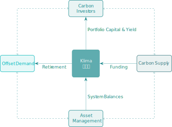
</figure>

Klima&nbsp;2.0 provides a fundamental capital, liquidity and execution layer for
wholesale Carbon trading, capturing spreads and structural pricing across the
asset class. It employs rational adaptive financial models to reflect
token-holders' collective risk-reward preferences, produced solely through
<span class="u-underline">native</span> smart contract balances from staking and
liquidity functions allowing price discovery and harmonious functions to govern
the stability and risk of the RBA&nbsp;token&nbsp;**KLIMA**.

The RBA&nbsp;model grants clean _look-through_ economic ownership of tokenised
Carbon assets to **KLIMA**&nbsp;token-holders, as well as self-governance for
risk and reward allowing maximum flexibility in this hybrid capital instrument
for growth <span class="u-underline">and</span> distribution.

### 2.1 Dual Utility tokens

In addition to the **KLIMA**&nbsp;token, Klima&nbsp;2.0 introduces a second
**Risk Governance** token&nbsp;**KlimaX**. This token is responsible for
modelling risk across the ecosystem by responding to the **KLIMA**&nbsp;token's
core selections and adding essential derivative parameters that manage adverse
selection and pricing capacity.

<figure id="figure-2" class="u-center">
<figcaption>Figure&nbsp;2: Token Replacement</figcaption>
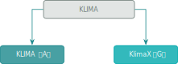
</figure>

**KLIMA**&nbsp;tokens have the beneficial ownership of the Portfolio and set
core allocation choices, whereas&nbsp;**KlimaX** acts as the _risk-seeking_
gauge for the portfolio construction.  

**KlimaX** is formally compensated with **KLIMA**&nbsp;tokens hence the two
tokens' interests are fully aligned and together perform dynamic Portfolio
optimisation as a result of collective owner utility-function.

### 2.2 High level Architecture

<figure id="figure-3" class="u-center">
<figcaption>Figure&nbsp;3: Klima&nbsp;2.0 Architecture</figcaption>
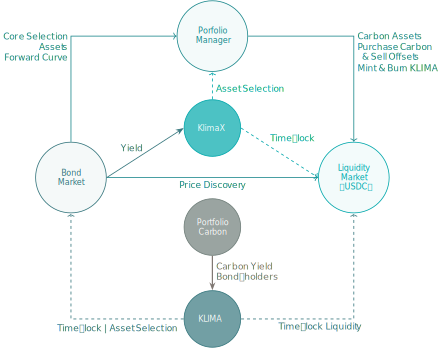
</figure>

Three economic pillars support the Klima&nbsp;2.0&nbsp;AAM:

1. **Portfolio Manager**:
    
    - Accumulates Carbon credits for the Portfolio by minting&nbsp;**KLIMA**.
    - Sells Carbon Offset certificates from the Portfolio by
    buring&nbsp;**KLIMA**.
    - Prices **Spot** and **Forward** delivery Carbon using the system generated
    curve. 
    
2. **Bond Market**:
    
    - **KLIMA**&nbsp;holders **Stake** irreversibly for a fixed time period.
    - Those Staking are able to _select_ Carbon assets for the Portfolio.
    - The Staking pattern over time creates a **KLIMA**&nbsp;Yield curve, which
    is distributed to Bond-holders. This is utilised for Forward delivery
    pricing in the Portfolio Manager and weightings for Bond-holders in
    governance and for their Spot Carbon Yield distribution.

3. **Liquidity Market**:

    - **KLIMA** and&nbsp;**KlimaX** holders are able to pair their tokens
    together, or in the case of&nbsp;**KLIMA** with&nbsp;USDC, in order to
    generate liquidity fees.
    - Locking Liquidity&nbsp;(Staking LP tokens) generates a share of the
    **KLIMA**&nbsp;Yield.
    - Locked **KLIMA**:**KlimaX**&nbsp;liquidity participates in general
    governance alongside Bond-holders.

Noting that _Staking_ and _Locking_ are used interchangeably throughout the
paper and for this model are identical functions where asset-transfers are
disabled for the period specified.

### 2.3 Economics and Incentives

#### 2.3.1 KLIMA&nbsp;Synthetic Yield

**KLIMA**&nbsp;emits a continuous Yield rewarding:

1. **KLIMA**&nbsp;Bond-holders. 

2. **KlimaX**&nbsp;Staking.

3. Both **KLIMA** and **KlimaX**&nbsp;Liquidity Provders&nbsp;(LPs).

The proportions and quantities are dynamic depending on the system state.

#### 2.3.2 KlimaX&nbsp;Incentives

The expansion of the **KlimaX**&nbsp;token supply is allocated to stakeholders
below in varying quantities depending on system balances.

1. **KLIMA**&nbsp;Bond-holders. 

2. **KlimaX**&nbsp;Staking.

3. Both **KLIMA** and **KlimaX**&nbsp;Liquidity Provders&nbsp;(LPs).

#### 2.3.3 Carbon Yield

Assuming the Portfolio holds spot Carbon credits, the Portfolio Manager emits a
continuous Carbon Yield to **KLIMA**&nbsp;**Bond-holders only** with the
proportion a function of the system state.

### 2.4 Portfolio Manager

At the core of the platform, the Portfolio Manager accumulates, trades and
distributes its Carbon Portfolio driven by parameters determined from collective
token-holder actions&nbsp;(and inaction).

<figure id="figure-4" class="u-center">
<figcaption>Figure&nbsp;4: Klima&nbsp;2.0 Portfolio Manager</figcaption>
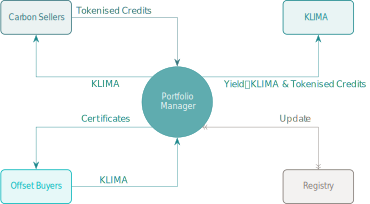
</figure>

The AAM **purchases** Carbon credits and **sells** Offset certificates by
pre-defined classification&nbsp;('Class'). It does
<span class="u-underline">not</span> sell Carbon credits as those are issued
through the Portfolio Yield function.

Token-holders collectively set the risk parameters for pricing of each Class by
defining:

- Portfolio weighting.

- Capacity curve and spreads.

Additional **global** parameters are similarly determined: 

- Forward-delivery discount rates.
    
- Synthetic yield curve creating incentives for Portfolio selection, liquidity
provision and risk management contributions.

- Proportion of Liquid Carbon credit yield released for&nbsp;**KLIMA** to
token-holders.

There are no oracles or external inputs required for Klima&nbsp;2.0 as it is
fully autonomous and responds to its own native state of token balances.

### 2.5 Tokens

#### 2.5.1 Carbon Registry

Holders of physical Carbon credits can create tokenised representation of their
assets through the Registry function. Here, physical assets are swapped for
their respective **C**&nbsp;tokens, based on the Registry's classification
system and the delivery schedule.

Once **C**&nbsp;tokens are created they can be sold to the AAM, or retired back
at the Registry to create the offset certificates&nbsp;(denoted&nbsp;**C\***).

#### 2.5.2 Risk Balanced Asset Token: KLIMA

**KLIMA** represents core ownership of the Portfolio assets, and is designed to
flex between asset and growth value drivers depending on token-holder activity.

**KLIMA** has <span class="u-underline">no maximum supply</span> but inflates
upon Carbon credit accumulation, and contracts upon issuance of Offset
certificates.

- When **Locked** for fixed maturities:
        
    - _Option_ to select Carbon classes for Portfolio weighting and
    pricing&nbsp;('Active').
    
    - Sets the Forward discount rate for Carbon Portfolio acquisition from
    collective Staking pattern over time.
    
    - Generates a **Synthetic yield** of&nbsp;**KLIMA** based on Forward curve
    and a **real Carbon yield** based on Active selection ratio.

    - Participates in governance for whitelisting Carbon assets.

- **Transactional** usage:

    - **Mint**: New&nbsp;**KLIMA** issued by the Portfolio Manager to purchase
    new Carbon credits for the Portfolio.

    - **Burn**: **KLIMA** are Purchased by the Portfolio Manager to issue Offset
    certificates.

- **Locked** Liquidity:

    - Generates a time-based relative share of the&nbsp;**KLIMA** Synthetic
    Yield, reflecting the risks taken to support the price of platform capital.

Noting that the tokens can delegate utility as required.

<figure id="figure-5" class="u-center">
<figcaption>Figure&nbsp;5: AAM Token Utility</figcaption>
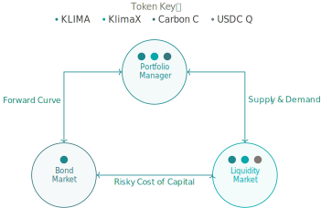
</figure>

#### 2.5.3 Risk Governance Token: KlimaX

**KlimaX**&nbsp;is a <span class="u-underline">fixed-supply</span> token issued
programmatically over time with a dynamic allocation for **Incentives**.

- When **Locked**:

    - Shapes the pricing curve and spread of&nbsp;**KLIMA**.
    - Determines risk premia for LPs.
    - Generates a share of Synthetic Yield.
    - Receives **KlimaX**&nbsp;Incentives.

- **Locked** Liquidity:

    - Generates a share of Synthetic Yield.
    - Participates in governance.
    - Receives **KlimaX**&nbsp;incentives.

#### 2.5.4 Staking functions

The **A**&nbsp;token has <span class="u-underline">2</span>&nbsp;staking
functions which are not independent:

<figure id="figure-6" class="u-center">
<figcaption>Figure&nbsp;6: <strong>KLIMA</strong> Staking</figcaption>
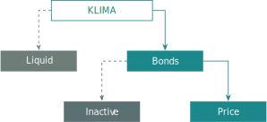
</figure>

1. **Bonds**: The **KLIMA**&nbsp;token is locked for a specific period of time
representing a liquidity preference for the holder in return for Yield. This
part of the stake cannot be amended.

2. **Price**: Collective selection of Carbon classes by **KLIMA**&nbsp;staking
determines the **instantaneous** price ratio for **KLIMA**&nbsp;token issuance.
This selection can be amended and withdrawn at any time to allow price
modulation for the platform of its Carbon assets.

The **KlimaX**&nbsp;token has a <span class="u-underline">single</span> staking
function that also optionally selects Carbon classes. This determines the rate
of issuance or price curve of&nbsp;**KLIMA** for the specified Carbon, as well
as the retirement burning rate.

Both tokens facilitate the Klima Carbon market to function efficiently with the
**KLIMA**&nbsp;token responsible for Portfolio selection and pricing, and the
**KlimaX**&nbsp;token modulating capacity and risk.

### 2.6 Initialisation of the KLIMA&nbsp;Token

The Klima Protocol has approximately **20 million tonnes** of Carbon credits in
its Treasury as assets, which will be used to create the initial issuance of
**KLIMA**&nbsp;tokens upon launch of Klima&nbsp;2.0.

<table id="table-1">
  <caption>Table&nbsp;1: Token Summary</caption>
  <thead>
    <tr>
      <th>Token
      <th>Amount
      <th>Notes
  </thead>
  <tbody>
    <tr>
      <td><strong>KLIMA</strong> <strong>A</strong>&nbsp;Token
      <td>20&nbsp;million
      <td>Supply expands and contracts perpetually.
    <tr>
      <td>
      <td>
      <td>87.5%&nbsp;of initial supply available to existing KLIMA&nbsp;holders.
    <tr>
      <td>
      <td>
      <td>Initially created on 1:1&nbsp;basis with Carbon Tonnes held.
    <tr>
      <td>
      <td>
      <td>Issues on Carbon received, and Burns on Carbon retired.
    <tr>
      <td><strong>KlimaX</strong> <strong>G</strong>&nbsp;Token
      <td>100&nbsp;million
      <td>Fixed supply
    <tr>
      <td>
      <td>
      <td>40%&nbsp;put into programmatic issuance as incentive yield over time.
    <tr>
      <td>
      <td>
      <td>40%&nbsp;for existing KLIMA&nbsp;holders
  </tbody>
</table>


### 2.7 End Users

1. **Carbon Credit Sellers**
    
    Those wishing to monetise spot or forward delivery classes of Carbon. 

   _**Portfolio Manager**: Continuously acquires **C**&nbsp;tokens using an
   autonomous pricing strategy, based on class, delivery and token balances,
   issuing new **KLIMA**&nbsp;tokens as consideration to build the
   **C**&nbsp;Portfolio._
    
2. **Offset Buyers**
    
    Those wishing to obtain the offset certificate by retiring Carbon credits
    from the Portfolio.

    _**Portfolio Manager**: Continuously sells offset certificates, by Burning
    **KLIMA**&nbsp;tokens and issuing the Offset certificate&nbsp;**C\***, by
    retiring the **C**&nbsp;token quantity in the Registry._

3. **Investors**

    Those who wish to own a liquid, or yielding locked fixed-maturity financial
    exposure, to a basket of Carbon assets.

    _**Bond Market**: Provides a daily time-based yield on  for those Staking
    **KLIMA**&nbsp;tokens, comprised of both a synthetic and real Portfolio
    carbon&nbsp;**C** component._

4. **Liquidity Providers**

    Those who wish to generate liquidity fees on their portfolio of
    Klima&nbsp;2.0 Assets coupled together or with USDC.

    _**Liquidity Market**: LPs are incentivised by the Synthetic Yield
    calculated from system metrics to compensate them for risk._
 
 5. **Active Portfolio Optimisation**

    _**KlimaX and KLIMA&nbsp;Asset Selection**: The Staking Incentives
    and allocations are designed for those who wish to participate in overall
    risk management to collectively resolve for the optimal Portfolio risks._


### 2.8 AAM Highlights

- **Decentralised Architecture**:

    The&nbsp;AAM is smart contract based, fully autonomous as to pricing and
    distribution of its assets with governance power held by risk-based capital.

- **Adverse Selection**:
    
    The&nbsp;AAM does not permit the direct purchase of Carbon credit
    **C**&nbsp;tokens from its Portfolio&nbsp;(Offsets only), but rather yields
    **C**&nbsp;tokens on a Portfolio basis over time. 
    
- **C Tokens**:
    
    Users with **C**&nbsp;tokens can always access offset certificates through
    the Registry, hold the specific **C**&nbsp;token or sell back to
    the&nbsp;AAM if required. Secondary markets and utility for
    **C**&nbsp;tokens may emerge over time.

- **Implied Spreads**:

    The AAM purchases **C**&nbsp;tokens at relative discounts based on capacity
    pricing and forward discount curves folding natural returns into the
    Portfolio capital.

- **Dual Tokens**:

    Whilst the **KLIMA**&nbsp;token reflects asset economics, the
    **KlimaX**&nbsp;token is essential for optimising pricing capacity in return
    **maximising risk-adjusted spreads** for the Portfolio. Since its earnings
    power is a function of the **KLIMA**&nbsp;token value, its role as this
    spread optimiser is truly economically aligned and as such fundamental
    values of **KLIMA**&nbsp;and **KlimaX**&nbsp;are highly correlated.

- **Hybrid Asset Model**

    The rate of **C**&nbsp;token yield for **KLIMA**&nbsp;generated from the
    underlying Portfolio is derived from the system state of the
    **KLIMA**&nbsp;token balances.

    - This enables investors collectively to model capital
    <span class="u-underline">and</span> yield proportions, allowing the price
    of the capital token to discover its **equilibrium** value with respect to
    the combination of **current** and **projected** underlying Portfolio value.

    - This flexibility enables a 'Pull to par' effect as growth expectations
    lower, whilst not limiting price appreciation potential in high growth
    projection markets.

    - The hybrid model incorporates both **asset stabilisation** plus
    **equity-like** returns.

    Critically this approach enables the **KLIMA**&nbsp;token to act as a true
    <span class="u-underline">medium of exchange</span> for the Carbon trading
    activity of the users, propagating the feedback loops to both
    the **KLIMA** and **KlimaX**&nbsp;tokens.

## 3 Core Economic Pillars

In this Section we refer to **KLIMA** and **KlimaX**&nbsp;tokens as&nbsp;**A**
and&nbsp;**G** respectively.

The three tenets of Klima&nbsp;2.0 enable the model to find equilibrium through
continuous dynamic feedback loops and system balances. There is no oversight or
centralised management entity with discretionary powers.

1. **Bond Market**: **A**&nbsp;token holders stake tokens until a set expiry to
create floating yield Bonds and have the ability to select Carbon Classes for
Portfolio weighting.

    - The collective temporal staking pattern produces a **Synthetic Yield**
    curve in **A**&nbsp;tokens to reward Bond-holders, as well as price the
    forward curve for the&nbsp;AAM.
        
    - A **real yield** of spot-delivery **C**&nbsp;tokens is issued continuously
    from the Portfolio to Bond-holders depending on the participation in
    Portfolio weightings.
        
    - Only **A**&nbsp;tokens participate in the Bond Market.

2. **Portfolio Manager**: The Portfolio Manager swaps its own token&nbsp;**A**
for Carbon&nbsp;**C**&nbsp;(in) or Carbon offset
certificates&nbsp;**C\***&nbsp;(out) to build a Portfolio of Carbon credits.

    - Both **Locked**&nbsp;**A** and&nbsp;**G** are used in the Portfolio
    Manager whereby **A**&nbsp;Staking determines the pricing of any given
    Carbon class, and **G**&nbsp;determines the rate of
    acquisition&nbsp;(disposal).
    
        _Only Bond-holders&nbsp;(Time-locked&nbsp;**A**) can participate in
        Portfolio weighting although it is not mandatory._

    - Forward-delivery Carbon&nbsp;(for a set of fixed dates out to
    10&nbsp;years) is transacted simultaneously with spot liquid Carbon.

3. **Liquidity Market**: Here the tokens are traded in 2&nbsp;core liquidity
pairs with various incentives available to Liquidity Provider token
holders&nbsp;(**LPs**), including a **Risky Yield** generated by the Bond Market
Synthetic Yield.

    - <span class="u-overline">**AG**</span>: Native token swap&nbsp;**A**
    and&nbsp;**G**.

    - <span class="u-overline">**AQ**</span>: The asset token&nbsp;**A** with
    USDC&nbsp;**Q**.

    The Liquidity Market provides the complementary facility to the Bond Market
    and the critical relationship between the native tokens and the hard
    currency of&nbsp;USDC.

The Klima&nbsp;2.0 system enables each participant in the various economic
pillars to act in the interests of their own capital and utility, which through
the harmonic model, enables price discovery, liquidity and stability for Carbon
trading which creates positive reinforcement cycles as catalysts for growth and
scale.

### 3.1 Bond Market

Holders of&nbsp;**A** can Stake&nbsp;(select) a Bond maturity from the set of
**Standard maturities**. Bonds expire every 90&nbsp;days on a rolling basis.
There are always 40&nbsp;maturities extending out to approximately 10&nbsp;years
for Bond staking.

- **Forward Curve**: Aggregate Bond-staking determines the shape of the discount
curve of the **A**&nbsp;token with regards to its purchasing rate of
forward-delivery Carbon.

- **Synthetic Yield**: Bond-holders receive a floating yield of new
**A**&nbsp;tokens on their stake following the shape of this discount curve.
Yield is calculated daily and accumulates to the principal stake. 

- **Real Carbon Yield**: Liquid Carbon in **C**&nbsp;token form is emitted to
Bond-holders on a daily basis assuming the portfolio holds spot Carbon assets.
The emission rate responds to Bond-holders staking for Portfolio pricing and up
to ~22% per quarter is released.

- **Liquidity**: There is no early unlocking; all principal and accumulated
yield is released only at Bond maturity.

**G**&nbsp;Tokens are <span class="u-underline">not</span> involved in the Bond
market. The forward curve is agnostic to Carbon class although only Bond-holders
can select Carbon classes for Portfolio pricing.

#### 3.1.1 Synthetic Yield and Forward-Delivery Curve

Defining:

- ${tex`S`}: Total **A**&nbsp;tokens staked for Bonds expressed as a proportion
of outstanding supply of&nbsp;**A**.

- ${tex`S_t`}: Total **A**&nbsp;tokens staked for Bond maturity
bucket&nbsp;${tex`t`}, expressed as a proportion of outstanding supply
of&nbsp;**A**, where&nbsp;${tex`{\sum S_t = S}`}, and&nbsp;${tex`t`} is the
index of standard maturities ${tex`t \in \{1, 2, 3, \dots, 40\}`}.

- ${tex`E_t`}: Time to expiry expressed in years.

```js
function constAreaLinear(range, area, inputSlope, slopeFactor = 0.007) {
  if (range.length === 1) {
    return [area];
  }

  let y1 = 0;
  let y2 = range.length - 1;
  let slope = slopeFactor * Math.atanh(inputSlope);
  let intercept = area / range.length;

  if (Math.abs(slope) > 2 * intercept / (y2 - y1 - 1)) {
    const yExactShift = Math.sqrt(Math.abs(2 * area / slope));
    const yRoundShift = Math.max(1, Math.round(yExactShift));
    if (slope > 0) {
      y1 = y2 - yRoundShift;
    } else {
      y2 = y1 + yRoundShift;
    }
    slope = Math.sign(slope) * 2 * area / Math.pow((y2 - y1), 2);
    intercept = Math.abs(slope) * (y2 - y1 - 1) / 2;
  }

  const yConstArea = [];
  for (let i = 0; i < range.length; i++) {
    const y = i - (y1 + y2) / 2;
    yConstArea.push(Math.max(0, slope * y + intercept));
  }

  return yConstArea;
}
```

```js
const vecE = d3.range(0.25, 10.1, 0.25);

const scaleE = d3.scaleLinear(d3.extent(vecE), [-1, 1]);

const vecS = constAreaLinear(vecE, 0.55, scaleE(inputD)).map(
  x => x * inputS / 0.55,
);

const vecReverseCumsumS = d3.cumsum(vecS.slice().reverse()).reverse();
```

Calculating curve parameters&nbsp;${tex`D`}, ${tex`C`}:

<div id="equation-1">

```tex
D = \frac{1}{S} \sum_{t=1}^{40} S_t \, E_t \tag{1}
```

</div>

```js
function dotProduct(v, w) {
  if (v.length !== w.length) {
    throw new Error("Vectors must have the same length");
  }
  return v.reduce((acc, val, i) => acc + val * w[i], 0);
}

function weightedArithmeticMean(v, weights) {
  return dotProduct(v, weights) / d3.sum(weights);
}
```

```js
const paramD = weightedArithmeticMean(vecE, vecS);
```

<div id="equation-2">

```tex
C = \frac{1}{S} \sum_{t=1}^{40} S_t \, E_t^2 \tag{2}
```

</div>

```js
const paramC = weightedArithmeticMean(vecE.map(e => e * e), vecS);
```

The shape of the yield curve is produced:

<div id="equation-3">

```tex
\gamma_t = \max \left( \frac{E_t}{D} - \frac{E_t^2}{2 \, C}, \, 0 \right)
  \tag{3}
```

</div>

```js
function computeGamma(vecE, paramD, paramC) {
  const twoC = 2 * paramC;
  return vecE.map(e => Math.max(0, e/paramD - e*e/twoC));
}
```

```js
const vecGamma = computeGamma(vecE, paramD, paramC);
```

Normalising&nbsp;${tex`\gamma_t`} to&nbsp;${tex`\hat \gamma_t`}:

<div id="equation-4">

```tex
\hat \gamma_t = \frac{\gamma_t}{\sum_{t=1}^{40} \gamma_t} \tag{4}
```

</div>

```js
function normalize(v) {
  const sum = d3.sum(v);
  return v.map(val => val / sum);
}
```

```js
const vecNormGamma = normalize(vecGamma);
```

With the cumulative sum of the normalised values expressed
as&nbsp;${tex`\Gamma_t`}:

<div id="equation-5">

```tex
\Gamma_t = \sum_{i=1}^t \hat \gamma_i \quad \text{for } t = 1, \dots, 40 \tag{5}
```

</div>

```js
const vecCumSumGamma = d3.cumsum(vecNormGamma);
```

The zero coupon yield curve&nbsp;${tex`Z_t`} is solved:

<div id="equation-6">

```tex
Z_t = (1 - S) \, \frac{\Gamma_t}{E_t} \tag{6}
```

</div>

```js
function computeZ(paramS, vecCumSumGamma, vecE) {
  return vecCumSumGamma.map((g, t) => (1 - paramS) * g / vecE[t]);
}
```

```js
const vecZ = computeZ(inputS, vecCumSumGamma, vecE);
```

Whereupon, the Bond discount rate&nbsp;${tex`B_t`} that forms the Forward
delivery curve is derived:

<div id="equation-7">

```tex
B_t = \exp(-Z_t \, E_t) \tag{7}
```

</div>

```js
function computeB(vecZ, vecE) {
  return vecZ.map((z, t) => Math.exp(-z * vecE[t]));
}
```

```js
const vecB = computeB(vecZ, vecE);
```

The yield due on **A**&nbsp;Bonds is calculated daily and added to staked
principal, hence the daily yield for each time bucket is calculated
as&nbsp;${tex`Y_t`}:

<div id="equation-8">

```tex
Y_t = \exp \left( \frac{Z_t}{365} \right) - 1 \tag{8}
```

</div>

```js
function computeY(vecZ) {
  return vecZ.map(z => Math.expm1(z / 365));
}
```

```js
const vecY = computeY(vecZ);
```

Hence, any bond stake&nbsp;${tex`A_t`} will increase by&nbsp;${tex`\Delta A_t`}:

<div id="equation-9">

```tex
\Delta A_t = A_t \, Y_t \tag{9}
```

</div>

With the total&nbsp;**A** tokens created on a daily basis for Bond inflation
as&nbsp;${tex`R`}:

<div id="equation-10">

```tex
R = \sum_{t=1}^{40} \Delta A_t \tag{10}
```

</div>

```js
const yieldData = [];
for (let t = 3; t < vecE.length; t += 4) {
  yieldData.push({
    key: "Stake A",
    value: 100 * d3.sum(vecS.slice(t - 3, t + 1)),
    time: vecE[t],
  });
  yieldData.push({
    key: "Yield Term Structure",
    value: 100 * vecZ[t],
    time: vecE[t],
  });
  yieldData.push({
    key: "Real Yield",
    value: 100 * (vecZ[t] - inputI),
    time: vecE[t],
  });
  yieldData.push({
    key: "Discount Curve",
    value: 100 * vecB[t],
    time: vecE[t],
  });
  yieldData.push({
    key: "Cumulative Stake A",
    value: 100 * vecReverseCumsumS[t - 3],
    time: vecE[t],
  });
}
const getStake = d => d.key === "Stake A" ? d.value : NaN;
const getYieldTerm = d => d.key === "Yield Term Structure" ? d.value : NaN;
const getRealYield = d => d.key === "Real Yield" ? d.value : NaN;
const getDiscount = d => d.key === "Discount Curve" ? d.value : NaN;
const getCumStake = d => d.key === "Cumulative Stake A" ? d.value : NaN;

const stringS = "Total Stake = " + inputS.toLocaleString(
  "en-GB",
  { style: "percent", minimumFractionDigits: 2, maximumFractionDigits: 2 },
);
const stringI = "Inflation = " + inputI.toLocaleString(
  "en-GB",
  { style: "percent", minimumFractionDigits: 2, maximumFractionDigits: 2 },
);
const stringD = `D = ${paramD.toLocaleString(
  "en-GB",
  { minimumFractionDigits: 2, maximumFractionDigits: 2 },
)} years`;
const stringC = `√C = ${Math.sqrt(paramC).toLocaleString(
  "en-GB",
  { minimumFractionDigits: 2, maximumFractionDigits: 2 },
)} years`;

const yieldParams = [
  { key: stringD, time: paramD },
  { key: stringC, time: Math.sqrt(paramC) },
];
```

<figure id="figure-7" class="u-center">
<figcaption>Figure&nbsp;7: Example of Bond Market State</figcaption>

```js
Plot.plot({
  caption: `Yield (${stringS}, ${stringI})`,
  color: {
    legend: true,
    range: d3.schemeCategory10,
    domain: ["Stake A", "Yield Term Structure", "Real Yield", stringD, stringC],
  },
  x: {
    ticks: d3.range(1, 11),
    domain: [0.25, 10.45],
    label: "Time to Expiry (Years)",
  },
  y: {
    domain: [
      0,
      Math.max(d3.max(yieldData, getStake), d3.max(yieldData, getYieldTerm)),
    ],
    grid: true,
  },
  insetTop: 16,
  insetLeft: 8,
  insetRight: 8,
  clip: true,
  marks: [
    Plot.frame(),
    Plot.axisY({ anchor: "left", label: "Stake A by Maturity (%)" }),
    Plot.axisY({ anchor: "right", label: "Yield Rates (%)" }),
    Plot.rectY(yieldData, {
      x1: d => d.time - 0.45,
      x2: d => d.time + 0.45,
      y: getStake,
      fill: "key",
    }),
    Plot.ruleX(yieldParams, {
      x: "time",
      stroke: "key",
      strokeWidth : 2,
      strokeDasharray: 4,
    }),
    Plot.lineY(yieldData, { x: "time", y: getYieldTerm, stroke: "key" }),
    Plot.dotY(yieldData, { x: "time", y: getYieldTerm, fill: "key" }),
    Plot.lineY(yieldData, { x: "time", y: getRealYield, stroke: "key" }),
    Plot.dotY(yieldData, { x: "time", y: getRealYield, fill: "key" }),
  ],
})
```

```js
const inputS = view(Inputs.range([1e-4, 1], {
  label: tex`S \text{ (share of \textbf{A}~tokens staked for bonds)}`,
  step: 1e-4,
  value: 0.55,
}));
const inputD = view(Inputs.range([0.25, 10], {
  label: tex`D \text{ (approximately)}`,
  step: 0.01,
  value: 4.69,
}));
const inputI = view(Inputs.range([0, 0.1], {
  label: tex`\text{Inflation }`,
  step: 0.0002,
  value: 0.0202,
}));
```

```js
Plot.plot({
  caption: "Discount Rate",
  color: {
    legend: true,
    range: [8, 5, 3, 4].map(i => d3.schemeCategory10[i]),
    domain: ["Cumulative Stake A", "Discount Curve", stringD, stringC],
  },
  x: {
    ticks: d3.range(1, 11),
    domain: [0.25, 10.45],
    label: "Time to Expiry (Years)"
  },
  y: { domain: [0, 100], grid: true },
  clip: true,
  insetTop: 16,
  insetLeft: 8,
  insetRight: 8,
  marks: [
    Plot.frame(),
    Plot.axisY({ anchor: "left", label: "Cumulative Stake (%)" }),
    Plot.axisY({ anchor: "right", label: "Discount (%)" }),
    Plot.rectY(yieldData, {
      x1: d => d.time - 0.45,
      x2: d => d.time + 0.45,
      y: getCumStake,
      fill: "key",
    }),
    Plot.ruleX(yieldParams, {
      x: "time",
      stroke: "key",
      strokeWidth : 2,
      strokeDasharray: 4,
    }),
    Plot.lineY(yieldData, { x: "time", y: getDiscount, stroke: "key" }),
    Plot.dotY(yieldData, { x: "time", y: getDiscount, fill: "key" }),
  ],
})
```

</figure>

For visualising the sensitivity of **A**&nbsp;overall inflation rates with
respect to staking and duration, [Figure&nbsp;8](#figure-8) assumes a single
maturity over the staking range to provide an approximation of
inflation&nbsp;${tex`{\Delta A \approx Z \, S}`}.

```js
function computeApproxDeltaA(paramS, paramE) {
  return paramS * (1 - paramS) / paramE;
}
```

```js
const inflationData = [];
for (let paramS = 0; paramS < 1.01; paramS += 0.1) {
  for (let paramE = 1; paramE <= 10; paramE++) {
    inflationData.push({
      key: "ΔA",
      e: paramE,
      s: paramS,
      value: computeApproxDeltaA(paramS, paramE),
    });
  }
}
```

<figure id="figure-8" class="u-center">
<figcaption>Figure&nbsp;8: Range of
  <strong>A</strong>&nbsp;Inflation</figcaption>

```js
Plot.plot({
  caption: html`A Inflation Rate from Bond Yields ${tex`\Delta A`}`,
  // aspectRatio: 1,
  color: { legend: true, scheme: "Spectral", type: "sequential", label: "ΔA" },
  x: { ticks: d3.range(1, 10.1, 1), domain: [10.5, 0.5], label: "Expiry Time E" },
  y: { ticks: d3.range(0, 1.01, 0.1), domain: [1.05, -0.05], label: "Staking S" },
  marks: [
    Plot.frame(),
    Plot.rect(inflationData, {
      x1: d => d.e - 0.5,
      x2: d => d.e + 0.5,
      y1: d => d.s - 0.05,
      y2: d => d.s + 0.05,
      fill: "value",
    }),
    Plot.text(inflationData, {
      x: "e",
      y: "s",
      text: d => Number.isNaN(d.value) ? "" : d.value.toLocaleString(
        "en-GB",
        { minimumFractionDigits: 2, maximumFractionDigits: 2 },
      ),
      fill: d => contrastingTextColor(
        d3.scaleSequential(
          [0, computeApproxDeltaA(0.5, 1)],
          d3.interpolateSpectral,
        )(d.value),
      ),
    }),
  ],
})
```

</figure>

#### 3.1.2 Governance Weightings

Governance rights, for example the whitelisting&nbsp;(blacklisting) of Carbon
classes, and any other matter requiring token stakeholder voting, are allocated
to two cohorts:

1. Bond staking: ${tex`S_t`}

2. Locked liquidity in the
**A**-**G**&nbsp;pair&nbsp;<span class="u-overline">**AG**</span>&nbsp;(see
[Section&nbsp;3.3](#3-3-liquidity-markets)) defined here as&nbsp;${tex`A_{Gt}`},
representing the quantity of **A**&nbsp;tokens held in the liquidity pool
expressed as a proportion of circulating supply.

Voting power is allocated by time and applied to the respective balance
of&nbsp;**A**:

1. Initial voting weights for Bonds&nbsp;${tex`v_t`}:

    <div id="equation-11">

    ```tex
    v_t = Z_t \, S_t \tag{11}
    ```

    </div>

2. Initial voting weights for LPs&nbsp;${tex`w_t`}:

    <div id="equation-12">

    ```tex
    w_t = Z_t \, A_{Gt} \tag{12}
    ```

    </div>

1. Final voting weights Bonds&nbsp;${tex`V_t`}:

    <div id="equation-13">

    ```tex
    V_t = \frac{v_t}{\sum_{j=1}^{40} (v_j + 2 w_j)} \tag{13}
    ```

    </div>

2. Final voting weights LPs&nbsp;${tex`W_t`}:

    <div id="equation-14">

    ```tex
    W_t = \frac{w_t}{\sum_{j=1}^{40} \left( \frac 1 2 v_j + w_j \right)}
      \tag{14}
    ```

    </div>

#### 3.1.3 Real Carbon Yield

Defining:

- ${tex`A`}: Total **A**&nbsp;tokens Staked for pricing of Carbon classes,
expressed as a proportion of outstanding supply of **A**&nbsp;Tokens.

With&nbsp;${tex`\mu`} as the daily emission factor applied to the Portfolio
holding spot delivery **C**&nbsp;tokens:

<div id="equation-15">

```tex
\mu = \frac{A \, (1 - A)}{90} \tag{15}
```

</div>

Carbon Yield is allocated to Bond-holders using&nbsp;(normalising) the _initial
voting weight_&nbsp;${tex`v_t`} determined in [Equation&nbsp;(11)](#equation-11).

### 3.2 Portfolio Manager

The Portfolio Manager role of swapping&nbsp;**A** for Carbon is managed through
a set of smart contracts driven by Staking choices from the token system, the
balances of assets held, and the discount curves generated by the Bond market.

The combined staking of&nbsp;**A** and&nbsp;**G** Tokens creates a dynamic
pricing matrix by class of Carbon and by time, enabling spot and forward trading
of Carbon. 

<figure id="figure-9" class="u-center">
<figcaption>Figure&nbsp;9: Klima&nbsp;2.0 Portfolio Manager</figcaption>
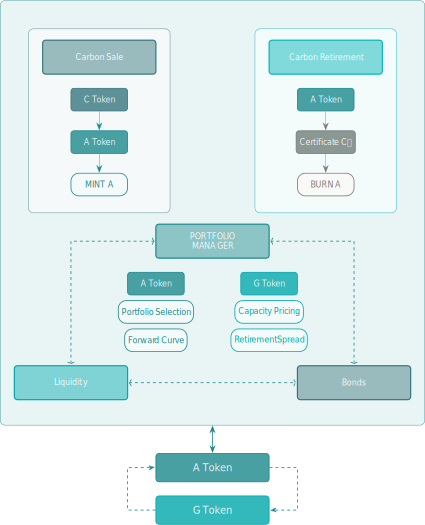
</figure>

#### 3.2.1 Purchase Carbon

_Users swap&nbsp;**C** for&nbsp;**A**_

<p id="3-2-1-1-existing-carbon-in-the-portfolio" tabindex="-1">
  <a class="observablehq-header-anchor"
     href="#3-2-1-1-existing-carbon-in-the-portfolio">
    <strong>Existing Carbon in the Portfolio</strong>
  </a>

Carbon classes&nbsp;${tex`{i \in \{1, 2, 3, \dots, n\}}`} are whitelisted
through governance by the **A**&nbsp;token and the
<span class="u-overline">**AG**</span>&nbsp;LP&nbsp;holders&nbsp;(see
[Section&nbsp;3.1.2](#3-1-2-governance-weightings)).

For Carbon pricing, both the **A**&nbsp;tokens and the **G**&nbsp;tokens may
stake for specific Carbon classes&nbsp;${tex`i`} and these are independent
stakes between the two token systems.

<figure id="figure-10" class="u-center">
<figcaption>Figure&nbsp;10: Token Staking Class Structure</figcaption>
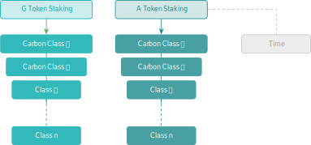
</figure>

For a Carbon class quantity to be sold to the&nbsp;AAM, it must have a strictly
positive quantity of **A**&nbsp;tokens staked for that Carbon class, otherwise
there is no price, and the Carbon cannot be sold.

Defining:

- ${tex`C_i`}: Total tonnes of Carbon class&nbsp;${tex`i`} currently held in the
Portfolio.

- ${tex`A_i`}: **A**&nbsp;tokens staked for Carbon class&nbsp;${tex`i`}
expressed as a proportion of outstanding supply of **A**&nbsp;Tokens
where&nbsp;${tex`{\sum A_i = A}`}.

- ${tex`G_i`}: **G**&nbsp;tokens staked for class&nbsp;${tex`i`} expressed as a
proportion of outstanding supply of **G**&nbsp;Tokens.

- ${tex`C_{it}`}: The quantity of Carbon class&nbsp;${tex`i`} held in
the&nbsp;AAM deliverable per maturity&nbsp;${tex`t`} where&nbsp;${tex`C_{i0}`}
reflects the liquid quantity.

In order to determine the present-value quantity of Carbon, ${tex`\bar C_i`}, we
apply the discount curve from [Equation&nbsp;(7)](#equation-7) to the liquidity
schedule and sum the discounted holdings:

<div id="equation-16">

```tex
\bar C_i = C_{i0} + \sum_{t=1}^{40} B_t \, C_{it} \tag{16}
```

</div>

```js
const vecCi = constAreaLinear(vecE, 1 - inputCi0, inputLiqShape, 0.01);

const paramBarCi = inputCi0 + dotProduct(vecB, vecCi);
```

```js
const carbonHeldData = [];
carbonHeldData.push({
  key: "Liquidity Schedule",
  value: 100 * inputCi0,
  time: 0,
});
for (let t = 3; t < vecE.length; t += 4) {
  carbonHeldData.push({
    key: "Liquidity Schedule",
    value: 100 * d3.sum(vecCi.slice(t - 3, t + 1)),
    time: vecE[t],
  });
  carbonHeldData.push({
    key: "Discount Curve",
    value: 100 * vecB[t],
    time: vecE[t],
  });
}
const getLiqSchedule = d => d.key === "Liquidity Schedule" ? d.value : NaN;

const stringBarCi = `Present-Value Carbon C̄ᵢ = ${paramBarCi.toLocaleString(
  "en-GB",
  { style: "percent", maximumFractionDigits: 0 },
)}`;

const heldCarbonParam = [{ key: stringBarCi, value: 100 * paramBarCi }];
```

```js
Plot.plot({
  caption: "Carbon Held in the AAM",
  color: {
    legend: true,
    range: [2, 5, 6].map(i => d3.schemeCategory10[i]),
    domain: ["Liquidity Schedule", "Discount Curve", stringBarCi],
  },
  x: {
    label: "Time to Expiry (Years)",
    labelAnchor: "right",
    labelArrow: true,
  },
  y: { domain: [0, 100], grid: true },
  insetTop: 16,
  clip: true,
  marks: [
    Plot.frame(),
    Plot.axisY({ anchor: "left", label: "Quantity of Carbon (%)" }),
    Plot.axisY({ anchor: "right", label: "Discount (%)" }),
    Plot.rectY(carbonHeldData, { x: "time", y: getLiqSchedule, fill: "key" }),
    Plot.ruleY(heldCarbonParam, {
      y: "value",
      stroke: "key",
      strokeWidth : 2,
      strokeDasharray: 4,
    }),
    Plot.lineY(carbonHeldData, { x: "time", y: getDiscount, stroke: "key" }),
    Plot.dotY(carbonHeldData, { x: "time", y: getDiscount, fill: "key" }),
  ],
})
```

```js
const inputCi0 = view(Inputs.range([0, 1], {
  label: tex`C_{i0} \text{ (liquid carbon from class } i \text{ held in AAM)}`,
  step: 1e-3,
}));
const inputLiqShape = view(Inputs.range([-1, 1], {
  label: tex`\text{Example liquidity schedule shape}`,
  step: 1e-3,
}));
```

Similarly, taking&nbsp;${tex`\Delta C_{it}`} as the quantity of
Carbon&nbsp;${tex`i`} to be sold with a specific maturity index&nbsp;${tex`t`}:

<div id="equation-17">

```tex
\Delta \bar C_i = \Delta C_{i0} + \sum_{t=1}^{40} B_t \, \Delta C_{it} \tag{17}
```

</div>

```js
const paramMaturityIdx = 4 * inputEt;

function computeDeltaCi0(deltaCi, t) {
  return t === 0 ? deltaCi : 0;
}

function computeVecDeltaCi(deltaCi, t) {
  const vecDeltaCi = Array(40).fill(0);
  if (t !== 0) {
    vecDeltaCi[t - 1] = deltaCi;
  }
  return vecDeltaCi;
}
```

```js
const paramDeltaCi0 = computeDeltaCi0(inputDeltaCi, paramMaturityIdx);

const vecDeltaCi = computeVecDeltaCi(inputDeltaCi, paramMaturityIdx);

const paramDeltaBarCi = paramDeltaCi0 + dotProduct(vecB, vecDeltaCi);
```

Once standardised by the discount curve, trades can be aggregated in the same
class for the defined trade or auction period.

```js
const carbonBuyData = [];
carbonBuyData.push({
  key: "Carbon Bought by AAM",
  value: 100 * paramDeltaCi0,
  time: 0,
});
for (let t = 3; t < vecE.length; t += 4) {
  carbonBuyData.push({
    key: "Carbon Bought by AAM",
    value: 100 * d3.sum(vecDeltaCi.slice(t - 3, t + 1)),
    time: vecE[t],
  });
  carbonBuyData.push({
    key: "Discount Curve",
    value: 100 * vecB[t],
    time: vecE[t],
  });
}
const getCarbonBought = d => d.key === "Carbon Bought by AAM" ? d.value : NaN;

const stringDeltaBarCi = "Present-Value Carbon Bought by AAM ΔC̄ᵢ = " +
        paramDeltaBarCi.toLocaleString(
          "en-GB",
          {
            style: "percent",
            minimumFractionDigits: 1,
            maximumFractionDigits: 1,
          },
        );
const boughtCarbonParam = [
  { key: stringDeltaBarCi, value: 100 * paramDeltaBarCi },
];
```

```js
Plot.plot({
  caption: "Carbon Bought by the AAM",
  color: {
    legend: true,
    range: [3, 5, 7].map(i => d3.schemeCategory10[i]),
    domain: ["Carbon Bought by AAM", "Discount Curve", stringDeltaBarCi],
  },
  x: {
    label: "Time to Expiry (Years)",
    labelAnchor: "right",
    labelArrow: true,
  },
  y: { domain: [0, 100], grid: true },
  insetTop: 16,
  clip: true,
  marks: [
    Plot.frame(),
    Plot.axisY({ anchor: "left", label: "Quantity of Carbon (%)" }),
    Plot.axisY({ anchor: "right", label: "Discount (%)" }),
    Plot.rectY(carbonBuyData, { x: "time", y: getCarbonBought, fill: "key" }),
    Plot.ruleY(boughtCarbonParam, {
      y: "value",
      stroke: "key",
      strokeWidth : 2,
      strokeDasharray: 4,
    }),
    Plot.lineY(carbonBuyData, { x: "time", y: getDiscount, stroke: "key" }),
    Plot.dotY(carbonBuyData, { x: "time", y: getDiscount, fill: "key" }),
  ],
})
```

```js
const inputDeltaCi = view(Inputs.range([0, 1], {
  label: tex`\Delta C_i \text{ (carbon from class } i \text{ bought by AAM)}`,
  step: 1e-3,
  value: 1,
}));
const inputEt = view(Inputs.range([0, 10], {
  label: tex`E_t \text{ (years to expiry)}`,
  step: 1,
  value: 6,
}));
```

Where&nbsp;${tex`\Delta \bar C_i`} is expressed as the relative increment to its
respective pool balance, the amount of **A**&nbsp;tokens issued to pay for
Carbon, ${tex`\Delta A`}, expressed as a proportion of current supply, is
determined as:

<div id="equation-18">

```tex
\ln(1 + \Delta A) =
  \left( A_i - \frac{A_i^2 \, (1 - G_i)^2}{2} \right) \ln(1 + \Delta \bar C_i)
  \tag{18}
```

</div>

Denoting the expression on the right hand side of
[Equation&nbsp;(18)](#equation-18) as&nbsp;${tex`\mathsf{RHS}`}:

<div id="equation-19">

```tex
\Delta A = \exp(\mathsf{RHS}) − 1 \tag{19}
```

</div>

```js
function computeDeltaA(Ai, Gi, deltaCi) {
  return Math.expm1((Ai - (Ai**2 * (1 - Gi)**2 / 2)) * Math.log1p(deltaCi));
}
```

Finally, ${tex`\Delta A`} is applied to the outstanding supply of&nbsp;**A** to
solve for token quantities.

[Figure&nbsp;11](#figure-11) illustrates the **G**&nbsp;token capacity to
maintain the initial Portfolio pricing of the **A**&nbsp;token. The data has
been normalised in [Figure&nbsp;12](#figure-12)
to&nbsp;${tex`\Delta \bar C_i \, A_i`}.

```js
function contrastingTextColor(backgroundColor) {
  if (d3.hsl(backgroundColor).l < 0.5) {
    return "white";
  } else {
    return "black";
  }
}
```

```js
const pricingData = [];
for (let paramGi = 0; paramGi < 1.01; paramGi += 0.1) {
  pricingData.push({
    key: "ΔA",
    ai: 0,
    gi: paramGi,
    value: NaN,
  });
  pricingData.push({
    key: "Normalised ΔA",
    ai: 0,
    gi: paramGi,
    value: NaN,
  });
  for (let paramAi = 0.1; paramAi < 1.01; paramAi += 0.1) {
    pricingData.push({
      key: "ΔA",
      ai: paramAi,
      gi: paramGi,
      value: computeDeltaA(paramAi, paramGi, inputDeltaBarCi),
    });
    pricingData.push({
      key: "Normalised ΔA",
      ai: paramAi,
      gi: paramGi,
      value: computeDeltaA(paramAi, paramGi, inputDeltaBarCi) /
              (inputDeltaBarCi * paramAi),
    });
  }
}
const getDeltaA = d => d.key === "ΔA" ? d.value : NaN;
const getNormDeltaA = d => d.key === "Normalised ΔA" ? d.value : NaN;
```

<figure id="figure-11" class="u-center">
<figcaption>Figure&nbsp;11: <strong>A</strong>&nbsp;Price
  Curves&nbsp;(${tex`\Delta A`}) when ${tex`\Delta \bar C_i = ${
    (100 * inputDeltaBarCi).toLocaleString(
      "en-GB",
      { maximumFractionDigits: 0 },
    )
  } \%`}</figcaption>

```js
Plot.plot({
  caption: html`Heatmap of ${tex`\Delta A`} with
          ${tex`\Delta \bar C_i = ${(100 * inputDeltaBarCi).toLocaleString(
            "en-GB",
            { maximumFractionDigits: 0 },
          )} \%`}`,
  // aspectRatio: 1,
  color: { legend: true, scheme: "Spectral", type: "sequential", label: "ΔA" },
  x: { ticks: d3.range(0, 1.01, 0.1), label: "Aᵢ" },
  y: { ticks: d3.range(0, 1.01, 0.1), domain: [1.05, -0.05], label: "Gᵢ" },
  marks: [
    Plot.frame(),
    Plot.rect(pricingData, {
      x1: d => d.ai - 0.05,
      x2: d => d.ai + 0.05,
      y1: d => d.gi - 0.05,
      y2: d => d.gi + 0.05,
      fill: getDeltaA,
    }),
    Plot.text(pricingData, {
      x: "ai",
      y: "gi",
      text: d => Number.isNaN(getDeltaA(d)) ? "" : d.value.toLocaleString(
        "en-GB",
        { minimumFractionDigits: 2, maximumFractionDigits: 2 },
      ),
      fill: d => contrastingTextColor(
        d3.scaleSequential(
          [
            computeDeltaA(0.1, 1, inputDeltaBarCi),
            computeDeltaA(1, 1, inputDeltaBarCi),
          ],
          d3.interpolateSpectral,
        )(d.value),
      ),
    }),
  ],
})
```

</figure>

```js
const inputDeltaBarCi = view(Inputs.range([0.01, 1], {
  label: tex`\Delta \bar C_i \text{ (present-value carbon bought by AAM)}`,
  step: 0.01,
  value: 1,
}));
```

<figure id="figure-12" class="u-center">
<figcaption>Figure&nbsp;12: Normalised
  <strong>A</strong>&nbsp;Price Curves&nbsp;(${tex`\Delta A`}) when&nbsp;${
    tex`\Delta \bar C_i = ${(100 * inputDeltaBarCi).toLocaleString(
      "en-GB",
      { maximumFractionDigits: 0 },
    )} \%`}</figcaption>

```js
Plot.plot({
  caption: html`Normalised Map of ${tex`\Delta A`} with
          ${tex`\Delta \bar C_i = ${(100 * inputDeltaBarCi).toLocaleString(
            "en-GB",
            { maximumFractionDigits: 0 },
          )} \%`}`,
  // aspectRatio: 1,
  color: {
    legend: true,
    scheme: "Spectral",
    type: "sequential",
    label: "Normalised ΔA",
  },
  x: { ticks: d3.range(0, 1.01, 0.1), label: "Aᵢ" },
  y: { ticks: d3.range(0, 1.01, 0.1), domain: [1.05, -0.05], label: "Gᵢ" },
  marks: [
    Plot.frame(),
    Plot.rect(pricingData, {
      x1: d => d.ai - 0.05,
      x2: d => d.ai + 0.05,
      y1: d => d.gi - 0.05,
      y2: d => d.gi + 0.05,
      fill: getNormDeltaA,
    }),
    Plot.text(pricingData, {
      x: "ai",
      y: "gi",
      text: d => Number.isNaN(getNormDeltaA(d)) ? "" : d.value.toLocaleString(
        "en-GB",
        { minimumFractionDigits: 2, maximumFractionDigits: 2 },
      ),
      fill: d => contrastingTextColor(
        d3.scaleSequential(
          [
            computeDeltaA(1, 0, inputDeltaBarCi) / inputDeltaBarCi,
            computeDeltaA(1, 1, inputDeltaBarCi) / inputDeltaBarCi,
          ],
          d3.interpolateSpectral,
        )(d.value),
      ),
    }),
  ],
})
```

</figure>

Noting that the sensitivity to&nbsp;${tex`G_i`} increases as&nbsp;${tex`A_i`}
increases and the effects become more pronounced as&nbsp;${tex`\Delta \bar C_i`}
increases.

<p id="3-2-1-2-zero-carbon-scenario" tabindex="-1">
  <a class="observablehq-header-anchor"
     href="#3-2-1-2-zero-carbon-scenario">
    <strong>Zero Carbon Scenario</strong>
  </a>

There are circumstances when there is zero Carbon held in the Portfolio for a
particular class, i.e.&nbsp;${tex`{C_i = 0}`}, which invalidates the calculation
of&nbsp;${tex`\Delta \bar C_i`} and a different approach is required.

Taking&nbsp;${tex`\Delta \bar C_\emptyset`} as the tonnes of Carbon
tokens&nbsp;(implying an existing balance of 1&nbsp;tonne), adjusted for forward
discounting, to be sold for any Carbon class that has a strictly positive
**A**&nbsp;stake&nbsp;${tex`A_\emptyset`}, together with
**G**&nbsp;stake&nbsp;${tex`G_\emptyset`}:

<div id="equation-20">

```tex
\Delta A =
  \frac{\Delta \bar C_\emptyset}{1 + \Delta \bar C_\emptyset} \, 
  \left( A_\emptyset - \frac{A_\emptyset^2 (1 - G_\emptyset)^2}{2} \right)^2
  \tag{20}
```

</div>

```js
function computeZeroCarbonDeltaA(Ai, Gi, deltaCnull) {
  return (deltaCnull / (1 + deltaCnull)) * (Ai - (Ai**2 * (1 - Gi)**2 / 2))**2;
}

function computeTrueDeltaA(Ai, Gi, barCiTonnes, deltaBarCiTonnes) {
  if (barCiTonnes === 0) {
    return computeZeroCarbonDeltaA(Ai, Gi, deltaBarCiTonnes);
  } else {
    const deltaBarCi = deltaBarCiTonnes / barCiTonnes;
    return computeDeltaA(Ai, Gi, deltaBarCi);
  }
}

function numberOfDigits(x) {
  return x === 0 ? 1 : (1 + Math.floor(Math.log10(x)));
}
```

```js
const zeroCarbonData = [];
for (let paramGi = 0; paramGi < 1.01; paramGi += 0.1) {
  zeroCarbonData.push({
    key: "ΔA",
    ai: 0,
    gi: paramGi,
    value: NaN,
  });
  zeroCarbonData.push({
    key: "Normalised ΔA",
    ai: 0,
    gi: paramGi,
    value: NaN,
  });
  for (let paramAi = 0.1; paramAi < 1.01; paramAi += 0.1) {
    zeroCarbonData.push({
      key: "ΔA",
      ai: paramAi,
      gi: paramGi,
      value: computeZeroCarbonDeltaA(paramAi, paramGi, inputDeltaBarCnull),
    });
    zeroCarbonData.push({
      key: "Normalised ΔA",
      ai: paramAi,
      gi: paramGi,
      value: computeZeroCarbonDeltaA(paramAi, paramGi, inputDeltaBarCnull) /
              ((inputDeltaBarCnull / (1 + inputDeltaBarCnull)) * paramAi**2),
    });
  }
}

const stringDeltaBarCnull = inputDeltaBarCnull.toLocaleString(
  "en-GB",
  {
    minimumSignificantDigits: Math.max(1, numberOfDigits(inputDeltaBarCnull)),
    maximumSignificantDigits: Math.max(1, numberOfDigits(inputDeltaBarCnull)),
  },
);
```

<figure id="figure-13" class="u-center">
<figcaption>Figure&nbsp;13: <strong>A</strong>&nbsp;Price
  Curves&nbsp;(${tex`\Delta A`}) when&nbsp;${
    tex`\Delta \bar C_\emptyset = ${stringDeltaBarCnull}`} tCO2eq</figcaption>

```js
Plot.plot({
  caption: html`Heatmap of ${tex`\Delta A`} with
          ${tex`\Delta \bar C_\emptyset = ${stringDeltaBarCnull}`} tCO2eq`,
  // aspectRatio: 1,
  color: { legend: true, scheme: "Spectral", type: "sequential", label: "ΔA" },
  x: { ticks: d3.range(0, 1.01, 0.1), label: "Aᵢ" },
  y: { ticks: d3.range(0, 1.01, 0.1), domain: [1.05, -0.05], label: "Gᵢ" },
  marks: [
    Plot.frame(),
    Plot.rect(zeroCarbonData, {
      x1: d => d.ai - 0.05,
      x2: d => d.ai + 0.05,
      y1: d => d.gi - 0.05,
      y2: d => d.gi + 0.05,
      fill: getDeltaA,
    }),
    Plot.text(zeroCarbonData, {
      x: "ai",
      y: "gi",
      text: d => Number.isNaN(getDeltaA(d)) ? "" : d.value.toLocaleString(
        "en-GB",
        { minimumFractionDigits: 4, maximumFractionDigits: 4 },
      ),
      fill: d => contrastingTextColor(
        d3.scaleSequential(
          [
            computeZeroCarbonDeltaA(0.1, 1, inputDeltaBarCnull),
            computeZeroCarbonDeltaA(1, 1, inputDeltaBarCnull),
          ],
          d3.interpolateSpectral,
        )(d.value),
      ),
    }),
  ],
})
```

</figure>

```js
const inputDeltaBarCnull = view(Inputs.range([1e-1, 1e5], {
  label: tex`\Delta \bar C_\emptyset
    \text{ (present-value tonnes bought by AAM)}`,
  step: 1e-1,
  value: 1e2,
  transform: Math.log,
}));
```

<figure id="figure-14" class="u-center">
<figcaption>Figure&nbsp;14: Normalised
  <strong>A</strong>&nbsp;Price Curves&nbsp;(${tex`\Delta A`}) when&nbsp;${
    tex`\Delta \bar C_i = ${stringDeltaBarCnull}`} tCO2eq</figcaption>

```js
Plot.plot({
  caption: html`Normalised Map of ${tex`\Delta A`} with
          ${tex`\Delta \bar C_\emptyset = ${stringDeltaBarCnull}`} tCO2eq`,
  // aspectRatio: 1,
  color: {
    legend: true,
    scheme: "Spectral",
    type: "sequential",
    label: "Normalised ΔA",
  },
  x: { ticks: d3.range(0, 1.01, 0.1), label: "Aᵢ" },
  y: { ticks: d3.range(0, 1.01, 0.1), domain: [1.05, -0.05], label: "Gᵢ" },
  marks: [
    Plot.frame(),
    Plot.rect(zeroCarbonData, {
      x1: d => d.ai - 0.05,
      x2: d => d.ai + 0.05,
      y1: d => d.gi - 0.05,
      y2: d => d.gi + 0.05,
      fill: getNormDeltaA,
    }),
    Plot.text(zeroCarbonData, {
      x: "ai",
      y: "gi",
      text: d => Number.isNaN(getNormDeltaA(d)) ? "" : d.value.toLocaleString(
        "en-GB",
        { minimumFractionDigits: 2, maximumFractionDigits: 2 },
      ),
      fill: d => contrastingTextColor(
        d3.scaleSequential(
          [
            computeZeroCarbonDeltaA(1, 0, inputDeltaBarCnull) /
                    (inputDeltaBarCnull / (1 + inputDeltaBarCnull)),
            computeZeroCarbonDeltaA(1, 1, inputDeltaBarCnull) /
                    (inputDeltaBarCnull / (1 + inputDeltaBarCnull)),
          ],
          d3.interpolateSpectral,
        )(d.value),
      ),
    }),
  ],
})
```

</figure>

#### 3.2.2 Sell Offset Certificates

_Users swap&nbsp;**A** for&nbsp;**C\***_

<p id="3-2-2-1-weighted-carbon-class" tabindex="-1">
  <a class="observablehq-header-anchor"
     href="#3-2-2-1-weighted-carbon-class">
    <strong>Weighted Carbon Class</strong>
  </a>

For retiring Carbon that is _weighted_, that is there is a strictly positive
**A**&nbsp;token stake for that class, an **A**&nbsp;token holder can extract
the Carbon class offset of their choice&nbsp;${tex`C_i`} but the available pool
is only the liquid balance, namely the element&nbsp;${tex`C_{i0}`}:

<div id="equation-21">

```tex
\ln(1 + \Delta C_i) =
  \frac{-\ln(1 + \Delta A)}{A_i + \frac 1 2 A_i^2 \, (1 - G_i)^2} \tag{21}
```

</div>

As before denoting the expression on the right hand side of
[Equation&nbsp;(21)](#equation-21) as&nbsp;${tex`\mathsf{RHS}`}:

<div id="equation-22">

```tex
\Delta C_i = \exp(\mathsf{RHS}) - 1 \tag{22}
```

</div>

```js
function computeDeltaCi(Ai, Gi, deltaA) {
  return Math.expm1(-Math.log1p(deltaA) / (Ai + (Ai**2 * (1 - Gi)**2 / 2)));
}
```

```js
const retirementData = [];
for (let paramGi = 0; paramGi < 1.01; paramGi += 0.1) {
  retirementData.push({
    key: "-ΔCᵢ",
    ai: 0,
    gi: paramGi,
    value: NaN,
  });
  for (let paramAi = 0.1; paramAi < 1.01; paramAi += 0.1) {
    retirementData.push({
      key: "-ΔCᵢ",
      ai: paramAi,
      gi: paramGi,
      value: -computeDeltaCi(paramAi, paramGi, inputDeltaA),
    });
  }
}
```

<figure id="figure-15" class="u-center">
<figcaption>Figure&nbsp;15: Proportion of Carbon Retired
  when&nbsp;${tex`\Delta A = ${(100 * inputDeltaA).toLocaleString(
    "en-GB",
    { minimumFractionDigits: 1, maximumFractionDigits: 1 },
  )} \%`}</figcaption>

```js
Plot.plot({
  caption: html`Heatmap of ${tex`-\Delta C_i`} with
          ${tex`\Delta A = ${(100 * inputDeltaA).toLocaleString(
            "en-GB",
            { minimumFractionDigits: 1, maximumFractionDigits: 1 },
          )} \%`}`,
  color: {
    legend: true,
    scheme: "Spectral",
    type: "sequential",
    label: "-ΔCᵢ",
  },
  x: { ticks: d3.range(0, 1.01, 0.1), label: "Aᵢ" },
  y: { ticks: d3.range(0, 1.01, 0.1), domain: [1.05, -0.05], label: "Gᵢ" },
  marks: [
    Plot.frame(),
    Plot.rect(retirementData, {
      x1: d => d.ai - 0.05,
      x2: d => d.ai + 0.05,
      y1: d => d.gi - 0.05,
      y2: d => d.gi + 0.05,
      fill: "value",
    }),
    Plot.text(retirementData, {
      x: "ai",
      y: "gi",
      text: d => Number.isNaN(d.value) ? "" : d.value.toLocaleString(
        "en-GB",
        { minimumFractionDigits: 2, maximumFractionDigits: 2 },
      ),
      fill: d => contrastingTextColor(
        d3.scaleSequential(
          [
            -computeDeltaCi(1, 0, inputDeltaA),
            -computeDeltaCi(0.1, 1, inputDeltaA),
          ],
          d3.interpolateSpectral,
        )(d.value),
      ),
    }),
  ],
})
```

</figure>

```js
const inputDeltaA = view(Inputs.range([0.001, 0.999], {
  label: tex`\Delta A \text{ (\textbf{A} tokens burnt by AAM)}`,
  step: 0.001,
  value: 0.1,
}));
```

[Figure&nbsp;15](#figure-15) shows the cost of Carbon increasing
with&nbsp;${tex`A_i`} and decreasing on&nbsp;${tex`G_i`}.

<p id="3-2-2-2-unweighted-carbon-class" tabindex="-1">
  <a class="observablehq-header-anchor"
     href="#3-2-2-2-unweighted-carbon-class">
    <strong>Unweighted Carbon Class</strong>
  </a>

An offset for Carbon class with a zero **A**&nbsp;stake cannot be extracted from
the portfolio by swapping in **A**&nbsp;tokens. However, it is part of the
Portfolio yield detailed in [Section 3.1.3](#3-1-3-real-carbon-yield).

<p id="3-2-2-3-liquidation" tabindex="-1">
  <a class="observablehq-header-anchor"
     href="#3-2-2-3-liquidation">
    <strong>Liquidation: ${tex`\Delta A = 1`}</strong>
  </a>

In the event that 100% of **A**&nbsp;tokens are placed into the burn mechanism
for Carbon Offsets, the balances of all Carbon held in the Portfolio post-trade
are distributed to all **G**&nbsp;holders.

```js
function computeSpread(Ai, Gi, deltaCinitial) {
  const deltaA = computeDeltaA(Ai, Gi, deltaCinitial);
  const deltaCfinal = -computeDeltaCi(Ai, Gi, deltaA);
  return (deltaCinitial - deltaCfinal) / deltaCinitial;
}
```

[Figure&nbsp;16](#figure-16) below shows the spread captured on a 'Round trip'
by the system where&nbsp;${tex`\varepsilon`} is the proportion retained:

```js
const liquidationData = [];
for (let paramGi = 0; paramGi < 1.01; paramGi += 0.1) {
  liquidationData.push({ key: "deltaa", ai: 0, gi: paramGi, value: NaN });
  liquidationData.push({ key: "deltac", ai: 0, gi: paramGi, value: NaN });
  liquidationData.push({ key: "spread", ai: 0, gi: paramGi, value: NaN });
  for (let paramAi = 0.1; paramAi < 1.01; paramAi += 0.1) {
    const deltaA = computeDeltaA(paramAi, paramGi, inputDeltaCinitial)
    liquidationData.push({
      key: "deltaa",
      ai: paramAi,
      gi: paramGi,
      value: computeDeltaA(paramAi, paramGi, inputDeltaCinitial) /
              inputDeltaCinitial,
    });
    liquidationData.push({
      key: "deltac",
      ai: paramAi,
      gi: paramGi,
      value: computeDeltaCi(paramAi, paramGi, deltaA) / inputDeltaCinitial,
    });
    liquidationData.push({
      key: "spread",
      ai: paramAi,
      gi: paramGi,
      value: computeSpread(paramAi, paramGi, inputDeltaCinitial),
    });
  }
}
const getLiqDeltaA = d => d.key === "deltaa" ? d.value : NaN;
const getLiqDeltaCi = d => d.key === "deltac" ? d.value : NaN;
const getLiqSpread = d => d.key === "spread" ? d.value : NaN;
```

<figure id="figure-16" class="u-center">
<figcaption>Figure&nbsp;16: Carbon ‘Spread’</figcaption>

```js
Plot.plot({
  caption: html`Heatmap of Carbon Spread ${tex`\varepsilon`} with Initial
          ${tex`\Delta C = ${(100 * inputDeltaCinitial).toLocaleString(
            "en-GB",
            { minimumFractionDigits: 1, maximumFractionDigits: 1 },
          )} \%`}`,
  color: {
    legend: true,
    scheme: "Spectral",
    domain: [0, computeSpread(1, 0, 1)],
    type: "sequential",
    label: "Carbon Spread ε",
  },
  x: { ticks: d3.range(0, 1.01, 0.1), label: "Aᵢ" },
  y: { ticks: d3.range(0, 1.01, 0.1), domain: [1.05, -0.05], label: "Gᵢ" },
  marks: [
    Plot.frame(),
    Plot.rect(liquidationData, {
      x1: d => d.ai - 0.05,
      x2: d => d.ai + 0.05,
      y1: d => d.gi - 0.05,
      y2: d => d.gi + 0.05,
      fill: getLiqSpread,
    }),
    Plot.text(liquidationData, {
      x: "ai",
      y: "gi",
      text: d => Number.isNaN(getLiqSpread(d)) ? "" : d.value.toLocaleString(
        "en-GB",
        { minimumFractionDigits: 2, maximumFractionDigits: 2 },
      ),
      fill: d => contrastingTextColor(
        d3.scaleSequential(
          [0, computeSpread(1, 0, inputDeltaCinitial)],
          d3.interpolateSpectral,
        )(d.value),
      ),
    }),
  ],
})
```

```js
const inputDeltaCinitial = view(Inputs.range([0.001, 1], {
  label: tex`\Delta C \text{ (carbon sold by AAM at liquidation)}`,
  step: 0.001,
  value: 0.1,
}));
```

</figure>

[Figure&nbsp;17](#figure-17) shows the component 'Spread' contributions on a
Carbon sale and purchase of offset round trip.

<figure id="figure-17" class="u-center">
<figcaption>Figure&nbsp;17: Carbon ‘Spread’ Components</figcaption>

```js
Plot.plot({
  caption: html`Heatmap of Carbon Spread Component ${tex`\Delta A`} with an
          Initial ${tex`\Delta C = ${(100 * inputDeltaCinitial).toLocaleString(
            "en-GB",
            { minimumFractionDigits: 1, maximumFractionDigits: 1 },
          )} \%`}`,
  color: {
    legend: true,
    scheme: "Spectral",
    domain: [0, 1],
    type: "sequential",
    label: "Carbon Spread Component ΔA",
  },
  x: { ticks: d3.range(0, 1.01, 0.1), label: "Aᵢ" },
  y: { ticks: d3.range(0, 1.01, 0.1), domain: [1.05, -0.05], label: "Gᵢ" },
  marks: [
    Plot.frame(),
    Plot.rect(liquidationData, {
      x1: d => d.ai - 0.05,
      x2: d => d.ai + 0.05,
      y1: d => d.gi - 0.05,
      y2: d => d.gi + 0.05,
      fill: getLiqDeltaA,
    }),
    Plot.text(liquidationData, {
      x: "ai",
      y: "gi",
      text: d => Number.isNaN(getLiqDeltaA(d)) ? "" : d.value.toLocaleString(
        "en-GB",
        { minimumFractionDigits: 2, maximumFractionDigits: 2 },
      ),
      fill: d => contrastingTextColor(d3.interpolateSpectral(d.value)),
    }),
  ],
})
```

```js
Plot.plot({
  caption: html`Heatmap of Carbon Spread Component ${tex`\Delta C`} with an
          Initial ${tex`\Delta C = ${(100 * inputDeltaCinitial).toLocaleString(
            "en-GB",
            { minimumFractionDigits: 1, maximumFractionDigits: 1 },
          )} \%`}`,
  color: {
    legend: true,
    scheme: "Greys",
    domain: [
      -1,
      computeDeltaCi(
        1,
        0,
        computeDeltaA(1, 0, inputDeltaCinitial) / inputDeltaCinitial,
      ),
    ],
    label: "Carbon Spread Component ΔC",
  },
  x: { ticks: d3.range(0, 1.01, 0.1), label: "Aᵢ" },
  y: { ticks: d3.range(0, 1.01, 0.1), domain: [1.05, -0.05], label: "Gᵢ" },
  marks: [
    Plot.frame(),
    Plot.rect(liquidationData, {
      x1: d => d.ai - 0.05,
      x2: d => d.ai + 0.05,
      y1: d => d.gi - 0.05,
      y2: d => d.gi + 0.05,
      fill: getLiqDeltaCi,
    }),
    Plot.text(liquidationData, {
      x: "ai",
      y: "gi",
      text: d => Number.isNaN(getLiqDeltaCi(d)) ? "" : d.value.toLocaleString(
        "en-GB",
        { minimumFractionDigits: 2, maximumFractionDigits: 2 },
      ),
      fill: d => contrastingTextColor(
        d3.scaleSequential(
          [
            -1,
            computeDeltaCi(
              1,
              0,
              computeDeltaA(1, 0, inputDeltaCinitial) / inputDeltaCinitial,
            ),
          ],
          d3.interpolateGreys,
        )(d.value),
      ),
    }),
  ],
})
```

</figure>

### 3.3 Liquidity Markets

Both&nbsp;**A** and&nbsp;**G** tokens can be used independently of
price&nbsp;(and time) staking for providing liquidity.

<figure id="figure-18" class="u-center">
<figcaption>Figure&nbsp;18: Token Liquidity and Pricing Structure</figcaption>
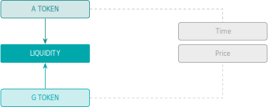
</figure>

There are two core liquidity pools:

1. An AAM 50:50 pairing of **A** and **G**&nbsp;tokens;
pool&nbsp;<span class="u-overline">**AG**</span>.

2. A hard currency USDC denoted as&nbsp;**Q** paired with&nbsp;**A**;
pool&nbsp;<span class="u-overline">**AQ**</span>.

#### 3.3.1 Liquidity Fees

The <span class="u-overline">**AQ**</span>&nbsp;pool will have its own set of
fees in the normal way.[^1]

The <span class="u-overline">**AG**</span>&nbsp;pool has different economics as
the assets are highly correlated since they represent the same economy. For this
reason, the fees are extremely low.

By locking liquidity&nbsp;(LP&nbsp;tokens) to the **standard maturities**, both
pools may receive a distribution of&nbsp;**A** tokens determined from the Risky
Yield calculation below. This is an <span class="u-underline">additional</span>
primary issuance to the Bond Synthetic Yields already discussed.

[^1]: Note the development of LP&nbsp;pricing functionality may be applicable.

#### 3.3.2 Risky Yield: Beta Determination

We can consider the Bond market yield as the system _risk-free_ rate. In
addition to this mechanism, a _risky_ spread is determined that is ultimately
paid to the liquidity providers of the **A** and **G**&nbsp;tokens as
compensation for the risk levels assumed.

As we have seen, the **G**&nbsp;token has an impact on risk-pricing
of&nbsp;**A**. As **G**&nbsp;staking increases, the relationship between the
Carbon class selected under&nbsp;${tex`G_i`} and the Portfolio token&nbsp;**A**
strengthens. We can consider&nbsp;${tex`G_i`} staking as an estimate of residual
or idiosyncratic risk in the carbon-class and this allows us to calculate a
Portfolio beta&nbsp;${tex`\beta`} from the implied betas of each carbon
class&nbsp;${tex`i`}.

<div id="equation-23">

```tex
\beta = \sqrt{\sum_{i=1}^n A_i - A_i \, (1 - G_i)^2} \tag{23}
```

</div>

```js
function computeBeta(vecAi, vecGi) {
  const beta2 = vecAi.reduce(
    (acc, Ai, i) => acc + Ai - Ai * (1 - vecGi[i])**2,
    0,
  );
  return Math.sqrt(beta2);
}
```

```js
function computeBetai(Ai, Gi) {
  return Math.sqrt(Ai - Ai * (1 - Gi)**2);
}
```

The Portfolio&nbsp;${tex`\beta`} determines a yield factor for the liquidity
pools of&nbsp;**A** to compensate for the implied risk levels.

For intuition, the map in [Figure&nbsp;19](#figure-19) shows the various outputs
of the function per Class.

```js
const betaData = [];
for (let paramGi = 0; paramGi < 1.01; paramGi += 0.1) {
  betaData.push({
    key: "βᵢ",
    ai: 0,
    gi: paramGi,
    value: NaN,
  });
  for (let paramAi = 0.1; paramAi < 1.01; paramAi += 0.1) {
    betaData.push({
      key: "βᵢ",
      ai: paramAi,
      gi: paramGi,
      value: computeBetai(paramAi, paramGi),
    });
  }
}
```

<figure id="figure-19" class="u-center">
<figcaption>Figure&nbsp;19: Range of&nbsp;${tex`\beta_i`}</figcaption>

```js
Plot.plot({
  caption: html`Heatmap of ${tex`\beta_i`}`,
  color: {
    legend: true,
    scheme: "Spectral",
    type: "sequential",
    label: "βᵢ",
  },
  x: { ticks: d3.range(0, 1.01, 0.1), label: "Aᵢ" },
  y: { ticks: d3.range(0, 1.01, 0.1), domain: [1.05, -0.05], label: "Gᵢ" },
  marks: [
    Plot.frame(),
    Plot.rect(betaData, {
      x1: d => d.ai - 0.05,
      x2: d => d.ai + 0.05,
      y1: d => d.gi - 0.05,
      y2: d => d.gi + 0.05,
      fill: "value",
    }),
    Plot.text(betaData, {
      x: "ai",
      y: "gi",
      text: d => Number.isNaN(d.value) ? "" : d.value.toLocaleString(
        "en-GB",
        { minimumFractionDigits: 2, maximumFractionDigits: 2 },
      ),
      fill: d => contrastingTextColor(d3.interpolateSpectral(d.value)),
    }),
  ],
})
```

</figure>

The table and figure below show an example of the effects on&nbsp;${tex`\beta`}
on allocating large ${tex`G_i`}&nbsp;values to small ${tex`A_i`}&nbsp;values
where the shift in ${tex`G_i`}&nbsp;results in a
lower&nbsp;${tex`\beta`}&nbsp;(0.27 from 0.55) with no change to total **G** and
**A**&nbsp;staking.

<table id="table-2">
  <caption>Table&nbsp;2: Effect on&nbsp;${tex`\beta`} from outsized
    <strong>G</strong>&nbsp;Staking</caption>
  <thead>
    <tr>
      <th>Class</th>
      <th class="u-center">1</th>
      <th class="u-center">2</th>
      <th class="u-center">3</th>
      <th class="u-center">4</th>
      <th class="u-center">${tex`\beta`}</th>
  </thead>
  <tbody>
    <tr>
      <td>${tex`A_i`}
      <td class="u-center">0.50
      <td class="u-center">0.20
      <td class="u-center">0.10
      <td class="u-center">0.05
      <td class="u-center">
    <tr class="u-gray">
      <td>Initial ${tex`G_i`}
      <td class="u-center"><span class="u-blue">0.30</span>
      <td class="u-center"><span class="u-blue">0.10</span>
      <td class="u-center"><span class="u-blue">0.05</span>
      <td class="u-center"><span class="u-blue">0.01</span>
      <td class="u-center">
    <tr>
      <td>Initial ${tex`\beta_i^2`}
      <td class="u-center">0.2550
      <td class="u-center">0.0380
      <td class="u-center">0.0098
      <td class="u-center">0.0010
      <td class="u-center"><span class="u-blue">0.5511</span>
    <tr class="u-gray">
      <td>New ${tex`G_i`}
      <td class="u-center"><span class="u-red">0.01</span>
      <td class="u-center"><span class="u-red">0.05</span>
      <td class="u-center"><span class="u-red">0.10</span>
      <td class="u-center"><span class="u-red">0.30</span>
      <td class="u-center">
    <tr>
      <td>New ${tex`\beta_i^2`}
      <td class="u-center">0.0100
      <td class="u-center">0.0195
      <td class="u-center">0.0190
      <td class="u-center">0.0255
      <td class="u-center"><span class="u-red">0.2719</span>
    <tr>
      <td>${tex`\Delta G_i`}
      <td class="u-center">(0.29)
      <td class="u-center">(0.05)
      <td class="u-center">0.05
      <td class="u-center">0.29
      <td class="u-center">
    <tr>
      <td>${tex`\Delta \beta_i^2`}
      <td class="u-center">(0.2451)
      <td class="u-center">(0.0185)
      <td class="u-center">0.0092
      <td class="u-center">0.0245
      <td class="u-center">
  </tbody>
</table>

```js
const arrayAi = [0.5, 0.2, 0.1, 0.05];
const arrayInitialGi = [0.3, 0.1, 0.05, 0.01];
const arrayNewGi = arrayInitialGi.toReversed();
const betaContribData = [];
for (let i = 0; i < arrayAi.length; i++) {
  const Ai = arrayAi[i];
  const initialGi = arrayInitialGi[i];
  const initialBeta2 = computeBetai(Ai, initialGi)**2;
  const newGi = arrayNewGi[i];
  const newBeta2 = computeBetai(Ai, newGi)**2;
  betaContribData.push({ key: "Initial Gᵢ", class: i, value: initialGi });
  betaContribData.push({ key: "Initial βᵢ²", class: i, value: initialBeta2 });
  betaContribData.push({ key: "New Gᵢ", class: i, value: newGi });
  betaContribData.push({ key: "New βᵢ²", class: i, value: newBeta2 });
}
const getInitialG = d => d.key === "Initial Gᵢ" ? d.value : NaN;
const getInitialBeta2 = d => d.key === "Initial βᵢ²" ? d.value : NaN;
const getNewG = d => d.key === "New Gᵢ" ? d.value : NaN;
const getNewBeta2 = d => d.key === "New βᵢ²" ? d.value : NaN;

const domainG = [0, Math.max(d3.max(arrayInitialGi), d3.max(arrayNewGi))];
const rangeBeta2 = [
  0,
  Math.max(
    d3.max(betaContribData, getInitialBeta2),
    d3.max(betaContribData, getNewBeta2),
  ),
];
const scaleG = d3.scaleLinear(domainG, rangeBeta2);
const mapScaleG = x => x.map(scaleG);

const paramInitialBeta = computeBeta(arrayAi, arrayInitialGi);
const paramNewBeta = computeBeta(arrayAi, arrayNewGi);

const stringInitialBeta = "Initial β = " + paramInitialBeta.toLocaleString(
  "en-GB",
  { minimumFractionDigits: 4, maximumFractionDigits: 4 },
);
const stringNewBeta = "New β = " + paramNewBeta.toLocaleString(
  "en-GB",
  { minimumFractionDigits: 4, maximumFractionDigits: 4 },
);
```

<figure id="figure-20" class="u-center">
<figcaption>Figure&nbsp;20: Example of <strong>G</strong>&nbsp;Stake
  on&nbsp;${tex`\beta`}</figcaption>

```js
Plot.plot({
  caption: html`${tex`\beta`} Contribution from <strong>G</strong> Staking`,
  color: {
    legend: true,
    range: ["gray", "black", "blue", "red"],
    domain: ["Initial βᵢ²", "New βᵢ²", "Initial Gᵢ", "New Gᵢ"],
  },
  x: {
    ticks: d3.range(4),
    label: "Aᵢ Over 4 Classes",
    tickFormat: d => arrayAi[d],
  },
  y: { domain: rangeBeta2 },
  insetTop: 16,
  insetLeft: 8,
  insetRight: 8,
  marks: [
    Plot.frame(),
    Plot.axisY({ anchor: "left", label: "βᵢ²" }),
    Plot.axisY(scaleG.ticks(), { anchor: "right", label: "Gᵢ", y: scaleG }),
    Plot.rectY(betaContribData, {
      x1: d => d.class - 0.45,
      x2: d => d.class,
      y: getInitialBeta2,
      fill: "key",
    }),
    Plot.rectY(betaContribData, {
      x1: d => d.class,
      x2: d => d.class + 0.45,
      y: getNewBeta2,
      fill: "key",
    }),
    Plot.lineY(betaContribData, Plot.mapY(mapScaleG, {
      x: "class",
      y: getInitialG,
      stroke: "key",
      strokeDasharray: 4,
    })),
    Plot.dotY(betaContribData, Plot.mapY(mapScaleG, {
      x: "class",
      y: getInitialG,
      fill: "key",
    })),
    Plot.lineY(betaContribData, Plot.mapY(mapScaleG, {
      x: "class",
      y: getNewG,
      stroke: "key",
      strokeDasharray: 4,
    })),
    Plot.dotY(betaContribData, Plot.mapY(mapScaleG, {
      x: "class",
      y: getNewG,
      fill: "key",
    })),
    Plot.text([stringInitialBeta], { x: 0.5, y: 0.23, fill: d => "blue" }),
    Plot.text([stringNewBeta], { x: 2.5, y: 0.23, fill: d => "red" }),
  ],
})
```

</figure>

[Figure&nbsp;20](#figure-20) shows the&nbsp;${tex`\beta`} sensitivity to
**G**&nbsp;staking as a function of **A**&nbsp;stake; that is to say that a
large ${tex`G_i`}&nbsp;stake on a small ${tex`A_i`}&nbsp;stake has limited
effects&nbsp;(notwithstanding other consequential factors).

#### 3.3.3 Allocation of Risk Premium

The full issuance of **A**&nbsp;tokens is depicted below including now the risky
premium for the liquidity pools accordingly.

<figure id="figure-21" class="u-center">
<figcaption>Figure&nbsp;21: <strong>A</strong>&nbsp;Token Flow
  Structure</figcaption>
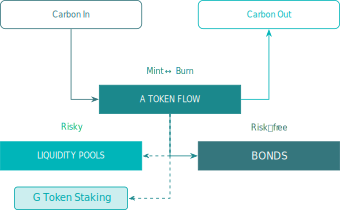
</figure>

#### 3.3.4 Share of Risky Premium

The risky premium allocation is shared between **G**&nbsp;staking,
<span class="u-overline">**AG**</span> and
<span class="u-overline">**AQ**</span>&nbsp;pools with
shares&nbsp;${tex`\lambda_{GG}`}, ${tex`\lambda_G`} and&nbsp;${tex`\lambda_Q`}
respectively.

Defining:

- ${tex`G_G`}: Total **G**&nbsp;tokens in the
<span class="u-overline">**AG**</span>&nbsp;pool, expressed as a proportion of
outstanding supply of&nbsp;**G**.

- ${tex`A_G`}: Total **A**&nbsp;tokens in the
<span class="u-overline">**AG**</span>&nbsp;pool, expressed as a proportion of
outstanding supply of&nbsp;**A**.

- ${tex`A_Q`}: Total **A**&nbsp;tokens in the
<span class="u-overline">**AQ**</span>&nbsp;pool, expressed as a proportion of
outstanding supply of&nbsp;**A**.

The allocation to **G**&nbsp;token staking, ${tex`\lambda_{GG}`}:

<div id="equation-24">

```tex
\lambda_{GG} = \frac{1 - A_Q}{1 + \left( \frac{\sum_{i=1}^{n}{G_i}}{G_G} \right)^2} \tag{24}
```

</div>

```js
function computeLambdaGG(AQ, Gi, GG) {
  return (1 - AQ) / (1 + (Gi / GG)**2);
}

function changeTranslation(dx, dy) {
  return function () {
    const svgTransformList = this.transform.baseVal;
    if (svgTransformList.length > 1) {
      throw new Error("SVGTransformList must only contain one translation");
    }
    const {e, f} = svgTransformList.consolidate().matrix;
    return `translate(${e + dx},${f + dy})`;
  }
}
```

```js
const lambdaGGData = [];
for (let paramGi = 0; paramGi < 1.01; paramGi += 0.1) {
  for (let paramAQ = 0; paramAQ < 1.01; paramAQ += 0.1) {
    lambdaGGData.push({
      key: "λ",
      aq: paramAQ,
      gi: paramGi,
      value: computeLambdaGG(paramAQ, paramGi, 1 - paramGi),
    });
  }
}
```

<figure id="figure-22" class="u-center">
<figcaption>Figure&nbsp;22: <strong>G</strong>&nbsp;Stake
  Allocation&nbsp;(assuming&nbsp;${tex`G_G = 1 - G_i`})</figcaption>

```js
const plotLambdaGG = Plot.plot({
  caption: html`Heatmap of ${tex`\lambda_{GG}`} with ${tex`G_G = 1 - G_i`}`,
  color: {
    legend: true,
    scheme: "Spectral",
    domain: [0, 1],
    type: "sequential",
    label: "λ",
  },
  x: { ticks: d3.range(0, 1.01, 0.1), label: "A  " },
  y: { ticks: d3.range(0, 1.01, 0.1), domain: [1.05, -0.05], label: "Gᵢ" },
  marks: [
    Plot.frame(),
    Plot.rect(lambdaGGData, {
      x1: d => d.aq - 0.05,
      x2: d => d.aq + 0.05,
      y1: d => d.gi - 0.05,
      y2: d => d.gi + 0.05,
      fill: "value",
    }),
    Plot.text(lambdaGGData, {
      x: "aq",
      y: "gi",
      text: d => Number.isNaN(d.value) ? "" : d.value.toLocaleString(
        "en-GB",
        { minimumFractionDigits: 2, maximumFractionDigits: 2 },
      ),
      fill: d => contrastingTextColor(
        d3.scaleSequential([0, 1], d3.interpolateSpectral)(d.value),
      ),
    }),
  ],
});

d3.select(plotLambdaGG)
  .select("g[aria-label='x-axis label']")
  .select("text")
    .clone(false)
    .attr("transform", changeTranslation(-12, 1.5))
    .attr("font-size", "0.6em")
    .attr("font-weight", "600")
    .text("Q");

display(plotLambdaGG);
```

</figure>

Noting the relationship between&nbsp;${tex`G`} and&nbsp;${tex`\beta`}, and
particularly if&nbsp;${tex`G = 0`}, ${tex`\beta = 0`}.

The residual share, ${tex`1 - λ_{GG}`}, is split between the liquidity pools:

<div id="equation-25">

```tex
\lambda_G = (1 - \lambda_{GG}) \frac{2 A_G}{2 A_G + A_Q \sqrt 2} \tag{25}
```

</div>

```js
function computeLambdaG(AQ, AG) {
  return 2 * AG / (2 * AG + AQ * Math.sqrt(2));
}
```

For completeness:

<div id="equation-26">

```tex
\lambda_Q = 1 - \lambda_{GG} - \lambda_G \tag{26}
```

</div>

```js
function computeLambdaQ(AQ, AG) {
  return 1 - computeLambdaG(AQ, AG);
}
```

```js
const lambdaGQData = [];
for (let paramAG = 0; paramAG < 1.01; paramAG += 0.1) {
  for (let paramAQ = 0; paramAQ < 1.01; paramAQ += 0.1) {
    if (paramAG + paramAQ < 1.01) {
      lambdaGQData.push({
        key: "Relative 𝗔𝗚 Liquidity Pool Share",
        aq: paramAQ,
        ag: paramAG,
        value: computeLambdaG(paramAQ, paramAG),
      });
      lambdaGQData.push({
        key: "Relative 𝗔𝗤 Liquidity Pool Share",
        aq: paramAQ,
        ag: paramAG,
        value: computeLambdaQ(paramAQ, paramAG),
      });
    }
  }
}
```

<figure id="figure-23" class="u-center">
<figcaption>Figure&nbsp;23: Liquidity Pool
  Split&nbsp;${tex`\lambda_G, \lambda_Q`}</figcaption>

```js
const plotLambdaGQ = Plot.plot({
  caption: html`Relative <span class="u-overline"><strong>AG</strong></span>
    and <span class="u-overline"><strong>AQ</strong></span>&nbsp;Liquidity Pools
    Shares`,
  aspectRatio: 1,
  color: {
    legend: true,
    scheme: "Spectral",
    domain: [0, 1],
    type: "sequential",
    label: "λ",
  },
  x: { ticks: d3.range(0, 1.01, 0.1), label: "A  " },
  y: {
    ticks: d3.range(0, 1.01, 0.1),
    domain: [1.05, -0.05],
    label: "A",
  },
  fx: { label: null },
  className: "LambdaGQ",
  marks: [
    Plot.frame(),
    Plot.rect(lambdaGQData, {
      x1: d => d.aq - 0.05,
      x2: d => d.aq + 0.05,
      y1: d => d.ag - 0.05,
      y2: d => d.ag + 0.05,
      fx: "key",
      fill: "value",
    }),
    Plot.text(lambdaGQData, {
      x: "aq",
      y: "ag",
      fx: "key",
      text: d => Number.isNaN(d.value) ? "" : d.value.toLocaleString(
        "en-GB",
        { minimumFractionDigits: 2, maximumFractionDigits: 2 },
      ),
      fill: d => contrastingTextColor(
        d3.scaleSequential([0, 1], d3.interpolateSpectral)(d.value),
      ),
    }),
  ],
});

d3.select(plotLambdaGQ)
  .select("g[aria-label='x-axis label']")
  .select("text")
  .clone(false)
    .attr("transform", changeTranslation(-12, 1.5))
    .attr("font-size", "0.6em")
    .attr("font-weight", "600")
    .text("Q");

d3.select(plotLambdaGQ)
  .select("g[aria-label='y-axis label']")
  .select("text")
    .attr("transform", changeTranslation(0, 10))
  .clone(false)
    .attr("transform", changeTranslation(14, 4.1))
    .attr("font-size", "0.6em")
    .attr("font-weight", "600")
    .text("G");

display(plotLambdaGQ);
```

</figure>

#### 3.3.5 Risky Premium Distribution

For&nbsp;${tex`\lambda_{GG}`}, ${tex`\lambda_G`}, ${tex`\lambda_Q`} we
apply&nbsp;${tex`\beta`}:

<div id="equation-27">

```tex
\Lambda_X = \lambda_X \, \beta, \quad \text{for } X \in \{GG, G, Q\} \tag{27}
```

</div>

Taking&nbsp;${tex`b`} as a discount parameter:

<div id="equation-28">

```tex
b = \frac{\sum_1^{40} Z_t \, S_t \, B_t}{\sum_1^{40} Z_t \, S_t } \tag{28}
```

</div>

The total Risky Yield tokens&nbsp;${tex`R_\lambda`}:

<div id="equation-29">

```tex
R_\lambda = b \, R \, (\Lambda_{GG} + \Lambda_G + \Lambda_Q) \tag{29}
```

</div>

The allocations of&nbsp;${tex`R_\lambda`} are pro-rata
to&nbsp;${tex`\Lambda_{GG}`}, ${tex`\Lambda_G`}, ${tex`\Lambda_Q`} and
thereafter:

1. Locked **G**: ${tex`\Lambda_{GG}`} in proportion to **G**.

2. Locked <span class="u-overline">**AG**</span>,
<span class="u-overline">**AQ**</span> tokens are allocated a
weighting&nbsp;${tex`G_t`}, ${tex`Q_t`} depending on their time
bucket&nbsp;${tex`t`}:

    <div id="equation-30">

    ```tex
    G_t = \frac{Z_t \, L_{Gt} \, B_t}{\sum Z_t \, L_{Gt} \, B_t} \tag{30}
    ```

    </div>

    <div id="equation-31">

    ```tex
    Q_t = \frac{Z_t \, L_{Qt} \, B_t}{\sum Z_t \, L_{Qt} \, B_t} \tag{31}
    ```

    </div>

    Where&nbsp;${tex`L_{Gt}`}, ${tex`L_{Qt}`} are the proportion of all
    liquidity locked in each time bucket
    for&nbsp;<span class="u-overline">**AG**</span>
    and&nbsp;<span class="u-overline">**AQ**</span> respectively.

Thereafter each time bucket allocation is proportionate to LP&nbsp;holdings.

### 3.4 Interactive Model

This additional section is not is the original PDF version of the whitepaper. It
presents an interactive model of the AAM where each parameter of interest can be
adjusted by the reader.

In
[Section&nbsp;3.4.1](#3-4-1-klima-tokens-emitted-when-the-aam-purchases-carbon),
a Carbon holder sells Carbon to the AAM in exchange for **A**&nbsp;tokens; from
the point of view of the AAM, this represents a Carbon purchase. In
[Section&nbsp;3.4.2](#3-4-2-carbon-sold-by-the-aam-when-it-burns-klima-tokens),
a holder of **A**&nbsp;tokens burns **A**&nbsp;tokens to buy Carbon from the
AAM; from the point of view of the AAM, this represents a Carbon sale.

#### 3.4.1 KLIMA Tokens Emitted When the AAM Purchases Carbon

In this section, the reader controls how many present-value tonnes of Carbon
class&nbsp;${tex`i`} are purchased by the AAM. The number of **A**&nbsp;tokens
emitted in exchange is calculated in real time. The price of Carbon
class&nbsp;${tex`i`} is calculated by dividing the number of **A**&nbsp;tokens
emitted by the AAM by the number of present-value tonnes of Carbon
class&nbsp;${tex`i`} purchased by the AAM.

|                   | Circulating **A**&nbsp;tokens | Present-value tonnes of class&nbsp;${tex`i`} in AAM |
| ----------------- | -----------------------------:| ---------------------------------------------------:|
| **Total**         | ${stringASupply}              | ${stringPresentTonnes}                              |
| **Variation**     | ${stringAEmitted}             | ${stringDeltaTonnes}                                |
| **Unit price**    | ${stringAPrice}               | ${stringBarCiPrice}                                 |

```js
function piecewiseLogTransform(xTran = 1) {
  return x => x > xTran ? Math.log(x) : x - xTran + Math.log(xTran);
}

function piecewiseLogInvert(xTran = 1) {
  return y => y > Math.log(xTran) ? Math.exp(y) : y - Math.log10(xTran) + xTran;
}

function setInput(input, value) {
  input.value = value;
  input.dispatchEvent(new Event("input", { bubbles: true }));
}
```

```js
const defaultAValue = 2e6;
const defaultASupply = 2e7;
const defaultPresentTonnes = 1e7;
const defaultDeltaTonnes = 1e2;
const defaultAi = 0.5;
const defaultGi = 0.5;

const viewAValue = Inputs.range([1e5, 1e9], {
  label: tex`\text{\textbf{A}~token USD market capitalization}`,
  step: 1,
  value: defaultAValue,
  transform: Math.log,
});
const viewASupply = Inputs.range([1e6, 1e10], {
  label: tex`\text{Circulating \textbf{A}~tokens}`,
  step: 1,
  value: defaultASupply,
  transform: Math.log,
});
const viewPresentTonnes = Inputs.range([0, 1e9], {
  label: tex`\bar C_i \text{ (present-value tonnes of class } i
    \text{ in AAM)}`,
  step: 1e-3,
  value: defaultPresentTonnes,
  transform: piecewiseLogTransform(1e-3),
  invert: piecewiseLogInvert(1e-3),
});
const viewDeltaTonnes = Inputs.range([1e-3, 1e7], {
  label: tex`\text{Present-value tonnes bought by AAM}`,
  step: 1e-3,
  value: defaultDeltaTonnes,
  transform: Math.log,
});
const viewAi = Inputs.range([0, 1], {
  label: tex`A_i \text{ (share of \textbf{A}~stake pricing class } i \text)`,
  step: 1e-6,
  value: defaultAi,
  transform: piecewiseLogTransform(1e-6),
  invert: piecewiseLogInvert(1e-6),
});
const viewGi = Inputs.range([0, 1], {
  label: tex`G_i \text{ (share of \textbf{G}~stake pricing class } i \text)`,
  step: 1e-6,
  value: defaultGi,
});
const viewZeroCarbon = Inputs.button(
  [["Zero Carbon Scenario", () => setInput(viewPresentTonnes, 0)]],
);
const viewReset = Inputs.button(
  [["Reset", () => {
    setInput(viewAValue, defaultAValue);
    setInput(viewASupply, defaultASupply);
    setInput(viewPresentTonnes, defaultPresentTonnes);
    setInput(viewDeltaTonnes, defaultDeltaTonnes);
    setInput(viewAi, defaultAi);
    setInput(viewGi, defaultGi);
  }]],
);
```

```js
const inputReset = view(viewReset);
const inputAValue = view(viewAValue);
const inputASupply = view(viewASupply);
const inputPresentTonnes = view(viewPresentTonnes);
const inputDeltaTonnes = view(viewDeltaTonnes);
const inputAi = view(viewAi);
const inputGi = view(viewGi);
display(viewZeroCarbon);
```

```js
if (inputAValue === defaultAValue && inputASupply === defaultASupply &&
        inputPresentTonnes === defaultPresentTonnes &&
        inputDeltaTonnes === defaultDeltaTonnes && inputAi === defaultAi &&
        inputGi === defaultGi) {
  viewReset.classList.add("u-hidden");
} else {
  viewReset.classList.remove("u-hidden");
}
if (inputPresentTonnes === 0) {
  viewZeroCarbon.classList.add("u-hidden");
} else {
  viewZeroCarbon.classList.remove("u-hidden");
}
```

```js
const paramDeltaA = computeTrueDeltaA(
  inputAi,
  inputGi,
  inputPresentTonnes,
  inputDeltaTonnes,
);
const paramDeltaTonnes = paramDeltaA === 0 ? 0 : inputDeltaTonnes;
const paramAEmitted = paramDeltaA * inputASupply;
const paramAPrice = inputAValue / inputASupply;
const paramBarCiPrice = inputAValue * paramDeltaA / inputDeltaTonnes;

const stringASupply = inputASupply.toLocaleString(
  "en-GB",
  {
    minimumFractionDigits: Math.max(0, 2 - numberOfDigits(paramAEmitted)),
    maximumFractionDigits: Math.max(0, 2 - numberOfDigits(paramAEmitted)),
  },
) + " KLIMA";
const stringPresentTonnes = inputPresentTonnes.toLocaleString(
  "en-GB",
  {
    minimumFractionDigits: Math.max(0, 1 - numberOfDigits(paramDeltaTonnes)),
    maximumFractionDigits: Math.max(0, 1 - numberOfDigits(paramDeltaTonnes)),
  },
) + " tCO2eq";
const stringAEmitted = "+" + paramAEmitted.toLocaleString(
  "en-GB",
  {
    minimumSignificantDigits: Math.max(2, numberOfDigits(paramAEmitted)),
    maximumSignificantDigits: Math.max(2, numberOfDigits(paramAEmitted)),
  },
) + " KLIMA";
const stringDeltaTonnes = "+" + paramDeltaTonnes.toLocaleString(
  "en-GB",
  {
    minimumSignificantDigits: Math.max(1, numberOfDigits(paramDeltaTonnes)),
    maximumSignificantDigits: Math.max(1, numberOfDigits(paramDeltaTonnes)),
  },
) + " tCO2eq";
const stringAPrice = "$" + paramAPrice.toLocaleString(
  "en-GB",
  {
    minimumSignificantDigits: Math.max(2, 2 + numberOfDigits(paramAPrice)),
    maximumSignificantDigits: Math.max(2, 2 + numberOfDigits(paramAPrice)),
  },
);
const stringBarCiPrice = "$" + paramBarCiPrice.toLocaleString(
  "en-GB",
  {
    minimumSignificantDigits: Math.max(2, 2 + numberOfDigits(paramBarCiPrice)),
    maximumSignificantDigits: Math.max(2, 2 + numberOfDigits(paramBarCiPrice)),
  },
);
```

#### 3.4.2 Carbon Sold by the AAM When it Burns KLIMA Tokens

In this section, the reader controls how many **A**&nbsp;tokens are burnt by the
AAM. The number of liquid tonnes of Carbon class&nbsp;${tex`i`} sold by the AAM
in exchange is calculated in real time. The price of Carbon is calculated by
dividing the number of **A**&nbsp;tokens burnt by the AAM by the number of
liquid tonnes of Carbon class&nbsp;${tex`i`} sold by the AAM.

|                   | Circulating **A**&nbsp;tokens | Liquid tonnes of class&nbsp;${tex`i`} in AAM |
| ----------------- | -----------------------------:| --------------------------------------------:|
| **Total**         | ${stringASupply_}             | ${stringLiquidTonnes}                        |
| **Variation**     | ${stringABurnt}               | ${stringDeltaCiTonnes}                       |
| **Unit price**    | ${stringAPrice_}              | ${stringCiPrice}                             |

```js
const defaultLiquidTonnes = 1e7;
const defaultABurnt = 1e2;
const defaultGnull = 0.5;
const defaultA = 0.5;
const defaultS = 0.5;

const viewAValue_ = Inputs.range([1e5, 1e9], {
  label: tex`\text{\textbf{A}~token USD market capitalization}`,
  step: 1,
  value: defaultAValue,
  transform: Math.log,
});
const viewASupply_ = Inputs.range([1e6, 1e10], {
  label: tex`\text{Circulating \textbf{A}~tokens}`,
  step: 1,
  value: defaultASupply,
  transform: Math.log,
});
const viewLiquidTonnes = Inputs.range([1e-3, 1e9], {
  label: tex`\text{Liquid tonnes of class } i \text{ in AAM}`,
  step: 1e-3,
  value: defaultLiquidTonnes,
  transform: Math.log,
});
const viewABurnt = Inputs.range([1e-1, 1e6], {
  label: tex`\text{\textbf{A}~tokens burnt by AAM}`,
  step: 1e-1,
  value: defaultABurnt,
  transform: Math.log,
});
const viewAi_ = Inputs.range([0, 1], {
  label: tex`A_i \text{ (share of \textbf{A}~stake pricing class } i \text)`,
  step: 1e-6,
  value: defaultAi,
  transform: piecewiseLogTransform(1e-6),
  invert: piecewiseLogInvert(1e-6),
});
const viewGi_ = Inputs.range([0, 1], {
  label: tex`G_i \text{ (share of \textbf{G}~stake pricing class } i \text)`,
  step: 1e-6,
  value: defaultGi,
});
const viewUnweighed = Inputs.button(
  [["Unweighed Carbon Class", () => setInput(viewAi, 0)]],
);
const viewReset_ = Inputs.button(
  [["Reset", () => {
    setInput(viewAValue_, defaultAValue);
    setInput(viewASupply_, defaultASupply);
    setInput(viewLiquidTonnes, defaultLiquidTonnes);
    setInput(viewABurnt, defaultABurnt);
    setInput(viewAi, defaultAi);
    setInput(viewGi, defaultGi);
  }]],
);
```

```js
const inputReset = view(viewReset_);
const inputAValue_ = view(viewAValue_);
const inputASupply_ = view(viewASupply_);
const inputLiquidTonnes = view(viewLiquidTonnes);
const inputABurnt = view(viewABurnt);
display(Inputs.bind(viewAi_, viewAi));
display(Inputs.bind(viewGi_, viewGi));
```

```js
if (inputAValue_ === defaultAValue && inputASupply_ === defaultASupply &&
        inputLiquidTonnes === defaultLiquidTonnes &&
        inputABurnt === defaultABurnt && inputAi === defaultAi &&
        inputGi === defaultGi) {
  viewReset_.classList.add("u-hidden");
} else {
  viewReset_.classList.remove("u-hidden");
}
```

```js
const paramABurnt = inputAi === 0 ? 0 : inputABurnt
const paramDeltaA_ = paramABurnt / inputASupply_;
const paramDeltaCi = inputAi === 0 ? -0 : computeDeltaCi(
  inputAi,
  inputGi,
  paramDeltaA_,
);
const paramDeltaCiTonnes = -paramDeltaCi * inputLiquidTonnes;
const paramAPrice_ = inputAValue_ / inputASupply_;
const paramCiPrice = inputAi === 0 ? 0 : inputAValue_ * paramDeltaA_ / paramDeltaCiTonnes;

const stringASupply_ = inputASupply_.toLocaleString(
  "en-GB",
  {
    minimumFractionDigits: Math.max(0, 2 - numberOfDigits(paramABurnt)),
    maximumFractionDigits: Math.max(0, 2 - numberOfDigits(paramABurnt)),
  },
) + " KLIMA";
const stringLiquidTonnes = inputLiquidTonnes.toLocaleString(
  "en-GB",
  {
    minimumFractionDigits: Math.max(0, 2 - numberOfDigits(paramDeltaCiTonnes)),
    maximumFractionDigits: Math.max(0, 2 - numberOfDigits(paramDeltaCiTonnes)),
  },
) + " tCO2eq";
const stringABurnt = "−" + paramABurnt.toLocaleString(
  "en-GB",
  {
    minimumSignificantDigits: Math.max(2, numberOfDigits(paramABurnt)),
    maximumSignificantDigits: Math.max(2, numberOfDigits(paramABurnt)),
  },
) + " KLIMA";
const stringDeltaCiTonnes = "−" + paramDeltaCiTonnes.toLocaleString(
  "en-GB",
  {
    minimumSignificantDigits: Math.max(2, numberOfDigits(paramDeltaCiTonnes)),
    maximumSignificantDigits: Math.max(2, numberOfDigits(paramDeltaCiTonnes)),
  },
) + " tCO2eq";
const stringAPrice_ = "$" + paramAPrice_.toLocaleString(
  "en-GB",
  {
    minimumSignificantDigits: Math.max(2, 2 + numberOfDigits(paramAPrice_)),
    maximumSignificantDigits: Math.max(2, 2 + numberOfDigits(paramAPrice_)),
  },
);
const stringCiPrice = "$" + paramCiPrice.toLocaleString(
  "en-GB",
  {
    minimumSignificantDigits: Math.max(2, 2 + numberOfDigits(paramCiPrice)),
    maximumSignificantDigits: Math.max(2, 2 + numberOfDigits(paramCiPrice)),
  },
);
```

## 4 Klima&nbsp;2.0 Token Distribution

### 4.1 Planned Allocations

<table id="table-3">
  <caption>Table&nbsp;3: <strong>KLIMA</strong> Token</caption>
  <thead>
    <tr>
      <th>Cohort
      <th class="u-center">Proportion
      <th class="u-center">Quantity&nbsp;(m)
  </thead>
  <tbody>
    <tr>
      <td>Klima Holders
      <td class="u-center">87.5%
      <td class="u-center">17.5
    <tr>
      <td>DAO / Treasury
      <td class="u-center">10%
      <td class="u-center">2.0
    <tr>
      <td>01X
      <td class="u-center">2.5%
      <td class="u-center">0.5
    <tr>
      <td>Total
      <td class="u-center">
      <td class="u-center">20
  </tbody>
</table>

<table id="table-4">
  <caption>Table&nbsp;4: <strong>KlimaX</strong> Token</caption>
  <thead>
    <tr>
      <th>Cohort
      <th class="u-center">Proportion
      <th class="u-center">Quantity&nbsp;(m)
      <th>Liquidity
  </thead>
  <tbody>
    <tr>
      <td>Klima Holders
      <td class="u-center">40%
      <td class="u-center">40
      <td>Logistic Vesting 48&nbsp;months
    <tr>
      <td>Ecosystem Grant
      <td class="u-center">5%
      <td class="u-center">5
      <td>Logistic Vesting 48&nbsp;months
    <tr class="u-gray">
      <td>Programmatic Incentives
      <td class="u-center">40%
      <td class="u-center">40
      <td>Incentive Curve
    <tr>
      <td>pKlima Holders
      <td class="u-center">3%
      <td class="u-center">3
      <td>Logistic Vesting 48&nbsp;months
    <tr>
      <td>DAO / Treasury
      <td class="u-center">4.5%
      <td class="u-center">4.5
      <td>24&nbsp;month locked&nbsp;LP
        of&nbsp;<span class="u-overline"><strong>AG</strong></span>
    <tr>
      <td>01X
      <td class="u-center">2.5%
      <td class="u-center">2.5
      <td>24&nbsp;month locked&nbsp;LP
        of&nbsp;<span class="u-overline"><strong>AG</strong></span>
    <tr>
      <td>Product Design and Development
      <td class="u-center">5%
      <td class="u-center">5
      <td>Logistic Vesting 48&nbsp;months
    <tr>
      <td>Total
      <td>
      <td class="u-center">100
      <td>
  </tbody>
</table>

```js
const allocInitGData = [];
for (let i = 0; i < 100.01; i += 0.25) {
  if (i < 2.51) {
    allocInitGData.push({ key: "01X", value: i });
  }
  if (2.49 < i && i < 5.51) {
    allocInitGData.push({ key: "pKlima Holders", value: i });
  }
  if (5.49 < i && i < 10.01) {
    allocInitGData.push({ key: "DAO / Treasury", value: i });
  }
  if (9.99 < i && i < 15.01) {
    allocInitGData.push({ key: "Ecosystem Grant", value: i });
  }
  if (14.99 < i && i < 20.01) {
    allocInitGData.push({ key: "Product Design", value: i });
  }
  if (19.99 < i && i < 60.01) {
    allocInitGData.push({ key: "Klima Holders", value: i });
  }
  if (59.99 < i) {
    allocInitGData.push({ key: "Incentives", value: i });
  }
}
const longitudeScale = d3.scaleLinear([180, -180]);
const getCenter = d =>
        [1.25, 4, 7.75, 12.5, 17.5, 40, 80].includes(d.value) ? d.value : NaN;

const cohortsDomain = [
      "Incentives",
      "Klima Holders",
      "Product Design",
      "Ecosystem Grant",
      "DAO / Treasury",
      "pKlima Holders",
      "01X",
    ];
```

<figure id="figure-24" class="u-center">
<figcaption>Figure&nbsp;24: <strong>KlimaX</strong>&nbsp;Token
  Allocations</figcaption>

```js
Plot.plot({
  projection: { type: "azimuthal-equidistant", rotate: [0, -90], scale: 2 },
  color: { legend: true, range: d3.schemeCategory10, domain: cohortsDomain },
  marks: [
    Plot.area(allocInitGData, {
      x1: ({ value }) => longitudeScale(value / 100),
      y1: -20,
      x2: ({ value }) => longitudeScale(value / 100),
      y2: -70,
      fill: "key",
    }),
  ]
})
```

</figure>

### 4.2 Programmatic Incentive Curve

The incentive issuance is built on a logistic function,
${tex`\operatorname{P}`}, to generate total proportion of supply in issue. It is
calibrated from the initial issuance at&nbsp;TGE&nbsp;${tex`P_0`} and the
inflection point time&nbsp;${tex`T`} where&nbsp;50% of **G**&nbsp;token
incentives have been released.

Setting&nbsp;${tex`x_0`} from the initial supply parameter:

<div id="equation-32">

```tex
x_0 = \ln\left( \frac{P_0}{1 - P_0} \right) \tag{32}
```

</div>

With ${tex`x_t`} at time point&nbsp;${tex`t \in (0, \infty)`}:

<div id="equation-33">

```tex
x_t = x_0 \, \left( 1 - \frac t T \right) \tag{33}
```

</div>

Giving supply function ${tex`\operatorname{P}(t)`} as:

<div id="equation-34">

```tex
\operatorname{P}(t) = \frac{\exp(x_t)}{\exp(x_t) + 1} \tag{34}
```

</div>

${tex`P_0`} set at&nbsp;${
  inputP0.toLocaleString(
    "en-GB",
    { style: "percent", maximumFractionDigits: 0 },
  )
} and&nbsp;${tex`T`} at ${
  inputT.toLocaleString("en-GB", { maximumFractionDigits: 0 })
}&nbsp;months:

```js
function computeP(t, P0, T) {
  const x0 = Math.log(P0 / (1 - P0));
  const xt = x0 * (1 - t / T);
  const exp = Math.exp(xt);
  return exp / (exp + 1);
}

function computeDerivP(t, P0, T) {
  const x0 = Math.log(P0 / (1 - P0));
  const xt = x0 * (1 - t / T);
  const exp = Math.exp(xt);
  const P = exp / (1 + exp);
  return -(x0 / T) * P * (1 - P);
}

function getVesting(vecVesting, t, tStart, tEnd) {
  if (t < tStart)
    return 0;
  else if (t < tEnd) {
    return vecVesting[t - tStart];
  } else {
    return vecVesting[tEnd - tStart - 1];
  }
}
```

```js
const tVestStart = 3;
const tVestEnd = 2 * inputT;
const tVesting = d3.range(tVestStart, tVestEnd);
const vecVestingDeriv = normalize(tVesting.map(t =>
  computeDerivP(t, inputP0, inputT)
));
const vecVesting = d3.cumsum(vecVestingDeriv);

let paramVestingPrevious = 0;
const vecSupplyIncentives = [];
const vecSupplyCirculating = [];
const supplyData = [];
for (let t = 0; t <= 72; t++) {
  const paramP = computeP(t, inputP0, inputT);
  const paramDerivP = computeDerivP(t, inputP0, inputT);
  const paramVesting = getVesting(vecVesting, t, tVestStart, tVestEnd);
  const paramVestingDiff = paramVesting - paramVestingPrevious;
  paramVestingPrevious = paramVesting;

  const supply01X = 2.5;
  const supplyPKlima = 3 * paramVesting;
  const supplyTreasury = 4.5;
  const supplyGrant = 5 * paramVesting;
  const supplyProduct = 5 * paramVesting;
  const supplyKlima = 40 * paramVesting;
  const supplyIncentives = 40 * paramP;
  vecSupplyIncentives.push(supplyIncentives);

  const supply01XStacked = supply01X;
  const supplyPKlimaStacked = supplyPKlima + supply01XStacked;
  const supplyTreasuryStacked = supplyTreasury + supplyPKlimaStacked;
  const supplyGrantStacked = supplyGrant + supplyTreasuryStacked;
  const supplyProductStacked = supplyProduct + supplyGrantStacked;
  const supplyKlimaStacked = supplyKlima + supplyProductStacked;
  const supplyIncentivesStacked = supplyIncentives + supplyKlimaStacked;
  const supplyCirculating = supplyIncentivesStacked / 100;
  vecSupplyCirculating.push(supplyIncentivesStacked);

  if (t <= 60) {
    const diffIncentives = 40 * paramDerivP;
    const diffKlima = 40 * paramVestingDiff;
    const diffProduct = 5 * paramVestingDiff;
    const diffGrant = 5 * paramVestingDiff;
    const diffPKlima = 3 * paramVestingDiff;
    const diffTreasury = t === 0 ? 4.5: 0;
    const diff01X = t === 0 ? 2.5 : 0;

    const diffIncentivesStacked = diffIncentives;
    const diffKlimaStacked = diffKlima + diffIncentivesStacked;
    const diffProductStacked = diffProduct + diffKlimaStacked;
    const diffGrantStacked = diffGrant + diffProductStacked;
    const diffPKlimaStacked = diffPKlima + diffGrantStacked;
    const diffTreasuryStacked = diffTreasury + diffPKlimaStacked;
    const diff01XStacked = diff01X + diffTreasuryStacked;

    supplyData.push({
      key: "Proportion of Supply",
      x: t,
      y: 100 * paramP,
    });
    supplyData.push({
      key: "Rate of Change",
      x: t,
      y: 100 * paramDerivP,
    });

    supplyData.push({
      key: "Circulating Supply (Stacked)",
      cohort: "01X",
      x: t,
      y: supply01XStacked / supplyCirculating,
    });
    supplyData.push({
      key: "Circulating Supply (Stacked)",
      cohort: "pKlima Holders",
      x: t,
      y: supplyPKlimaStacked / supplyCirculating,
    });
    supplyData.push({
      key: "Circulating Supply (Stacked)",
      cohort: "DAO / Treasury",
      x: t,
      y: supplyTreasuryStacked / supplyCirculating,
    });
    supplyData.push({
      key: "Circulating Supply (Stacked)",
      cohort: "Ecosystem Grant",
      x: t,
      y: supplyGrantStacked / supplyCirculating,
    });
    supplyData.push({
      key: "Circulating Supply (Stacked)",
      cohort: "Product Design",
      x: t,
      y: supplyProductStacked / supplyCirculating,
    });
    supplyData.push({
      key: "Circulating Supply (Stacked)",
      cohort: "Klima Holders",
      x: t,
      y: supplyKlimaStacked / supplyCirculating,
    });
    supplyData.push({
      key: "Circulating Supply (Stacked)",
      cohort: "Incentives",
      x: t,
      y: supplyIncentivesStacked / supplyCirculating,
    });

    supplyData.push({
      key: "Circulating Supply (Unstacked)",
      cohort: "01X",
      x: t,
      y: supply01X / supplyCirculating,
    });
    supplyData.push({
      key: "Circulating Supply (Unstacked)",
      cohort: "pKlima Holders",
      x: t,
      y: supplyPKlima / supplyCirculating,
    });
    supplyData.push({
      key: "Circulating Supply (Unstacked)",
      cohort: "DAO / Treasury",
      x: t,
      y: supplyTreasury / supplyCirculating,
    });
    supplyData.push({
      key: "Circulating Supply (Unstacked)",
      cohort: "Ecosystem Grant",
      x: t,
      y: supplyGrant / supplyCirculating,
    });
    supplyData.push({
      key: "Circulating Supply (Unstacked)",
      cohort: "Product Design",
      x: t,
      y: supplyProduct / supplyCirculating,
    });
    supplyData.push({
      key: "Circulating Supply (Unstacked)",
      cohort: "Klima Holders",
      x: t,
      y: supplyKlima / supplyCirculating,
    });
    supplyData.push({
      key: "Circulating Supply (Unstacked)",
      cohort: "Incentives",
      x: t,
      y: supplyIncentives / supplyCirculating,
    });

    supplyData.push({
      key: "Total Supply (Stacked)",
      cohort: "01X",
      x: t,
      y: supply01XStacked,
    });
    supplyData.push({
      key: "Total Supply (Stacked)",
      cohort: "pKlima Holders",
      x: t,
      y: supplyPKlimaStacked,
    });
    supplyData.push({
      key: "Total Supply (Stacked)",
      cohort: "DAO / Treasury",
      x: t,
      y: supplyTreasuryStacked,
    });
    supplyData.push({
      key: "Total Supply (Stacked)",
      cohort: "Ecosystem Grant",
      x: t,
      y: supplyGrantStacked,
    });
    supplyData.push({
      key: "Total Supply (Stacked)",
      cohort: "Product Design",
      x: t,
      y: supplyProductStacked,
    });
    supplyData.push({
      key: "Total Supply (Stacked)",
      cohort: "Klima Holders",
      x: t,
      y: supplyKlimaStacked,
    });
    supplyData.push({
      key: "Total Supply (Stacked)",
      cohort: "Incentives",
      x: t,
      y: supplyIncentivesStacked,
    });

    supplyData.push({
      key: "Total Supply (Unstacked)",
      cohort: "01X",
      x: t,
      y: supply01X,
    });
    supplyData.push({
      key: "Total Supply (Unstacked)",
      cohort: "pKlima Holders",
      x: t,
      y: supplyPKlima,
    });
    supplyData.push({
      key: "Total Supply (Unstacked)",
      cohort: "DAO / Treasury",
      x: t,
      y: supplyTreasury,
    });
    supplyData.push({
      key: "Total Supply (Unstacked)",
      cohort: "Ecosystem Grant",
      x: t,
      y: supplyGrant,
    });
    supplyData.push({
      key: "Total Supply (Unstacked)",
      cohort: "Product Design",
      x: t,
      y: supplyProduct,
    });
    supplyData.push({
      key: "Total Supply (Unstacked)",
      cohort: "Klima Holders",
      x: t,
      y: supplyKlima,
    });
    supplyData.push({
      key: "Total Supply (Unstacked)",
      cohort: "Incentives",
      x: t,
      y: supplyIncentives,
    });

    supplyData.push({
      key: "Total Supply Differential (Unstacked)",
      cohort: "Incentives",
      x: t,
      y: diffIncentives,
    });
    supplyData.push({
      key: "Total Supply Differential (Unstacked)",
      cohort: "Klima Holders",
      x: t,
      y: diffKlima,
    });
    supplyData.push({
      key: "Total Supply Differential (Unstacked)",
      cohort: "Product Design",
      x: t,
      y: diffProduct,
    });
    supplyData.push({
      key: "Total Supply Differential (Unstacked)",
      cohort: "Ecosystem Grant",
      x: t,
      y: diffGrant,
    });
    supplyData.push({
      key: "Total Supply Differential (Unstacked)",
      cohort: "pKlima Holders",
      x: t,
      y: diffPKlima,
    });
    supplyData.push({
      key: "Total Supply Differential (Unstacked)",
      cohort: "DAO / Treasury",
      x: t,
      y: diffTreasury,
    });
    supplyData.push({
      key: "Total Supply Differential (Unstacked)",
      cohort: "01X",
      x: t,
      y: diff01X,
    });
  }
}

const vecNextYearIncentives = vecSupplyIncentives.map((val, t) =>
  vecSupplyIncentives[t + 12] - val);
const vecAPY = vecSupplyCirculating.map((val, t) =>
  100 * (vecSupplyCirculating[t + 12] - val) / val);
const vecAPR = vecSupplyCirculating.map((val, t) =>
  100 * (vecSupplyCirculating[t + 12] - vecNextYearIncentives[t] - val) / val);

for (let t = 0; t <= 60; t++) {
  supplyData.push({ key: "APY", x: t, y: vecAPY[t] });
  supplyData.push({ key: "APR", x: t, y: vecAPR[t] });
}

const getLogisticCurve = d => d.key === "Proportion of Supply" ? d.y : NaN;
const getRateOfChange = d => d.key === "Rate of Change" ? d.y : NaN;
const getCirculatingStacked = d =>
        d.key === "Circulating Supply (Stacked)" ? d.y : NaN;
const getCirculatingUnstacked = d =>
        d.key === "Circulating Supply (Unstacked)" ? d.y : NaN;
const getTotalStacked = d => d.key === "Total Supply (Stacked)" ? d.y : NaN;
const getTotalUnstacked = d => d.key === "Total Supply (Unstacked)" ? d.y : NaN;
const getDiffUnstacked = d =>
        d.key === "Total Supply Differential (Unstacked)" ? d.y : NaN;
const getCohortCirculatingStacked = d =>
        d.key === "Circulating Supply (Stacked)" ? d.cohort : NaN;
const getCohortCirculatingUnstacked = d =>
        d.key === "Circulating Supply (Unstacked)" ? d.cohort : NaN;
const getCohortTotalStacked = d =>
        d.key === "Total Supply (Stacked)" ? d.cohort : NaN;
const getCohortTotalUnstacked = d =>
        d.key === "Total Supply (Unstacked)" ? d.cohort : NaN;
const getCohortDiffUnstacked = d =>
        d.key === "Total Supply Differential (Unstacked)" ? d.cohort : NaN;
const getAPY = d => d.key === "APY" ? d.y : NaN;
const getAPR = d => d.key === "APR" ? d.y : NaN;

const domainRateOfChange = [0, d3.max(supplyData, getRateOfChange)];
const scaleRateOfChange = d3.scaleLinear(domainRateOfChange, [0, 100]);
const mapScaleRateOfChange = x => x.map(scaleRateOfChange);

const stringP0 = "Initial Issuance P₀ = " + inputP0.toLocaleString(
  "en-GB",
  { style: "percent", maximumFractionDigits: 0 },
);
const stringT = "Inflection Point Time T = " + inputT.toLocaleString(
  "en-GB",
  { maximumFractionDigits: 0 },
) + " months";

const supplyParams = [
  { key: stringP0, x: 0.5, y: 100 * inputP0 },
  { key: stringT, x: inputT, y: 50 },
];
```

<figure id="figure-25" class="u-center">
<figcaption>Figure&nbsp;25: Incentive Issuance</figcaption>

```js
Plot.plot({
  caption: "Logistic Curve",
  color: {
    legend: true,
    range: [5, 7, 0, 2].map(i => d3.schemeCategory10[i]),
    domain: ["Proportion of Supply", "Rate of Change", stringP0, stringT],
  },
  x: { ticks: d3.range(0, 60.1, 12), label: "‘Life’ Span (Months)", grid: true },
  y: { domain: [0, 100] },
  insetTop: 16,
  clip: true,
  marks: [
    Plot.frame(),
    Plot.axisY({ anchor: "left", label: "Proportion of Supply (%)" }),
    Plot.axisY(scaleRateOfChange.ticks(), {
      anchor: "right",
      tickFormat: scaleRateOfChange.tickFormat(),
      label: "Rate of Change (%/Month)",
      y: scaleRateOfChange
    }),
    Plot.lineY(supplyData, Plot.mapY(mapScaleRateOfChange, {
      x: "x",
      y: getRateOfChange,
      stroke: "key",
      strokeWidth : 2,
      strokeDasharray: 4,
    })),
    Plot.lineY(supplyData, {
      x: "x",
      y: getLogisticCurve,
      stroke: "key",
      strokeWidth : 2,
    }),
    Plot.areaY(supplyData, Plot.mapY(mapScaleRateOfChange, {
      x: "x",
      y: getRateOfChange,
      fill: "key",
      fillOpacity: 0.3,
    })),
    Plot.areaY(supplyData, {
      x: "x",
      y: getLogisticCurve,
      fill: "key",
      fillOpacity: 0.3,
    }),
    Plot.ruleX(supplyParams, {
      x: d => d.key === stringT ? d.x : NaN,
      y: "y",
      stroke: "key",
      strokeWidth : 2,
      strokeDasharray: 4,
    }),
    Plot.dotY(supplyParams, {
      x: "x",
      y: "y",
      r: 5,
      fill: "key",
    }),
  ]
})
```

</figure>

```js
const inputP0 = view(Inputs.range([0.01, 0.5], {
  label: tex`P_0 \text{ (initial issuance at TGE)}`,
  step: 0.01,
  value: 0.07,
}));
const inputT = view(Inputs.range([2, 60], {
  label: tex`T \text{ (inflection point time in months)}`,
  step: 1,
  value: 24,
}));
```

<figure id="figure-26" class="u-center">
<figcaption>Figure&nbsp;26: <strong>KlimaX</strong>&nbsp;Token Supply Over
  Time</figcaption>

```js
Plot.plot({
  caption: "Cohort: Circulating Supply (Stacked)",
  color: { legend: true, range: d3.schemeCategory10, domain: cohortsDomain },
  x: { ticks: d3.range(0, 60.1, 12), label: "Time (Months)", grid: true },
  y: { domain: [0, 100], label: "Circulating Supply (%)", grid: true },
  clip: true,
  marks: [
    Plot.frame(),
    Plot.lineY(supplyData, {
      x: "x",
      y: getCirculatingStacked,
      stroke: getCohortCirculatingStacked,
      strokeWidth : 2,
    }),
    Plot.areaY(supplyData, {
      x: "x",
      y: getCirculatingUnstacked,
      fill: getCohortCirculatingUnstacked,
      fillOpacity: 0.5,
    }),
  ]
})
```

```js
Plot.plot({
  caption: "Cohort: Total Supply (Stacked)",
  color: { legend: true, range: d3.schemeCategory10, domain: cohortsDomain },
  x: { ticks: d3.range(0, 60.1, 12), label: "Time (Months)", grid: true },
  y: { domain: [0, 100], label: "Total Supply (%)", grid: true },
  clip: true,
  marks: [
    Plot.frame(),
    Plot.lineY(supplyData, {
      x: "x",
      y: getTotalStacked,
      stroke: getCohortTotalStacked,
      strokeWidth : 2,
    }),
    Plot.areaY(supplyData, {
      x: "x",
      y: getTotalUnstacked,
      fill: getCohortTotalUnstacked,
      fillOpacity: 0.5,
    }),
  ]
})
```

```js
Plot.plot({
  caption: "Cohort: Total Supply (Unstacked)",
  color: { legend: true, range: d3.schemeCategory10, domain: cohortsDomain },
  x: { ticks: d3.range(0, 60.1, 12), label: "Time (Months)", grid: true },
  y: { label: "Total Supply (%)", grid: true },
  insetTop: 16,
  clip: true,
  marks: [
    Plot.frame(),
    Plot.lineY(supplyData, {
      x: "x",
      y: getTotalUnstacked,
      stroke: getCohortTotalUnstacked,
      strokeWidth : 2,
    }),
    Plot.areaY(supplyData, {
      x: "x",
      y1: 0,
      y2: getTotalUnstacked,
      fill: getCohortTotalUnstacked,
      fillOpacity: 0.2,
    }),
  ]
})
```

</figure>

<figure id="figure-27" class="u-center">
<figcaption>Figure&nbsp;27: <strong>KlimaX</strong>&nbsp;Token Supply Risk
  Metrics</figcaption>

```js
Plot.plot({
  caption: "Total Supply Differential (Stacked)",
  color: { legend: true, range: d3.schemeCategory10, domain: cohortsDomain },
  x: { ticks: d3.range(0, 60.1, 12), label: "Time (Months)", grid: true },
  y: { label: "Rate of Growth (%/Month)", grid: true },
  insetTop: 16,
  clip: true,
  marks: [
    Plot.frame(),
    Plot.rectY(supplyData, {
      x: "x",
      y: getDiffUnstacked,
      fill: getCohortDiffUnstacked,
    }),
  ]
})
```

```js
Plot.plot({
  caption: "Utility Incentive Yield",
  color: {
    legend: true,
    range: [9, 8].map(i => d3.schemeCategory10[i]),
    domain: ["APY", "APR"],
  },
  x: { ticks: d3.range(0, 60.1, 12), label: "Time (Months)", grid: true },
  y: {
    domain: [0, Math.max(d3.max(vecAPR), d3.max(vecAPY))],
    label: "Annual Percentage (%)",
    grid: true,
  },
  insetTop: 16,
  clip: true,
  marks: [
    Plot.frame(),
    Plot.lineY(supplyData, {
      x: "x",
      y: getAPY,
      stroke: "key",
      strokeWidth : 2,
    }),
    Plot.areaY(supplyData, {
      x: "x",
      y1: 0,
      y2: getAPY,
      fill: "key",
      fillOpacity: 0.2,
    }),
    Plot.lineY(supplyData, {
      x: "x",
      y: getAPR,
      stroke: "key",
      strokeWidth : 2,
      strokeDasharray: 4,
    }),
  ]
})
```

</figure>

### 4.3 Incentive Allocations

<figure id="figure-28" class="u-center">
<figcaption>Figure&nbsp;28: <strong>G</strong>&nbsp;Token Incentive Distribution
  Structure</figcaption>
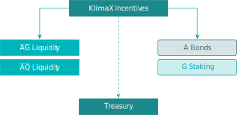
</figure>

The **relative utilisation** measurement factor&nbsp;${tex`\upsilon`} is
calculated as follows.

Defining initially:

- ${tex`G`}: Total **G**&nbsp;tokens staked expressed as a proportion of
circulating supply, ${tex`G \in [0, 1]`}.

- ${tex`L`}: Total **G**&nbsp;tokens held in the
<span class="u-overline">**AG**</span>&nbsp;pool expressed as a proportion of
circulating supply, ${tex`L \in (0, 1]`}.

Where ${tex`\upsilon = 0`} if ${tex`G + L = 0`}, otherwise:

<div id="equation-35">

```tex
\upsilon = \left( \frac{2 G L}{G^2 + L^2} \right)^2 \tag{35}
```

</div>

```js
function computeUpsilon(G, L) {
  if (G === 0 && L === 0) {
    return 0;
  } else {
    return (2 * G * L / (G**2 + L**2))**2;
  }
}
```

```js
const upsilonData = [];
for (let paramG = 0; paramG < 1.01; paramG += 0.05) {
  for (let paramL = 0; paramL < 1.01; paramL += 0.05) {
    if (paramG + paramL < 1.01) {
      upsilonData.push({
        key: "υ",
        l: paramL,
        g: paramG,
        value: computeUpsilon(paramG, paramL),
      });
    }
  }
}
```

<figure id="figure-29" class="u-center">
<figcaption>Figure&nbsp;29: Upsilon&nbsp;${tex`\upsilon`} range of
  values</figcaption>

```js
Plot.plot({
  caption: html`Range of ${tex`\upsilon`}`,
  aspectRatio: 1,
  color: {
    legend: true,
    scheme: "Spectral",
    domain: [0, 1],
    type: "sequential",
    label: "Relative Utilisation υ",
  },
  x: { ticks: d3.range(0, 1.01, 0.1), label: "Liquidity L" },
  y: {
    ticks: d3.range(0, 1.01, 0.1),
    domain: [1.025, -0.025],
    label: "Stake G",
  },
  marks: [
    Plot.frame(),
    Plot.rect(upsilonData, {
      x1: d => d.l - 0.025,
      x2: d => d.l + 0.025,
      y1: d => d.g - 0.025,
      y2: d => d.g + 0.025,
      fill: "value",
    }),
    Plot.text(upsilonData, {
      x: "l",
      y: "g",
      text: d => Number.isNaN(d.value) ? "" : d.value.toLocaleString(
        "en-GB",
        { minimumFractionDigits: 2, maximumFractionDigits: 2 },
      ),
      fill: d => contrastingTextColor(
        d3.scaleSequential([0, 1], d3.interpolateSpectral)(d.value),
      ),
    }),
  ],
})
```

</figure>

The **absolute utilisation** parameter&nbsp;${tex`\eta`} is defined
as&nbsp;${tex`\eta = 0`} if ${tex`G + L = 0`}, otherwise:

<div id="equation-36">

```tex
\eta = \frac{2 G L}{G (1 - G) + L ( 1 - L)} \tag{36}
```

</div>

```js
function computeEta(G, L) {
  if (G === 0 && L === 0) {
    return 0;
  } else {
    return 2 * G * L / (G * (1 - G) + L * (1 - L));
  }
}
```

```js
const etaData = [];
for (let paramG = 0; paramG < 1.01; paramG += 0.05) {
  for (let paramL = 0; paramL < 1.01; paramL += 0.05) {
    if (paramG + paramL < 1.01) {
      etaData.push({
        key: "η",
        l: paramL,
        g: paramG,
        value: computeEta(paramG, paramL),
      });
    }
  }
}
```

```js
Plot.plot({
  caption: html`Range of ${tex`\eta`}`,
  aspectRatio: 1,
  color: {
    legend: true,
    scheme: "Spectral",
    domain: [0, 1],
    type: "sequential",
    label: "Absolute Utilisation η",
  },
  x: { ticks: d3.range(0, 1.01, 0.1), label: "Liquidity L" },
  y: {
    ticks: d3.range(0, 1.01, 0.1),
    domain: [1.025, -0.025],
    label: "Stake G",
  },
  marks: [
    Plot.frame(),
    Plot.rect(etaData, {
      x1: d => d.l - 0.025,
      x2: d => d.l + 0.025,
      y1: d => d.g - 0.025,
      y2: d => d.g + 0.025,
      fill: "value",
    }),
    Plot.text(etaData, {
      x: "l",
      y: "g",
      text: d => Number.isNaN(d.value) ? "" : d.value.toLocaleString(
        "en-GB",
        { minimumFractionDigits: 2, maximumFractionDigits: 2 },
      ),
      fill: d => contrastingTextColor(
        d3.scaleSequential([0, 1], d3.interpolateSpectral)(d.value),
      ),
    }),
  ],
})
```

Incentives&nbsp;${tex`I`} are allocated as follows:

<p id="4-3-1-treasury" tabindex="-1">
  <a class="observablehq-header-anchor" href="#4-3-1-treasury">
    <strong>Treasury</strong>
  </a>

The allocation to the Treasury&nbsp;${tex`I_T`} is the imbalance generated
from&nbsp;${tex`\upsilon`}:

<div id="equation-37">

```tex
I_T = 1 - \upsilon \, \eta \tag{37}
```

</div>

```js
function computeTreasury(G, L) {
  return Math.max(0, 1 - computeUpsilon(G, L) * computeEta(G, L));
}
```

<p id="4-3-2-post-treasury" tabindex="-1">
  <a class="observablehq-header-anchor" href="#4-3-2-post-treasury">
    <strong>Post Treasury</strong>
  </a>

The residual post Treasury allocation is shared four ways within 2&nbsp;buckets:

1. <p id="4-3-2-1-a-bonds-and-g-staking" tabindex="-1">
    <a class="observablehq-header-anchor" href="#4-3-2-1-a-bonds-and-g-staking">
      <strong>A Bonds & G Staking</strong>
    </a>

    Where&nbsp;${tex`S`} is the proportion of **A**&nbsp;tokens that are staked
    for Bonds&nbsp;(as defined previously in
    [Section&nbsp;3.1](#3-1-bond-market)):

    1. **A**&nbsp;Bonds, ${tex`I_S`}:

        <div id="equation-38">

        ```tex
        I_S = S \, \frac{L^2}{G^2 + L^2} \tag{38}
        ```

        </div>


    2. **G**&nbsp;Staking, ${tex`I_G`}:

        <div id="equation-39">

        ```tex
        I_G = (1 − S) \, \frac{L^2}{G^2 + L^2} \tag{39}
        ```

        </div>

```js
function computeIBonds(G, L, S) {
  if (G === 0 && L === 0) {
    return 0;
  } else {
    return S * L**2 / (G**2 + L**2);
  }
}

function computeIStaking(G, L, S) {
  if (G === 0 && L === 0) {
    return 0;
  } else {
    return (1 - S) * L**2 / (G**2 + L**2);
  }
}
```

2. <p id="4-3-2-2-liquidity" tabindex="-1">
    <a class="observablehq-header-anchor" href="#4-3-2-2-liquidity">
      <strong>Liquidity</strong>
    </a>

    With&nbsp;${tex`\lambda_G`}, ${tex`\lambda_Q`}, ${tex`\lambda_{GG}`} as
    defined in [Section&nbsp;3.3.4](#3-3-4-share-of-risky-premium):

    3. <span class="u-overline">**AG**</span>&nbsp;Pool&nbsp;${tex`I_{AG}`}:

        <div id="equation-40">

        ```tex
        I_{AG} = \frac{\lambda_G}{1 - \lambda_{GG}} \, \frac{G^2}{G^2 + L^2}
          \tag{40}
        ```

        </div>

    4. <span class="u-overline">**AQ**</span>&nbsp;Pool&nbsp;${tex`I_{AQ}`}:

        <div id="equation-41">

        ```tex
        I_{AQ} = \frac{\lambda_Q}{1 - \lambda_{GG}} \, \frac{G^2}{G^2 + L^2}
          \tag{41}
        ```

        </div>

```js
function computeIPool(G, L, weight) {
  if (G === 0 && L === 0) {
    return 0;
  } else {
    return weight * G**2 / (G**2 + L**2);
  }
}
```

```js
const allocationSQData = [];
for (let paramG = 0; paramG < 1.01; paramG += 0.1) {
  for (let paramL = 0; paramL < 1.01; paramL += 0.1) {
    if (paramG + paramL < 1.01) {
      allocationSQData.push({
        key: "𝗔 Bonds Allocation",
        l: paramL,
        g: paramG,
        value: computeIBonds(paramG, paramL, inputS_),
      });
      allocationSQData.push({
        key: "𝗚 Staking Allocation",
        l: paramL,
        g: paramG,
        value: computeIStaking(paramG, paramL, inputS_),
      });
    }
  }
}
```

<figure id="figure-30" class="u-center">
<figcaption>Figure&nbsp;30: Share of Non-Treasury Incentives&nbsp;${tex`I_S`},
  ${tex`I_G`}, ${tex`I_{AG}`} and&nbsp;${tex`I_{AQ}`}</figcaption>

```js
const plotAllocationSQ = Plot.plot({
  caption: html`1. <strong>A</strong>&nbsp;Bonds and
    <strong>G</strong>&nbsp;Staking Allocations&nbsp;${tex`I_S`}
    and&nbsp;${tex`I_G`}`,
  aspectRatio: 1,
  color: {
    legend: true,
    scheme: "Spectral",
    domain: [0, 1],
    type: "sequential",
    label: "Allocation I",
  },
  x: { ticks: d3.range(0, 1.01, 0.1), label: "Liquidity L" },
  y: {
    ticks: d3.range(0, 1.01, 0.1),
    domain: [1.05, -0.05],
    label: "Stake G",
  },
  fx: { label: null },
  marks: [
    Plot.frame(),
    Plot.rect(allocationSQData, {
      x1: d => d.l - 0.05,
      x2: d => d.l + 0.05,
      y1: d => d.g - 0.05,
      y2: d => d.g + 0.05,
      fx: "key",
      fill: "value",
    }),
    Plot.text(allocationSQData, {
      x: "l",
      y: "g",
      fx: "key",
      text: d => Number.isNaN(d.value) ? "" : d.value.toLocaleString(
        "en-GB",
        { minimumFractionDigits: 2, maximumFractionDigits: 2 },
      ),
      fill: d => contrastingTextColor(
        d3.scaleSequential([0, 1], d3.interpolateSpectral)(d.value),
      ),
    }),
  ],
});

d3.select(plotAllocationSQ)
  .select("g[aria-label='y-axis label']")
  .select("text")
    .attr("transform", changeTranslation(0, 10));

display(plotAllocationSQ);
```

```js
const inputS_ = view(Inputs.range([1, 0], {
  label: tex`S \text{ (share of } A \text{ tokens staked for bonds)}`,
  step: 0.01,
  value: 0.5,
}));
```

```js
const allocationPoolData = [];
for (let paramG = 0; paramG < 1.01; paramG += 0.1) {
  for (let paramL = 0; paramL < 1.01; paramL += 0.1) {
    if (paramG + paramL < 1.01) {
      allocationPoolData.push({
        key: "𝗔𝗚 Pool Allocation",
        l: paramL,
        g: paramG,
        value: computeIPool(paramG, paramL, inputWeightAG),
      });
      allocationPoolData.push({
        key: "𝗔𝗤 Pool Allocation",
        l: paramL,
        g: paramG,
        value: computeIPool(paramG, paramL, paramWeightAQ),
      });
    }
  }
}
```

```js
const plotAllocationPool = Plot.plot({
  caption: html`2. <span class="u-overline"><strong>AG</strong></span>
    and&nbsp;<span class="u-overline"><strong>AQ</strong></span>&nbsp;Liquidity
    Pools Allocations&nbsp;${tex`I_{AG}`} and&nbsp;${tex`I_{AQ}`}`,
  aspectRatio: 1,
  color: {
    legend: true,
    scheme: "Spectral",
    domain: [0, 1],
    type: "sequential",
    label: "Allocation I",
  },
  x: { ticks: d3.range(0, 1.01, 0.1), label: "Liquidity L" },
  y: {
    ticks: d3.range(0, 1.01, 0.1),
    domain: [1.05, -0.05],
    label: "Stake G",
  },
  fx: { label: null },
  marks: [
    Plot.frame(),
    Plot.rect(allocationPoolData, {
      x1: d => d.l - 0.05,
      x2: d => d.l + 0.05,
      y1: d => d.g - 0.05,
      y2: d => d.g + 0.05,
      fx: "key",
      fill: "value",
    }),
    Plot.text(allocationPoolData, {
      x: "l",
      y: "g",
      fx: "key",
      text: d => Number.isNaN(d.value) ? "" : d.value.toLocaleString(
        "en-GB",
        { minimumFractionDigits: 2, maximumFractionDigits: 2 },
      ),
      fill: d => contrastingTextColor(
        d3.scaleSequential([0, 1], d3.interpolateSpectral)(d.value),
      ),
    }),
  ],
});

d3.select(plotAllocationPool)
  .select("g[aria-label='y-axis label']")
  .select("text")
    .attr("transform", changeTranslation(0, 10));

display(plotAllocationPool);
```

```js
const inputWeightAG = view(Inputs.range([1, 0], {
  label: tex`\text{Relative share of \textbf{A}~tokens held in }
    \overline{\textbf{AG}}~\text{pool}`,
  step: 0.01,
  value: 0.5,
}));
```

```js
const paramWeightAQ = 1 - inputWeightAG;
```

</figure>

```js
const treasuryData = [];
for (let paramG = 0; paramG < 1.01; paramG += 0.05) {
  for (let paramL = 0; paramL < 1.01; paramL += 0.05) {
    if (paramG + paramL < 1.01) {
      treasuryData.push({
        key: "I_T",
        l: paramL,
        g: paramG,
        value: computeTreasury(paramG, paramL),
      });
    }
  }
}
```

<figure id="figure-31" class="u-center">
<figcaption>Figure&nbsp;31: Treasury Incentives&nbsp;${tex`I_T`}</figcaption>

```js
Plot.plot({
  caption: html`Treasury Allocation ${tex`I_T`}`,
  aspectRatio: 1,
  color: {
    legend: true,
    scheme: "Spectral",
    domain: [0, 1],
    type: "sequential",
    label: "Allocation I",
  },
  x: { ticks: d3.range(0, 1.01, 0.1), label: "Liquidity L" },
  y: {
    ticks: d3.range(0, 1.01, 0.1),
    domain: [1.025, -0.025],
    label: "Stake G",
  },
  marks: [
    Plot.frame(),
    Plot.rect(treasuryData, {
      x1: d => d.l - 0.025,
      x2: d => d.l + 0.025,
      y1: d => d.g - 0.025,
      y2: d => d.g + 0.025,
      fill: "value",
    }),
    Plot.text(treasuryData, {
      x: "l",
      y: "g",
      text: d => Number.isNaN(d.value) ? "" : d.value.toLocaleString(
        "en-GB",
        { minimumFractionDigits: 2, maximumFractionDigits: 2 },
      ),
      fill: d => contrastingTextColor(
        d3.scaleSequential([0, 1], d3.interpolateSpectral)(d.value),
      ),
    }),
  ],
})
```

</figure>
