# Klima&nbsp;2.0

<p class="u-center">The Dark Sole Enterprise Ltd<br>
  <a href="mailto:ds@darksole.vip" class="u-nocolor">ds@darksole.vip</a>
<p class="u-center">With contributions from
  <a href="mailto:scott@klimadao.finance"
     class="u-nocolor">scott@klimadao.finance</a>
<p class="u-center">March 25, 2025
<p class="u-center">
<p class="u-center">Autonomous Asset Manager, Liquidity and Bond Markets powered
  by a Dual Token structure designed for efficient and rational decentralised
  liquidity in the carbon offset markets.
<p class="u-center">Version&nbsp;1.30
<p class="u-center">
<table class="Copyright">
  <tr class="Copyright-row">
    <th class="Copyright-cell">Copyright Notice
  </tr>
  <tr class="Copyright-row">
    <td class="Copyright-cell">This document represents original work by
    dark_sole
    <a href="mailto:ds@darksole.vip" class="u-nocolor">ds@darksole.vip</a>.
    While contributions from others are gratefully acknowledged, all
    intellectual property rights remain with the author. The models, algorithms,
    processes, products, methodologies, and concepts described herein are
    licensed exclusively for commercial use by Klima DAO. No other party may
    implement, copy, modify, or derive works from these materials without
    explicit written permission from the author.
  </tr>
  <tr class="Copyright-row">
    <td class="Copyright-cell">© 2025 dark_sole. All rights reserved.
  </tr>
</table>

## 1 Introduction

Klima&nbsp;DAO was conceived to create market infrastructure driving seamless
liquidity for Carbon monetisation and Carbon retirement. It has been constructed
using decentralised architecture with a token system 'KLIMA' for dynamic
economic governance. Whilst it has been successful in brand and customer
acquisition, as well as acquiring real Carbon assets, the current token model
and processes are unwieldy and will not allow the product to scale to its
potential given the opportunity.

Hence we present **Klima&nbsp;2.0** as a fundamental capital, liquidity and execution
layer for wholesale Carbon trading.

### 1.1 Client base

There are two end-users of the platform that create the supply and demand of
Carbon assets.

1. **Sellers** wishing to capitalise liquid or
<span class="u-underline">forward</span> delivery classes of Carbon.
Forward-delivery trades at various discounts as a function of class and time.

2. **Buyers** who wish to retire Carbon in order to obtain the offset credit.

### 1.2 Automated Asset Manager

Both clients are facilitated through the Automated Asset Manager&nbsp;(**AAM**),
a smart contract based system that continuously acquires
(tokenised)&nbsp;Carbon, as well as sells offset certificates from its liquid
Carbon portfolio, using the native **capital token** as a medium of exchange.

<p id="figure-1" class="u-center">Figure&nbsp;1: Automated Asset
  Manager&nbsp;(AAM) Transaction Flow

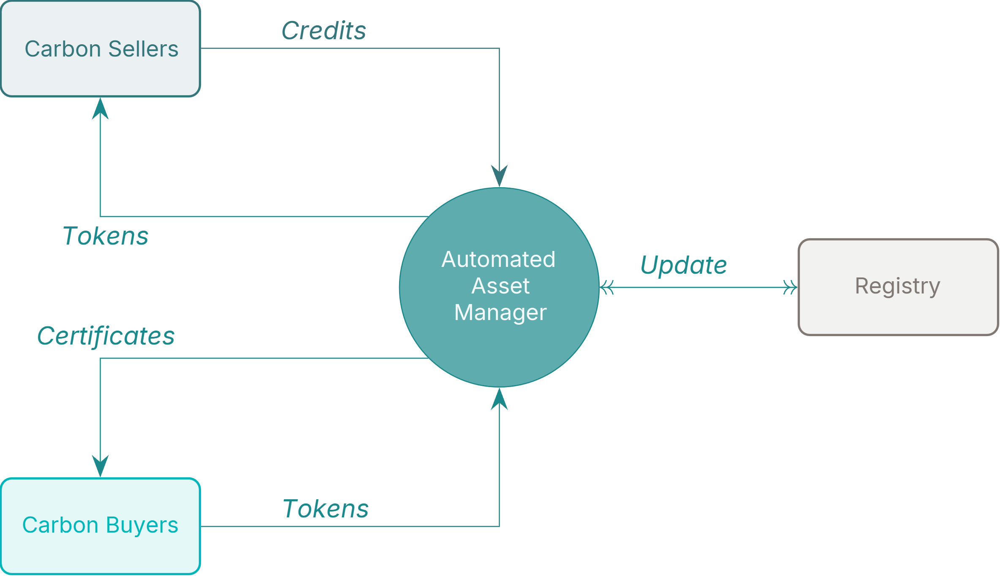

### 1.3 Dual tokens

The Klima economy shall be powered by two tokens:

1. Capital or **Asset token** as detailed above that determines Carbon class
capital allocation by the AAM and the general forward (discount) curve for
Carbon assets. These tokens are used to buy and sell Carbon as in
[Figure&nbsp;1](#figure-1).

2. A **Risk Governance** token that combines with the capital token to shape the
risk profile of the underlying Carbon portfolio.

The new tokens are named KLIMA and KlimaX respectively, noting that the original
token name carries through to the Asset Token reflecting the original utility.
For the purposes of the document we shall refer to these tokens as&nbsp;**A**
and&nbsp;**G** where brevity is required.

### 1.4 Core Economic Pillars

In addition to the AAM, there are two other tenets of Klima&nbsp;2.0 that enable
the model to find equilibrium through continous dynamic feedback loops.
Importantly these are generated solely from token balances in the smart
contracts and there is no oversight nor a centralised discretionary actor.

1. **AAM**: The AAM swaps its own token&nbsp;**A** for
Carbon&nbsp;**C**&nbsp;(in) or Carbon offset
certificates&nbsp;**C\***&nbsp;(out) to build a portfolio of Carbon.

    - Both&nbsp;**A** and&nbsp;**G** are also used as 'Staking' tokens in the
    AAM whereby&nbsp;**A** determines the weighting of any given Carbon class,
    and&nbsp;**G** determines the rate of acquisition&nbsp;(disposal).

    - Forward-delivery Carbon&nbsp;(for a set of fixed dates out to 10 years) is
    transacted simultaneously with liquid Carbon.

2. **Bond Market**: **A** holders stake tokens until a set expiry to create
floating yield bonds.

    - The collective temporal staking pattern produces a yield curve to reward
    bond-holders as well as price the forward curve for the AAM.

    - Only **A**&nbsp;tokens participate in the Bond Market which is responsible
    for pricing the cost of **illiquidity**.

3. **Liquidity Market**: Here the tokens are traded in 2 core liquidity pairs
with various incentives available to Liquidity Provider token
holders&nbsp;(**LPs**), including a **risky-yield** generated by the Bond
Market.

    1. <span class="u-overline">**AG**</span>: Native token swap&nbsp;**A**
    and&nbsp;**G**.

    2. <span class="u-overline">**AQ**</span>: The asset token&nbsp;**A** with
    USDC&nbsp;**Q**.

    The Liquidity Market provides the complementary facility to the Bond Market
    and the critical relationship between the native tokens and the hard
    currency of USDC.

<p id="figure-2" class="u-center">Figure&nbsp;2: Market Architectures, Token
  Utility

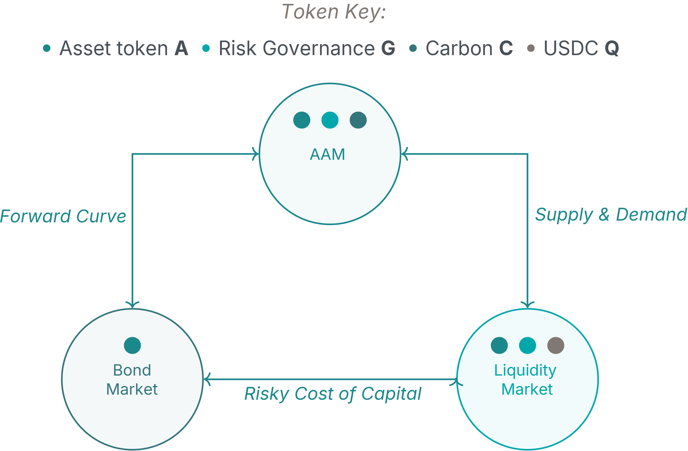

The Klima&nbsp;2.0 system enables each participant in the various economic
pillars to act in the&nbsp;(selfish) interests of their own capital and utility,
which through the harmonic model, enables price discovery, liquidity and
stability for Carbon trading which feeds back on itself as a catalyst for growth
and scale.

### 1.5 Initialisation of the&nbsp;KLIMA Asset Token

Klima DAO has approximately 20&nbsp;million&nbsp;tonnes of **Carbon** credits in
its treasury as assets which will be used to create the initial issuance
of **A**&nbsp;tokens upon launch of Klima&nbsp;2.0.

### 1.6 User Experience

A summary of user functionality:

- AAM
    - Tokenise Carbon that is liquid or forward-delivery to create
    **C**&nbsp;tokens.
    - Swap Carbon&nbsp;**C**&nbsp;(liquid and forward) for **A**&nbsp;tokens.
    - Swap **A**&nbsp;tokens for liquid Carbon offset certificate&nbsp;**C\***.
    - Stake **A**&nbsp;tokens for specific Carbon classes to contribute to the
    underlying portfolio weighting and pricing.
    - Stake **G**&nbsp;tokens for specific Carbon classes to contribute to the
    underlying portfolio pricing and capacity.

- Bond Market
    - Stake **A**&nbsp;tokens for set maturities to create Bonds and receive
    yield.

- Liquidity Market
    - Swap **A**&nbsp;tokens for&nbsp;**G** or USDC&nbsp;**Q** in the Liquidity
    Market.
    - Swap **G**&nbsp;tokens for&nbsp;**A** in the Liquidity Market.
    - Add **A**&nbsp;tokens, **G**&nbsp;tokens or USDC&nbsp;**Q** to liquidity
    pools and stake LP&nbsp;tokens to receive fees and a share of
    **G**&nbsp;incentives and **A**&nbsp;yield.

## 2 Economic System

The customer activity is managed through a smart contract asset manager driven
by staking choices from the token system, the balances of assets held, and the
discount curves generated by the bond market.

<p id="figure-3" class="u-center">Figure&nbsp;3: Autonomous Asset
  Manager&nbsp;– Detailed Architecture

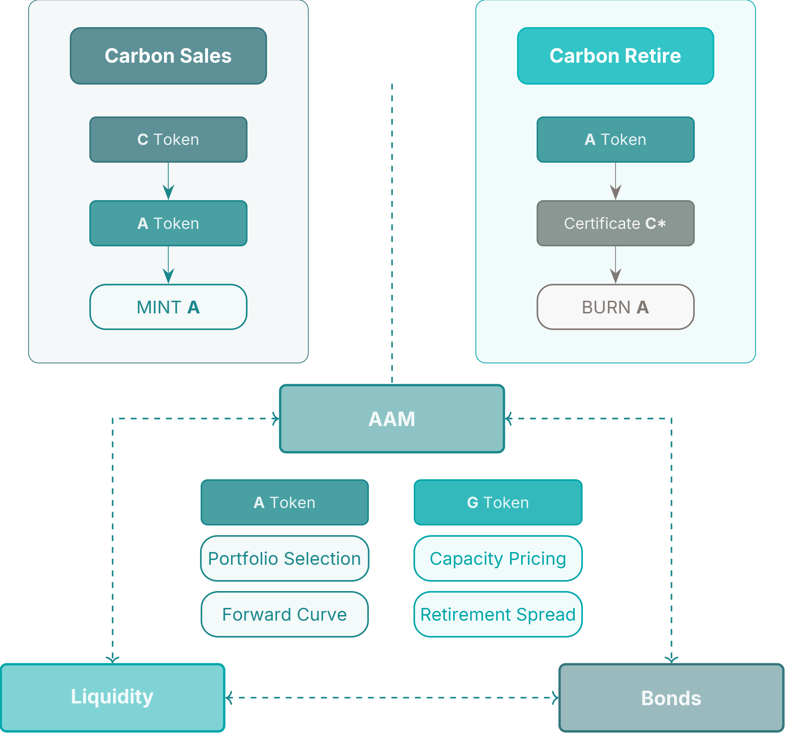

The AAM is a smart contract exchange platform that facilitates:

1. The sale of Carbon in return for newly issued&nbsp;**A** tokens.

2. The issuance of retirement certificates to burn&nbsp;**A** tokens.

The combined staking of&nbsp;**A** and&nbsp;**G** Tokens creates a dynamic
pricing matrix by class of Carbon, and by time, enabling spot and forward
trading of Carbon.

## 3 Two Token Model

The current token is deprecated and replaced with two new tokens:

<p id="figure-4" class="u-center">Figure&nbsp;4: Token Derivation Structure

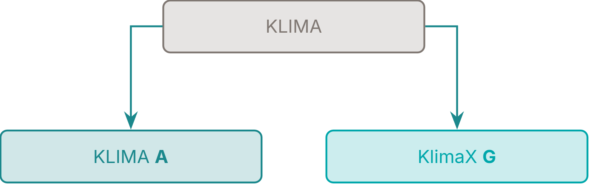

**A** is issued autonomously to acquire Carbon and is a tokenised representation
of the underlying Klima Carbon portfolio. It is also minted to pay Bond yields
and Risky Yield for LPs, and is burnt when Carbon certificates are purchased.

The **A**&nbsp;token has <span class="u-underline">2 independent</span> staking
functions:

<p id="figure-5" class="u-center">Figure&nbsp;5: Asset Token Staking Dimensions

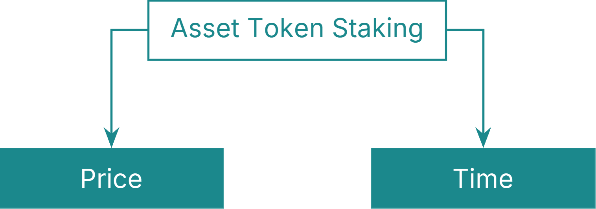

1. **Price**: Collective selection of Carbon classes by **A**&nbsp;staking
determines the instantaneous price ratio for **A**&nbsp;token issuance. This
stake can be amended and withdrawn at any time to allow price modulation for the
platform of its Carbon assets.

2. **Time**: The **A**&nbsp;token is locked for a specific period of time
representing a liquidity preference for the holder in return for yield. This
part of the stake cannot be amended.

The **G**&nbsp;token has a <span class="u-underline">single</span> staking
function that also selects Carbon classes. This determines the rate of issuance
or price curve of&nbsp;**A** for the specified Carbon, as well as the retirement
burning rate.

Both tokens facilitate the Klima Carbon market to function efficiently with the
**A**&nbsp;token responsible for portfolio selection and pricing, and the
**G**&nbsp;token modulating capacity and risk.

<p id="table-1" class="u-center">Table&nbsp;1: Token Summary

<table>
  <thead>
    <tr>
      <th>Token
      <th>Amount
      <th>Notes
  </thead>
  <tbody>
    <tr>
      <td>KLIMA <strong>A</strong>&nbsp;Token
      <td>20&nbsp;million
      <td>Supply expands and contracts perpetually.
    <tr>
      <td>
      <td>
      <td>87.5% of initial supply available to existing KLIMA holders.
    <tr>
      <td>
      <td>
      <td>Initially created on 1:1&nbsp;basis with Carbon Tonnes held.
    <tr>
      <td>
      <td>
      <td>Issues on Carbon received, and Burns on Carbon retired.
    <tr>
      <td>
      <td>
      <td class="u-gray">Sets portfolio weights for Carbon classes
    <tr>
      <td>
      <td>
      <td class="u-gray">Sets discount curve for foward pricing
    <tr>
      <td>KlimaX <strong>G</strong>&nbsp;Token
      <td>100&nbsp;million
      <td>Fixed supply
    <tr>
      <td>
      <td>
      <td>40% put into programmatic issuance as incentive yield over time.
    <tr>
      <td>
      <td>
      <td>40% for existing KLIMA holders
    <tr>
      <td>
      <td>
      <td class="u-gray">Sets capacity-price curve for Carbon classes
    <tr>
      <td>
      <td>
      <td class="u-gray">Sets retirement spread for Carbon offsets
  </tbody>
</table>

## 4 Bond Market

Holders of&nbsp;**A** can stake&nbsp;(select) a bond maturity from the set of
**standard maturities**. Bonds expire every 90&nbsp;days on a rolling basis.
There are always 40&nbsp;maturities extending out to approximately 10&nbsp;years
for bond staking.

- Collective Bond staking detemines the shape of the discount curve of the
**A**&nbsp;token with regards to its purchasing rate of forward Carbon.

- Bondholders receive a floating yield of new **A**&nbsp;tokens on their stake
following the shape of this discount curve. Yield is calculated daily and
accumulates to the principal stake.

- There is no un-staking and all principal and accumulated yield is released at
bond maturity.

**G**&nbsp;Tokens are not involved in the bond market and the forward curve is
agnostic to Carbon class (as Carbon selection for portfolio weighting is an
independent utility function of&nbsp;**A**).

### 4.1 Bond Market Calculations

Defining:

- ${tex`S`}: Total **A**&nbsp;tokens staked for Bonds expressed as a proportion
of outstanding supply of&nbsp;**A**.

- ${tex`S_t`}: Total **A**&nbsp;tokens staked for each Bond maturity
bucket&nbsp;${tex`t`}, expressed as a proportion of outstanding supply
of&nbsp;**A**, where&nbsp;${tex`\sum S_t = S`}, and ${tex`t`} is the index of
standard maturities&nbsp;${tex`t \in \{ 1, 2, \dots, 40 \}`}.

- ${tex`E_t`}: Time to expiry expressed in years.

```js
function constAreaLinear(range, area, inputSlope, slopeFactor = 0.007) {
  if (range.length === 1) {
    return [area];
  }

  let y1 = 0;
  let y2 = range.length - 1;
  let slope = slopeFactor * Math.atanh(inputSlope);
  let intercept = area / range.length;

  if (Math.abs(slope) > 2 * intercept / (y2 - y1 - 1)) {
    const yExactShift = Math.sqrt(Math.abs(2 * area / slope));
    const yRoundShift = Math.max(1, Math.round(yExactShift));
    if (slope > 0) {
      y1 = y2 - yRoundShift;
    } else {
      y2 = y1 + yRoundShift;
    }
    slope = Math.sign(slope) * 2 * area / Math.pow((y2 - y1), 2);
    intercept = Math.abs(slope) * (y2 - y1 - 1) / 2;
  }

  const yConstArea = [];
  for (let i = 0; i < range.length; i++) {
    const y = i - (y1 + y2) / 2;
    yConstArea.push(Math.max(0, slope * y + intercept));
  }

  return yConstArea;
}
```

```js
const vecE = d3.range(0.25, 10.1, 0.25);

const scaleE = d3.scaleLinear(d3.extent(vecE), [-1, 1]);

const vecS = constAreaLinear(vecE, 0.55, scaleE(inputD)).map(
  x => x * inputS / 0.55,
);

const vecReverseCumsumS = d3.cumsum(vecS.slice().reverse()).reverse();
```

Calculating curve parameters&nbsp;${tex`D`}, ${tex`C`}:

```js
html`<span id="equation-1">${tex.block`D = \frac 1 S \sum_{t=1}^{40} S_t \, E_t
  \tag{1}`}</span>`
```

```js
function dotProduct(v, w) {
  if (v.length !== w.length) {
    throw new Error("Vectors must have the same length");
  }
  return v.reduce((acc, val, i) => acc + val * w[i], 0);
}

function weightedArithmeticMean(v, weights) {
  return dotProduct(v, weights) / d3.sum(weights);
}
```

```js
const paramD = weightedArithmeticMean(vecE, vecS);
```

```js
html`<span id="equation-2">${tex.block`C = \frac 1 S \sum_{t=1}^{40} S_t \,
  E_t^2 \tag{2}`}</span>`
```

```js
const paramC = weightedArithmeticMean(vecE.map(e => e * e), vecS);
```

The shape of the yield curve&nbsp;${tex`\gamma_t`} is produced:

```js
html`<span id="equation-3">${tex.block`\gamma_t = \max
  \left( \frac{E_t}{D} - \frac{E_t^2}{2 \, C}, 0 \right) \tag{3}`}</span>`
```

```js
function computeGamma(vecE, paramD, paramC) {
  const twoC = 2 * paramC;
  return vecE.map(e => Math.max(0, e/paramD - e*e/twoC));
}
```

```js
const vecGamma = computeGamma(vecE, paramD, paramC);
```

Normalising&nbsp;${tex`\gamma_t`} to&nbsp;${tex`\hat\gamma_t`}:

```js
html`<span id="equation-4">${tex.block`\hat\gamma_t =
  \frac{\gamma_t}{\sum_{t=1}^{40} \gamma_t} \tag{4}`}</span>`
```

```js
function normalize(v) {
  const sum = d3.sum(v);
  return v.map(val => val / sum);
}
```

```js
const vecNormGamma = normalize(vecGamma);
```

With the cumulative sum of the normalised values expressed
as&nbsp;${tex`\Gamma_t`}:

```js
html`<span id="equation-5">${tex.block`\Gamma_t = \sum_{i=1}^t \hat\gamma_i
  \quad \text{for } t = 1, \dots, 40 \tag{5}`}</span>`
```

```js
const vecCumSumGamma = d3.cumsum(vecNormGamma);
```

The zero coupon yield curve&nbsp;${tex`Z_t`} is solved:

```js
html`<span id="equation-6">${tex.block`Z_t = (1 - S) \, \frac{\Gamma_t}{E_t}
  \tag{6}`}</span>`
```

```js
function computeZ(paramS, vecCumSumGamma, vecE) {
  return vecCumSumGamma.map((g, t) => (1 - paramS) * g / vecE[t]);
}
```

```js
const vecZ = computeZ(inputS, vecCumSumGamma, vecE);
```

Finally, the Bond discount rate&nbsp;${tex`B_t`} is derived:

```js
html`<span id="equation-7">${tex.block`B_t = \exp(-Z_t E_t) \tag{7}`}</span>`
```

```js
function computeB(vecZ, vecE) {
    return vecZ.map((z, t) => Math.exp(-z * vecE[t]));
}
```

```js
const vecB = computeB(vecZ, vecE);
```

The yield due on **A**&nbsp;bonds is calculated daily and added to staked
principal, hence the daily yield for each time bucket is calculated
as&nbsp;${tex`Y_t`}:

```js
html`<span id="equation-8">${tex.block`Y_t = \exp \left( \frac{Z_t}{365} \right)
  - 1 \tag{8}`}</span>`
```

```js
function computeY(vecZ) {
    return vecZ.map(z => Math.expm1(z / 365));
}
```

```js
const vecY = computeY(vecZ);
```

Hence, any bond stake&nbsp;${tex`A_t`} will increase by&nbsp;${tex`\Delta A_t`}:

```js
html`<span id="equation-9">${tex.block`\Delta A_t = A_t \, Y_t \tag{9}`}</span>`
```

The total tokens created on a daily basis for Bond inflation&nbsp;${tex`R`} is:

```js
html`<span id="equation-10">${tex.block`R = \sum_{t=1}^{40} \Delta A_t
  \tag{10}`}</span>`
```

<p id="figure-6" class="u-center">Figure&nbsp;6: Example of Bond Market State

```js
const yieldData = [];
for (let t = 3; t < vecE.length; t += 4) {
  yieldData.push({
    key: "Stake A",
    value: 100 * d3.sum(vecS.slice(t - 3, t + 1)),
    time: vecE[t],
  });
  yieldData.push({
    key: "Yield Term Structure",
    value: 100 * vecZ[t],
    time: vecE[t],
  });
  yieldData.push({
    key: "Real Yield",
    value: 100 * (vecZ[t] - inputI),
    time: vecE[t],
  });
  yieldData.push({
    key: "Discount Curve",
    value: 100 * vecB[t],
    time: vecE[t],
  });
  yieldData.push({
    key: "Cumulative Stake A",
    value: 100 * vecReverseCumsumS[t - 3],
    time: vecE[t],
  });
}
const getStake = d => d.key === "Stake A" ? d.value : NaN;
const getYieldTerm = d => d.key === "Yield Term Structure" ? d.value : NaN;
const getRealYield = d => d.key === "Real Yield" ? d.value : NaN;
const getDiscount = d => d.key === "Discount Curve" ? d.value : NaN;
const getCumStake = d => d.key === "Cumulative Stake A" ? d.value : NaN;

const stringS = "Total Stake = " + inputS.toLocaleString(
  "en-GB",
  { style: "percent", minimumFractionDigits: 2, maximumFractionDigits: 2 },
);
const stringI = "Inflation = " + inputI.toLocaleString(
  "en-GB",
  { style: "percent", minimumFractionDigits: 2, maximumFractionDigits: 2 },
);
const stringD = `D = ${paramD.toLocaleString(
  "en-GB",
  { minimumFractionDigits: 2, maximumFractionDigits: 2 },
)} years`;
const stringC = `√C = ${Math.sqrt(paramC).toLocaleString(
  "en-GB",
  { minimumFractionDigits: 2, maximumFractionDigits: 2 },
)} years`;

const yieldParams = [
  { key: stringD, time: paramD },
  { key: stringC, time: Math.sqrt(paramC) },
];
```

```js
Plot.plot({
  caption: `Yield (${stringS}, ${stringI})`,
  color: {
    legend: true,
    range: d3.schemeCategory10,
    domain: ["Stake A", "Yield Term Structure", "Real Yield", stringD, stringC],
  },
  x: {
    ticks: d3.range(1, 11),
    domain: [0.25, 10.45],
    label: "Time to Expiry (Years)",
  },
  y: {
    domain: [
      0,
      Math.max(d3.max(yieldData, getStake), d3.max(yieldData, getYieldTerm)),
    ],
    grid: true,
  },
  insetTop: 16,
  insetLeft: 8,
  insetRight: 8,
  clip: true,
  marks: [
    Plot.frame(),
    Plot.axisY({ anchor: "left", label: "Stake A by Maturity (%)" }),
    Plot.axisY({ anchor: "right", label: "Yield Rates (%)" }),
    Plot.rectY(yieldData, {
      x1: d => d.time - 0.45,
      x2: d => d.time + 0.45,
      y: getStake,
      fill: "key",
    }),
    Plot.ruleX(yieldParams, {
      x: "time",
      stroke: "key",
      strokeWidth : 2,
      strokeDasharray: 4,
    }),
    Plot.lineY(yieldData, { x: "time", y: getYieldTerm, stroke: "key" }),
    Plot.dotY(yieldData, { x: "time", y: getYieldTerm, fill: "key" }),
    Plot.lineY(yieldData, { x: "time", y: getRealYield, stroke: "key" }),
    Plot.dotY(yieldData, { x: "time", y: getRealYield, fill: "key" }),
  ],
})
```

```js
const inputS = view(Inputs.range([1e-4, 1], {
  label: tex`S \text{ (share of } A \text{ tokens staked for bonds)}`,
  step: 1e-4,
  value: 0.55,
}));
const inputD = view(Inputs.range([0.25, 10], {
  label: tex`D \text{ (approximately)}`,
  step: 0.01,
  value: 4.69,
}));
const inputI = view(Inputs.range([0, 0.1], {
  label: tex`\text{Inflation }`,
  step: 0.0002,
  value: 0.0202,
}));
```

```js
Plot.plot({
  caption: "Discount Rate",
  color: {
    legend: true,
    range: [8, 5, 3, 4].map(i => d3.schemeCategory10[i]),
    domain: ["Cumulative Stake A", "Discount Curve", stringD, stringC],
  },
  x: {
    ticks: d3.range(1, 11),
    domain: [0.25, 10.45],
    label: "Time to Expiry (Years)"
  },
  y: { domain: [0, 100], grid: true },
  clip: true,
  insetTop: 16,
  insetLeft: 8,
  insetRight: 8,
  marks: [
    Plot.frame(),
    Plot.axisY({ anchor: "left", label: "Cumulative Stake (%)" }),
    Plot.axisY({ anchor: "right", label: "Discount (%)" }),
    Plot.rectY(yieldData, {
      x1: d => d.time - 0.45,
      x2: d => d.time + 0.45,
      y: getCumStake,
      fill: "key",
    }),
    Plot.ruleX(yieldParams, {
      x: "time",
      stroke: "key",
      strokeWidth : 2,
      strokeDasharray: 4,
    }),
    Plot.lineY(yieldData, { x: "time", y: getDiscount, stroke: "key" }),
    Plot.dotY(yieldData, { x: "time", y: getDiscount, fill: "key" }),
  ],
})
```

For visualising the sensitivity of **A**&nbsp;overall inflation rates with
respect to staking and duration, [Figure&nbsp;7](#figure-7) assumes a single
maturity over the staking range to provide an approximation of inflation
${tex`\Delta A \approx Z \, S`}.

<p id="figure-7" class="u-center">Figure&nbsp;7: Range of
  <strong>A</strong>&nbsp;Inflation

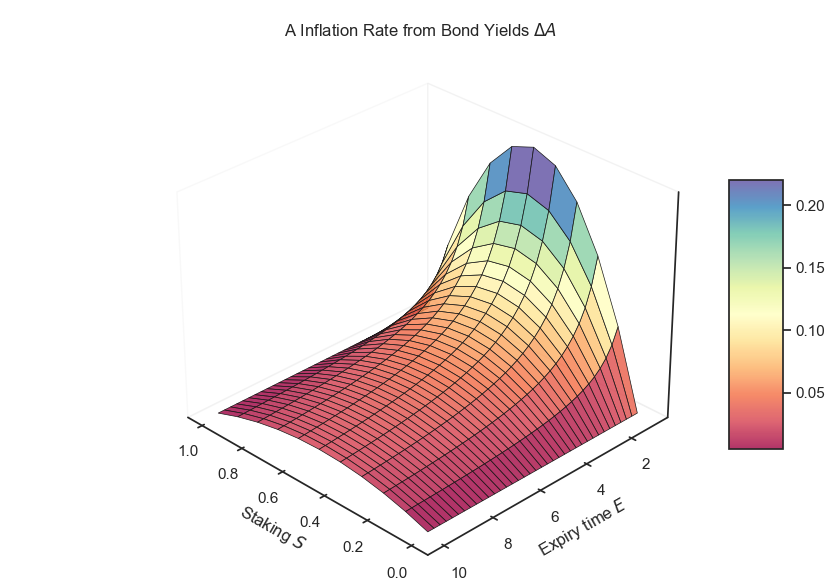

## 5 Governance

Governance rights, for example the whitelisting&nbsp;(blacklisting) of Carbon
classes, and any other matter requiring token stakeholder voting, are allocated
to two cohorts:

1. Bond staking: ${tex`S_t`}

2. Locked liquidity in the
**A**–**G**&nbsp;pair&nbsp;<span class="u-overline">**AG**</span>&nbsp;(see
[Section&nbsp;7](#7-liquidity)) defined here as&nbsp;${tex`A_{Gt}`} representing
the quantity of **A**&nbsp;tokens held in the liquidity pool expressed as a
proportion of circulating supply.

Voting power is allocated by time and applied to the respective balance
of&nbsp;**A**:

1. Initial voting weights for Bonds&nbsp;${tex`v_t`}:

    ```js
    html`<span id="equation-11">${tex.block`v_t =
      Z_t \, S_t \, B_t \tag{11}`}</span>`
    ```

2. Initial voting weights for LPs&nbsp;${tex`w_t`}:

    ```js
    html`<span id="equation-12">${tex.block`w_t =
      Z_t \, A_{Gt} \, B_t \tag{12}`}</span>`
    ```

1. Final voting weights Bonds&nbsp;${tex`V_t`}:

    ```js
    html`<span id="equation-13">${tex.block`V_t = \frac{v_t}
      {\sum_{j=1}^{40} (v_j + 2 w_j)} \tag{13}`}</span>`
    ```

2. Final voting weights LPs&nbsp;${tex`W_t`}:

    ```js
    html`<span id="equation-14">${tex.block`W_t = \frac{w_t}{\sum_{j=1}^{40}
      \left( \frac 1 2 v_j + w_j \right)} \tag{14}`}</span>`
    ```

## 6 Automated Asset Manager

### 6.1 Carbon Sales&nbsp;(AAM Purchase)

#### 6.1.1 Existing Carbon in the Portfolio

Carbon classes&nbsp;${tex`i \in \{1, 2, 3, \dots, n\}`} are whitelisted through
governance by the **A**&nbsp;token and the
<span class="u-overline">**AG**</span>&nbsp;LP&nbsp;holders (see
[Section&nbsp;5](#5-governance)).

For Carbon pricing, both the **A**&nbsp;tokens and the **G**&nbsp;tokens may
stake for specific Carbon classes&nbsp;${tex`C_i`} and these are independent
stakes between the two token systems.

<p id="figure-8" class="u-center">Figure&nbsp;8: Token Staking Class Structure

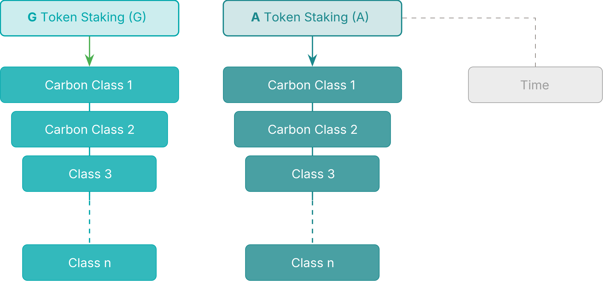

For a Carbon class quantity to be sold to the AAM, it must have a strictly
positive quantity of **A**&nbsp;tokens staked for that Carbon class, otherwise
there is no price, and the Carbon cannot be sold.

Defining:

- ${tex`A`}: Total **A**&nbsp;tokens staked for pricing of Carbon classes,
expressed as a proportion of outstanding supply of **A**&nbsp;tokens.

- ${tex`C_i`}: Total tonnes of Carbon class&nbsp;${tex`i`} currently held in the
portfolio.

- ${tex`A_i`}: **A**&nbsp;tokens staked for Carbon class&nbsp;${tex`i`}
expressed as a proportion of outstanding supply of **A** tokens
where&nbsp;${tex`\sum A_i = A`}.

- ${tex`G_i`}: **G** tokens staked for class&nbsp;${tex`i`} expressed as a
proportion of outstanding supply of **G**&nbsp;tokens.

- ${tex`C_{it}`}: The quantity of Carbon class&nbsp;${tex`i`} held in the AAM
deliverable per maturity&nbsp;${tex`t`} where&nbsp;${tex`C_{i0}`} reflects the
liquid quantity.

In order to determine the present-value quantity of Carbon, ${tex`\bar C_i`}, we
apply the discount curve from [Equation&nbsp;(7)](#equation-7) to the liquidity
schedule and sum the discounted holdings:

```js
html`<span id="equation-15">${tex.block`\bar C_i = C_{i0} +
  \sum_{t=1}^{40} B_t \, C_{it} \tag{15}`}</span>`
```

```js
const vecCi = constAreaLinear(vecE, 1 - inputCi0, inputLiqShape, 0.01);

const paramBarCi = inputCi0 + dotProduct(vecB, vecCi);
```

```js
const carbonHeldData = [];
carbonHeldData.push({
  key: "Liquidity Schedule",
  value: 100 * inputCi0,
  time: 0,
});
for (let t = 3; t < vecE.length; t += 4) {
  carbonHeldData.push({
    key: "Liquidity Schedule",
    value: 100 * d3.sum(vecCi.slice(t - 3, t + 1)),
    time: vecE[t],
  });
  carbonHeldData.push({
    key: "Discount Curve",
    value: 100 * vecB[t],
    time: vecE[t],
  });
}
const getLiqSchedule = d => d.key === "Liquidity Schedule" ? d.value : NaN;

const stringBarCi = `Present-Value Carbon C̄ᵢ = ${paramBarCi.toLocaleString(
  "en-GB",
  { style: "percent", maximumFractionDigits: 0 },
)}`;

const heldCarbonParam = [{ key: stringBarCi, value: 100 * paramBarCi }];
```

```js
Plot.plot({
  caption: "Carbon Held in the AAM",
  color: {
    legend: true,
    range: [2, 5, 6].map(i => d3.schemeCategory10[i]),
    domain: ["Liquidity Schedule", "Discount Curve", stringBarCi],
  },
  x: {
    label: "Time to Expiry (Years)",
    labelAnchor: "right",
    labelArrow: true,
  },
  y: { domain: [0, 100], grid: true },
  insetTop: 16,
  clip: true,
  marks: [
    Plot.frame(),
    Plot.axisY({ anchor: "left", label: "Quantity of Carbon (%)" }),
    Plot.axisY({ anchor: "right", label: "Discount (%)" }),
    Plot.rectY(carbonHeldData, { x: "time", y: getLiqSchedule, fill: "key" }),
    Plot.ruleY(heldCarbonParam, {
      y: "value",
      stroke: "key",
      strokeWidth : 2,
      strokeDasharray: 4,
    }),
    Plot.lineY(carbonHeldData, { x: "time", y: getDiscount, stroke: "key" }),
    Plot.dotY(carbonHeldData, { x: "time", y: getDiscount, fill: "key" }),
  ],
})
```

```js
const inputCi0 = view(Inputs.range([0, 1], {
  label: tex`C_{i0} \text{ (liquid carbon held for class } i \text)`,
  step: 1e-3,
}));
const inputLiqShape = view(Inputs.range([-1, 1], {
  label: tex`\text{Example liquidity schedule shape}`,
  step: 1e-3,
}));
```

Similarly, taking&nbsp;${tex`\Delta C_{it}`} as the quantity of
Carbon&nbsp;${tex`i`} to be sold with a specific maturity index&nbsp;${tex`t`}:

```js
html`<span id="equation-16">${tex.block`\Delta \bar C_i = \Delta C_{i0} +
  \sum_{t=1}^{40} B_t \, \Delta C_{it} \tag{16}`}</span>`
```

```js
const paramMaturityIdx = 4 * inputEt;

function computeDeltaCi0(deltaCi, t) {
  return paramMaturityIdx === 0 ? deltaCi : 0;
}

function computeVecDeltaCi(deltaCi, t) {
  const vecDeltaCi = Array(40).fill(0);
  if (t !== 0) {
    vecDeltaCi[t - 1] = deltaCi;
  }
  return vecDeltaCi;
}
```

```js
const paramDeltaCi0 = computeDeltaCi0(inputDeltaCi, paramMaturityIdx);

const vecDeltaCi = computeVecDeltaCi(inputDeltaCi, paramMaturityIdx);

const paramDeltaBarCi = paramDeltaCi0 + dotProduct(vecB, vecDeltaCi);
```

Once standardised by the discount curve, trades can be agglomerated in the same
class for the defined trade or auction period.

```js
const carbonBuyData = [];
carbonBuyData.push({
  key: "Carbon Bought",
  value: 100 * paramDeltaCi0,
  time: 0,
});
for (let t = 3; t < vecE.length; t += 4) {
  carbonBuyData.push({
    key: "Carbon Bought",
    value: 100 * d3.sum(vecDeltaCi.slice(t - 3, t + 1)),
    time: vecE[t],
  });
  carbonBuyData.push({
    key: "Discount Curve",
    value: 100 * vecB[t],
    time: vecE[t],
  });
}
const getCarbonBought = d => d.key === "Carbon Bought" ? d.value : NaN;

const stringDeltaBarCi = "Present-Value Bought Carbon ΔC̄ᵢ = " +
        paramDeltaBarCi.toLocaleString(
          "en-GB",
          {
            style: "percent",
            minimumFractionDigits: 1,
            maximumFractionDigits: 1,
          },
        );
const boughtCarbonParam = [
  { key: stringDeltaBarCi, value: 100 * paramDeltaBarCi },
];
```

```js
Plot.plot({
  caption: "Carbon Bought by the AAM",
  color: {
    legend: true,
    range: [3, 5, 7].map(i => d3.schemeCategory10[i]),
    domain: ["Carbon Bought", "Discount Curve", stringDeltaBarCi],
  },
  x: {
    label: "Time to Expiry (Years)",
    labelAnchor: "right",
    labelArrow: true,
  },
  y: { domain: [0, 100], grid: true },
  insetTop: 16,
  clip: true,
  marks: [
    Plot.frame(),
    Plot.axisY({ anchor: "left", label: "Quantity of Carbon (%)" }),
    Plot.axisY({ anchor: "right", label: "Discount (%)" }),
    Plot.rectY(carbonBuyData, { x: "time", y: getCarbonBought, fill: "key" }),
    Plot.ruleY(boughtCarbonParam, {
      y: "value",
      stroke: "key",
      strokeWidth : 2,
      strokeDasharray: 4,
    }),
    Plot.lineY(carbonBuyData, { x: "time", y: getDiscount, stroke: "key" }),
    Plot.dotY(carbonBuyData, { x: "time", y: getDiscount, fill: "key" }),
  ],
})
```

```js
const inputDeltaCi = view(Inputs.range([0, 1], {
  label: tex`\Delta C_i \text{ (carbon bought from class } i \text)`,
  step: 1e-3,
  value: 1,
}));
const inputEt = view(Inputs.range([0, 10], {
  label: tex`E_t \text{ (years to expiry)}`,
  step: 1,
  value: 6,
}));
```

Where&nbsp;${tex`\Delta \bar C_i`} is expressed as the relative increment to its
respective pool balance, the amount of **A**&nbsp;tokens issued to pay for
Carbon, ${tex`\Delta A`}, expressed as a proportion of current supply, is
determined as:

```js
html`<span id="equation-17">${tex.block`\ln(1 + \Delta A) =
  \left( A_i - \frac{A_i^2 \, (1 - G_i)^2}{2} \right) \ln(1 + \Delta \bar C_i)
  \tag{17}`}</span>`
```

For completeness, denoting the expression on the right hand side of
[Equation&nbsp;(17)](#equation-17) as&nbsp;${tex`\mathsf{RHS}`}:

```js
html`<span id="equation-18">${tex.block`\Delta A = \exp(\mathsf{RHS}) − 1
  \tag{18}`}</span>`
```

```js
function computeDeltaA(Ai, Gi, deltaCi) {
    return Math.expm1((Ai - (Ai**2 * (1 - Gi)**2 / 2)) * Math.log1p(deltaCi));
}
```

Finally, ${tex`\Delta A`} is applied to the outstanding supply of&nbsp;**A** to
solve for token quantities.

[Figure&nbsp;9](#figure-9) illustrates the **G**&nbsp;token capacity to maintain
the initial portfolio pricing of the **A**&nbsp;token. The data has been
normalised in [Figure&nbsp;10](#figure-10) to&nbsp;${tex`\Delta \bar C_i A_i`}.

<p id="figure-9" class="u-center">Figure&nbsp;9: <strong>A</strong>&nbsp;Price
  Curves&nbsp;(${tex`\Delta A`}) when ${tex`\Delta \bar C_i = ${
    (100 * inputDeltaBarCi).toLocaleString(
      "en-GB",
      { maximumFractionDigits: 0 },
    )
  } \%`}

```js
function contrastingTextColor(backgroundColor) {
  if (d3.hsl(backgroundColor).l < 0.5) {
    return "white";
  } else {
    return "black";
  }
}

const pricingData = [];
for (let paramGi = 0; paramGi < 1.01; paramGi += 0.1) {
  pricingData.push({
    key: "ΔA",
    ai: 0,
    gi: paramGi,
    value: NaN,
  });
  pricingData.push({
    key: "Normalised ΔA",
    ai: 0,
    gi: paramGi,
    value: NaN,
  });
  for (let paramAi = 0.1; paramAi < 1.01; paramAi += 0.1) {
    pricingData.push({
      key: "ΔA",
      ai: paramAi,
      gi: paramGi,
      value: computeDeltaA(paramAi, paramGi, inputDeltaBarCi),
    });
    pricingData.push({
      key: "Normalised ΔA",
      ai: paramAi,
      gi: paramGi,
      value: computeDeltaA(paramAi, paramGi, inputDeltaBarCi) /
              (inputDeltaBarCi * paramAi),
    });
  }
}
const getDeltaA = d => d.key === "ΔA" ? d.value : NaN;
const getNormDeltaA = d => d.key === "Normalised ΔA" ? d.value : NaN;
```

```js
Plot.plot({
  caption: html`Heatmap of ${tex`\Delta A`} with
          ${tex`\Delta \bar C_i = ${(100 * inputDeltaBarCi).toLocaleString(
            "en-GB",
            { maximumFractionDigits: 0 },
          )} \%`}`,
  color: { legend: true, scheme: "Spectral", type: "sequential", label: "ΔA" },
  x: { ticks: d3.range(0, 1.01, 0.1), label: "Aᵢ" },
  y: { ticks: d3.range(0, 1.01, 0.1), domain: [1.05, -0.05], label: "Gᵢ" },
  marks: [
    Plot.frame(),
    Plot.rect(pricingData, {
      x1: d => d.ai - 0.05,
      x2: d => d.ai + 0.05,
      y1: d => d.gi - 0.05,
      y2: d => d.gi + 0.05,
      fill: getDeltaA,
    }),
    Plot.text(pricingData, {
      x: "ai",
      y: "gi",
      text: d => Number.isNaN(getDeltaA(d)) ? "" : d.value.toLocaleString(
        "en-GB",
        { minimumFractionDigits: 2, maximumFractionDigits: 2 },
      ),
      fill: d => contrastingTextColor(
        d3.scaleSequential(
          [
            computeDeltaA(0.1, 1, inputDeltaBarCi),
            computeDeltaA(1, 1, inputDeltaBarCi),
          ],
          d3.interpolateSpectral,
        )(d.value),
      ),
    }),
  ],
})
```

```js
const inputDeltaBarCi = view(Inputs.range([0.01, 1], {
  label: tex`\Delta \bar C_i \text{ (present-value carbon bought)}`,
  step: 0.01,
  value: 1,
}));
```

<p id="figure-10" class="u-center">Figure&nbsp;10: Normalised
  <strong>A</strong>&nbsp;Price Curves&nbsp;(${tex`\Delta A`})
  when&nbsp;${
    tex`\Delta \bar C_i = ${(100 * inputDeltaBarCi).toFixed()} \%`
  }

```js
Plot.plot({
  caption: html`Normalised Map of ${tex`\Delta A`} with
          ${tex`\Delta \bar C_i = ${(100 * inputDeltaBarCi).toLocaleString(
            "en-GB",
            { maximumFractionDigits: 0 },
          )} \%`}`,
  color: {
    legend: true,
    scheme: "Spectral",
    type: "sequential",
    label: "Normalised ΔA",
  },
  x: { ticks: d3.range(0, 1.01, 0.1), label: "Aᵢ" },
  y: { ticks: d3.range(0, 1.01, 0.1), domain: [1.05, -0.05], label: "Gᵢ" },
  marks: [
    Plot.frame(),
    Plot.rect(pricingData, {
      x1: d => d.ai - 0.05,
      x2: d => d.ai + 0.05,
      y1: d => d.gi - 0.05,
      y2: d => d.gi + 0.05,
      fill: getNormDeltaA,
    }),
    Plot.text(pricingData, {
      x: "ai",
      y: "gi",
      text: d => Number.isNaN(getNormDeltaA(d)) ? "" : d.value.toLocaleString(
        "en-GB",
        { minimumFractionDigits: 2, maximumFractionDigits: 2 },
      ),
      fill: d => contrastingTextColor(
        d3.scaleSequential(
          [
            computeDeltaA(1, 0, inputDeltaBarCi) / inputDeltaBarCi,
            computeDeltaA(1, 1, inputDeltaBarCi) / inputDeltaBarCi,
          ],
          d3.interpolateSpectral,
        )(d.value),
      ),
    }),
  ],
})
```

Noting that the sensitivity to&nbsp;${tex`G_i`} increases as&nbsp;${tex`A_i`}
increases and the effects become more pronounced
as&nbsp;${tex`\Delta \bar C_i`} increases.

#### 6.1.2 Zero Carbon scenario

There is the circumstance when there is zero Carbon held in the portfolio for a
particular class, i.e.&nbsp;${tex`C_i = 0`} which invalidates the calculation
of&nbsp;${tex`\Delta \bar C_i`}. This is dealt with by computing an _implied_
portfolio balance&nbsp;${tex`\tilde C_i`}.

Defining&nbsp;${tex`\bar C_j`} as the Carbon balances under
[Equation&nbsp;(15)](#equation-15) for the whole portfolio of&nbsp;${tex`J`}
Carbon classes with strictly positive Carbon balances and&nbsp;${tex`A_j`} as
the respective price stakes expressed as the proportion of outstanding
**A**&nbsp;tokens; and with&nbsp;${tex`C_\emptyset`} as any Carbon class with a
zero Carbon balance with a strictly positive&nbsp;**A** price stake.

The implied balance for any zero carbon asset is given as:

```js
html`<span id="equation-19">${tex.block`\tilde C_\emptyset =
  \left( \prod_{j=1}^J \bar C_j^{A_j} \right)^\frac{1}{\sum_1^J A_j}
  \tag{19}`}</span>`
```

```js
function weightedGeometricMean(v, weights) {
  if (v.length !== weights.length) {
    throw new Error("Vectors must have the same length");
  }
  if (weights.every(el => el === 0)) {
    return 1;
  } else {
    const weigthedProduct = v.reduce(
      (acc, val, i) => acc * Math.pow(val, weights[i]),
      1,
    );
    return Math.pow(weigthedProduct, 1 / d3.sum(weights));
  }
}
```

```js
const vecBarC = [inputC1, inputC2, inputC3];

const vecA = [inputA1, inputA2, inputA3];

const paramTildeCnull = weightedGeometricMean(vecBarC, vecA);
```

Hence&nbsp;${tex`\tilde C_\emptyset`} can be substituted in
[Equation&nbsp;(16)](#equation-16) for&nbsp;${tex`\bar C_i`} and the process can
compute.

```js
function computeDeltaBarCi(deltaBarCiTonnes, barCi, tildeCnull) {
  const trueBarCiTonnes = barCi === 0 ? tildeCnull : barCi;
  return deltaBarCiTonnes / trueBarCiTonnes;
}
```

```js
const balanceData = [];
for (let i = 0; i < vecBarC.length; i++) {
  balanceData.push({ key: "Carbon Balance", value: vecBarC[i], class: i + 1 });
  balanceData.push({ key: "A Stake", value: vecA[i], class: i + 1 });
}
const getCarbonBalance = d => d.key === "Carbon Balance" ? d.value : NaN;
const getAStake = d => d.key === "A Stake" ? d.value : NaN;

const stringTildeCnull = `Implied Balance: ${paramTildeCnull.toLocaleString(
  "en-GB",
  { maximumFractionDigits: 0 },
)} tCO2eq`;

const balanceParam = [{ key: stringTildeCnull, value: paramTildeCnull }];
```

```js
Plot.plot({
  caption: "Implied Balance of a Zero-Carbon Class",
  color: {
    legend: true,
    range: [4, 1].map(i => d3.schemeCategory10[i]),
    domain: ["Carbon Balance", stringTildeCnull],
  },
  x: { label: "Carbon Class", labelAnchor: "right", labelArrow: true },
  y: {
    type: "log",
    domain: [1, 1e9],
    grid: true,
    label: "Carbon Balance (tCO2eq)",
  },
  insetTop: 24,
  marks: [
    Plot.frame(),
    Plot.rectY(balanceData, {
      x: "class",
      y1: 1,
      y2: getCarbonBalance,
      fill: "key",
    }),
    Plot.ruleY(balanceParam, {
      y: "value",
      stroke: "key",
      strokeWidth : 2,
      strokeDasharray: 4,
    }),
    Plot.text(balanceData, {
      x: "class",
      y: d => 2 * d3.filter(
        d3.filter(balanceData, getCarbonBalance),
        c => c.class === d.class,
      )[0].value,
      text: d =>
        Number.isNaN(getAStake(d)) ? null : "Aᵢ = " + d.value.toLocaleString(
          "en-GB",
          { style: "percent", maximumFractionDigits: 0 },
        ),
      fontSize: "1.5em",
      fill: "black",
      stroke: "white",
    }),
  ],
})
```

```js
const inputC1 = view(Inputs.range([1, 1e9], {
  label: tex`\bar C_1 \text{ (class } 1 \text{ present-value balance)}`,
  step: 1,
  value: 1e7,
  transform: Math.log,
}));
const inputC2 = view(Inputs.range([1, 1e9], {
  label: tex`\bar C_2 \text{ (class } 2 \text{ present-value balance)}`,
  step: 1,
  value: 1e5,
  transform: Math.log,
}));
const inputC3 = view(Inputs.range([1, 1e9], {
  label: tex`\bar C_3 \text{ (class } 3 \text{ present-value balance)}`,
  step: 1,
  value: 1e3,
  transform: Math.log,
}));
```

```js
const inputA1 = view(Inputs.range([0.0, 1/3], {
  label: tex`A_1 \text{ (\textbf{A}~stake pricing class } 1 \text)`,
  step: 0.01,
  value: 0.1,
}));
const inputA2 = view(Inputs.range([0.0, 1/3], {
  label: tex`A_2 \text{ (\textbf{A}~stake pricing class } 2 \text)`,
  step: 0.01,
  value: 0.1,
}));
const inputA3 = view(Inputs.range([0.0, 1/3], {
  label: tex`A_3 \text{ (\textbf{A}~stake pricing class } 3 \text)`,
  step: 0.01,
  value: 0.1,
}));
```

### 6.2 Carbon Retirement&nbsp;(AAM Sells)

#### 6.2.1 Weighted Carbon Class

For retiring Carbon that is _weighted_, that is there is a strictly positive
**A**&nbsp;token stake for that class, an **A**&nbsp;token holder can extract
the Carbon class offset of their choice&nbsp;${tex`C_i`} but the available pool
is only the liquid balance, namely the element&nbsp;${tex`C_{i0}`}:

```js
html`<span id="equation-20">${tex.block`\ln(1 + \Delta C_i) =
  \frac{\ln(1 - \Delta A)}{A_i + \frac 1 2 A_i^2 \, (1 - G_i)^2} \quad \Delta A
  \neq 1 \tag{20}`}</span>`
```

As before denoting the expression on the right hand side of
[Equation&nbsp;(20)](#equation-20) as&nbsp;${tex`\mathsf{RHS}`}:

```js
html`<span id="equation-21">${tex.block`\Delta C_i = \exp(\mathsf{RHS}) - 1
  \tag{21}`}</span>`
```

```js
function computeDeltaCi(Ai, Gi, deltaA) {
  return Math.expm1(Math.log1p(-deltaA) / (Ai + (Ai**2 * (1 - Gi)**2 / 2)));
}
```

<p id="figure-11" class="u-center">Figure&nbsp;11: Proportion of Carbon Retired
  when&nbsp;${tex`\Delta A = ${
    (100 * inputDeltaA).toLocaleString(
      "en-GB",
      { minimumFractionDigits: 1, maximumFractionDigits: 1 },
    )
  } \%`}

```js
const retirementData = [];
for (let paramGi = 0; paramGi < 1.01; paramGi += 0.1) {
  retirementData.push({
    key: "-ΔCᵢ",
    ai: 0,
    gi: paramGi,
    value: NaN,
  });
  for (let paramAi = 0.1; paramAi < 1.01; paramAi += 0.1) {
    retirementData.push({
      key: "-ΔCᵢ",
      ai: paramAi,
      gi: paramGi,
      value: -computeDeltaCi(paramAi, paramGi, inputDeltaA),
    });
  }
}
```

```js
Plot.plot({
  caption: html`Heatmap of ${tex`-\Delta C_i`} with
          ${tex`\Delta A = ${(100 * inputDeltaA).toLocaleString(
            "en-GB",
            { minimumFractionDigits: 1, maximumFractionDigits: 1 },
          )} \%`}`,
  color: {
    legend: true,
    scheme: "Spectral",
    type: "sequential",
    label: "-ΔCᵢ",
  },
  x: { ticks: d3.range(0, 1.01, 0.1), label: "Aᵢ" },
  y: { ticks: d3.range(0, 1.01, 0.1), domain: [1.05, -0.05], label: "Gᵢ" },
  marks: [
    Plot.frame(),
    Plot.rect(retirementData, {
      x1: d => d.ai - 0.05,
      x2: d => d.ai + 0.05,
      y1: d => d.gi - 0.05,
      y2: d => d.gi + 0.05,
      fill: "value",
    }),
    Plot.text(retirementData, {
      x: "ai",
      y: "gi",
      text: d => Number.isNaN(d.value) ? "" : d.value.toLocaleString(
        "en-GB",
        { minimumFractionDigits: 2, maximumFractionDigits: 2 },
      ),
      fill: d => contrastingTextColor(
        d3.scaleSequential(
          [
            -computeDeltaCi(1, 0, inputDeltaA),
            -computeDeltaCi(0.1, 1, inputDeltaA),
          ],
          d3.interpolateSpectral,
        )(d.value),
      ),
    }),
  ],
})
```

```js
const inputDeltaA = view(Inputs.range([0.001, 0.999], {
  label: tex`\Delta A \text{ (quantity of } A \text{ tokens burnt)}`,
  step: 0.001,
  value: 0.1,
}));
```

[Figure&nbsp;11](#figure-11) shows the cost of Carbon increasing
with&nbsp;${tex`A_i`} and decreasing with&nbsp;${tex`G_i`}.

#### 6.2.2 Unweighted Carbon Class

When a Carbon class is included in the portfolio but currently has no
weighting&nbsp;(${tex`A_i = 0`}) some modifications are required. An important
distinction is the retirement of zero-weighted Carbon is as a portfolio and not
for specified Carbon classes. The **A**&nbsp;token burnt will receive a portion
of the underlying residual portfolio weighted by tons of liquid Carbon.

Assuming ${tex`A \neq 1`}:

${tex`A_i`} is replaced in [Equation&nbsp;(20)](#equation-20) for the residual
portfolio of unweighted Carbon, ${tex`C_\emptyset`}, with an implied
weighting&nbsp;${tex`\tilde A_\emptyset`} derived from the total liquid Carbon
assets:

```js
html`<span id="equation-22">${tex.block`\tilde A_\emptyset = (1 - A)^2
  \tag{22}`}</span>`
```

```js
function computeTildeAnull(A) {
  return (1 - A)**2;
}
```

With&nbsp;${tex`K`} classes of Carbon existing in the residual portfolio, noting
that&nbsp;${tex`C_{\emptyset 0} = \sum_{k=1}^K C_{k0}`}, with&nbsp;${tex`G_k`}
similarly defined, we can determine an average for&nbsp;${tex`G_\emptyset`}:

```js
html`<span id="equation-23">${tex.block`G_\emptyset = \frac{1}{C_{\emptyset 0}}
  \sum_{k=1}^K G_k \, C_{k0} \tag{23}`}</span>`
```

```js
const vecC0 = [inputC1_0, inputC2_0, inputC3_0];

const vecG = [inputG1, inputG2, inputG3];

const paramGnull = weightedArithmeticMean(vecG, vecC0);
```

```js
const unweightedData = [];
for (let i = 0; i < vecC0.length; i++) {
  unweightedData.push({ key: "Stake G", value: 100 * vecG[i], class: i + 1 });
  unweightedData.push({
    key: "Liquid Carbon Balance",
    value: 100 * vecC0[i],
    class: i + 1,
  });
}
const getLiquidBalance = d => d.key === "Liquid Carbon Balance" ? d.value : NaN;
const getGStake = d => d.key === "Stake G" ? d.value : NaN;

const stringGnull = `Implied G Stake: ${paramGnull.toLocaleString(
  "en-GB",
  { style: "percent", maximumFractionDigits: 0 },
)}`;

const unweightedParam = [{ key: stringGnull, value: 100 * paramGnull }];
```

```js
Plot.plot({
  caption: "Implied G Stake of an Unweighted Carbon Class",
  color: {
    legend: true,
    range: [2, 1, 4].map(i => d3.schemeCategory10[i]),
    domain: ["Stake G", "Liquid Carbon Balance", stringGnull],
  },
  x: { label: "Carbon Class", labelAnchor: "right", labelArrow: true },
  y: { domain: [0, 100/3], grid: true },
  insetTop: 16,
  marks: [
    Plot.frame(),
    Plot.axisY({ anchor: "left", label: "Stake (%)" }),
    Plot.axisY({ anchor: "right", label: "Carbon Balance (%)" }),
    Plot.rectY(unweightedData, {
      x: "class",
      y: getLiquidBalance,
      fill: "key",
    }),
    Plot.lineY(unweightedData, { x: "class", y: getGStake, stroke: "key" }),
    Plot.dotY(unweightedData, { x: "class", y: getGStake, fill: "key" }),
    Plot.ruleY(unweightedParam, {
      y: "value",
      stroke: "key",
      strokeWidth : 2,
      strokeDasharray: 4,
    }),
  ],
})
```

```js
const inputG1 = view(Inputs.range([0.0, 1/3], {
  label: tex`G_1 \text{ (\textbf{G}~stake pricing class } 1 \text)`,
  step: 0.001,
  value: 0.1,
}));
const inputG2 = view(Inputs.range([0.0, 1/3], {
  label: tex`G_2 \text{ (\textbf{G}~stake pricing class } 2 \text)`,
  step: 0.001,
  value: 0.2,
}));
const inputG3 = view(Inputs.range([0.0, 1/3], {
  label: tex`G_3 \text{ (\textbf{G}~stake pricing class } 3 \text)`,
  step: 0.001,
  value: 0.3,
}));
```

```js
const inputC1_0 = view(Inputs.range([0.001, 1/3], {
  label: tex`C_{1 \, 0} \text{ (class } 1 \text{ liquid balance)}`,
  step: 0.001,
  value: 0.3,
}));
const inputC2_0 = view(Inputs.range([0.001, 1/3], {
  label: tex`C_{2 \, 0} \text{ (class } 2 \text{ liquid balance)}`,
  step: 0.001,
  value: 0.1,
}));
const inputC3_0 = view(Inputs.range([0.001, 1/3], {
  label: tex`C_{3 \, 0} \text{ (class } 3 \text{ liquid balance)}`,
  step: 0.001,
  value: 0.2,
}));
```

Substituting in [Equation&nbsp;(20)](#equation-20):

```js
html`<span id="equation-24">${tex.block`\ln(1 + \Delta C_\emptyset) =
  \frac{\ln(1 - \Delta A)}
  {\tilde A_\emptyset + \frac 1 2 \tilde A_\emptyset^2 \, (1 - G_\emptyset)^2}
  \quad \Delta A \neq 1 \tag{24}`}</span>`
```

```js
function computeTrueDeltaCi(Ai, Gi, Anull, Gnull, deltaA) {
  const trueAi = Ai === 0 ? Anull : Ai;
  const trueGi = Ai === 0 ? Gnull : Gi;
  return computeDeltaCi(trueAi, trueGi, deltaA);
}
```

The result&nbsp;${tex`\Delta C_\emptyset`} is applied to the liquid elements of
the residual portfolio to determine the delivery quantities.

If&nbsp;${tex`A = 1`}:

In the event that there is 100%&nbsp;**A**&nbsp;staking for price, and the
portfolio consists of zero-staked Carbon classes with liquid balances, the
portfolio begins to issue these balances
<span class="u-underline">to all **A** Bond holders</span> as a daily liquid
yield using the governance-based weightings&nbsp;${tex`V`} in
[Section&nbsp;5](#5-governance), [Equation&nbsp;(13)](#equation-13).

With&nbsp;${tex`S`} as previously defined as the total **A**&nbsp;tokens staked
as bonds (time staking):

```js
html`<span id="equation-25">${tex.block`\Delta C_\emptyset = \frac{1}{365} \,
  \frac{S}{1 - \frac 1 2 (1 - G_\emptyset)^2} \tag{25}`}</span>`
```

```js
function computeDeltaCnull(Ai, A, S, Gnull) {
  if (Ai === 0 && A === 1) {
    return S / (365 * (1 - (1 - Gnull)**2 / 2));
  } else {
    return 0;
  }
}
```

#### 6.2.3 Liquidation: ${tex`\Delta A = 1`}

In the event that 100% of **A**&nbsp;tokens are placed into the burn mechanism
for Carbon offsets, the following occurs:

- The portfolio of liquid tokens is distributed to the **A**&nbsp;token sellers
pro-rata to **A**&nbsp;contribution

- A new set of nominal **A**&nbsp;tokens are issued to locked **G**&nbsp;token
holders on a pro-rata basis

```js
function computeSpread(Ai, Gi, deltaCinitial) {
  const deltaA = computeDeltaA(Ai, Gi, deltaCinitial);
  const deltaCfinal = -computeDeltaCi(Ai, Gi, deltaA);
  return (deltaCinitial - deltaCfinal) / deltaCinitial;
}
```

[Figure&nbsp;12](#figure-12) below shows the spread captured on a 'round trip'
by the system where&nbsp;${tex`\varepsilon`} is the proportion retained.

<p id="figure-12" class="u-center">Figure&nbsp;12: Carbon ‘Spread’

```js
const spreadData = [];
for (let paramGi = 0; paramGi < 1.01; paramGi += 0.1) {
  spreadData.push({
    key: "spread",
    ai: 0,
    gi: paramGi,
    value: NaN,
  });
  for (let paramAi = 0.1; paramAi < 1.01; paramAi += 0.1) {
    spreadData.push({
      key: "spread",
      ai: paramAi,
      gi: paramGi,
      value: computeSpread(paramAi, paramGi, inputDeltaCinitial),
    });
  }
}
const getSpread = d => d.key === "spread" ? d.value : NaN;
```

```js
Plot.plot({
  caption: html`Heatmap of Carbon Spread ${tex`\varepsilon`} with Initial
          ${tex`\Delta C = ${(100 * inputDeltaCinitial).toLocaleString(
            "en-GB",
            { minimumFractionDigits: 1, maximumFractionDigits: 1 },
          )} \%`}`,
  color: {
    legend: true,
    scheme: "Spectral",
    domain: [0, computeSpread(1, 0, 1)],
    type: "sequential",
    label: "Carbon Spread ε",
  },
  x: { ticks: d3.range(0, 1.01, 0.1), label: "Aᵢ" },
  y: { ticks: d3.range(0, 1.01, 0.1), domain: [1.05, -0.05], label: "Gᵢ" },
  marks: [
    Plot.frame(),
    Plot.rect(spreadData, {
      x1: d => d.ai - 0.05,
      x2: d => d.ai + 0.05,
      y1: d => d.gi - 0.05,
      y2: d => d.gi + 0.05,
      fill: getSpread,
    }),
    Plot.text(spreadData, {
      x: "ai",
      y: "gi",
      text: d => Number.isNaN(getSpread(d)) ? "" : d.value.toLocaleString(
        "en-GB",
        { minimumFractionDigits: 2, maximumFractionDigits: 2 },
      ),
      fill: d => contrastingTextColor(
        d3.scaleSequential(
          [0, computeSpread(1, 0, inputDeltaA)],
          d3.interpolateSpectral,
        )(d.value),
      ),
    }),
  ],
})
```

```js
const inputDeltaCinitial = view(Inputs.range([0.001, 1], {
  label: tex`\Delta C \text{ (initial carbon sale)}`,
  step: 0.001,
  value: 0.1,
}));
```

[Figure&nbsp;13](#figure-13) shows the component spread parts on a Carbon sale
and purchase converging to&nbsp;1&nbsp;(no spread) as&nbsp;${tex`A_i`}
and&nbsp;${tex`G_i`} tend to&nbsp;100%.

<p id="figure-13" class="u-center">Figure&nbsp;13: Carbon ‘Spread’ Components

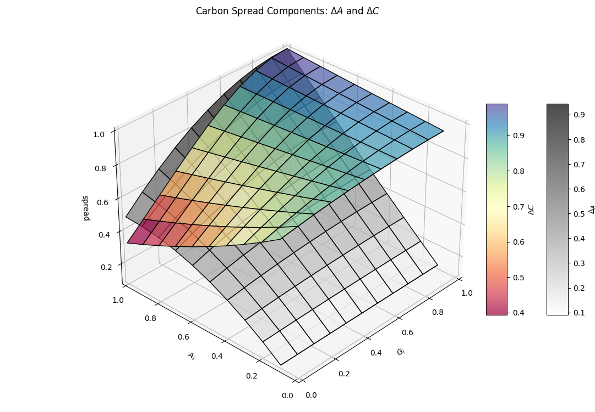

### 6.3 Interactive Model

This additional section is not is the original PDF version of the whitepaper. It
presents an interactive model of the AAM where each parameter of interest can be
adjusted by the reader.

In [Section&nbsp;6.3.1](#6-3-1-a-tokens-emitted-when-the-aam-purchases-carbon),
a Carbon holder sells Carbon to the AAM in exchange for **A**&nbsp;tokens; from
the point of view of the AAM, this represents a Carbon purchase. In
[Section&nbsp;6.3.2](#6-3-2-carbon-sold-by-the-aam-when-it-burns-a-tokens), a
holder of **A**&nbsp;tokens burns **A**&nbsp;tokens to buy Carbon from the AAM;
from the point of view of the AAM, this represents a Carbon sale.

#### 6.3.1 A Tokens Emitted When the AAM Purchases Carbon

In this section, the reader controls how many present-value tonnes of Carbon
class&nbsp;${tex`i`} are purchased by the AAM. The number of **A**&nbsp;tokens
emitted in exchange is calculated in real time. The price of Carbon
class&nbsp;${tex`i`} is calculated by dividing the number of **A**&nbsp;tokens
emitted by the AAM by the number of present-value tonnes of Carbon
class&nbsp;${tex`i`} purchased by the AAM.

|                   | Circulating **A**&nbsp;tokens | Present-value tonnes of class&nbsp;${tex`i`} in AAM |
| ----------------- | -----------------------------:| ---------------------------------------------------:|
| **Total**         | ${stringASupply}              | ${stringPresentTonnes}                              |
| **Variation**     | ${stringAEmitted}             | ${stringDeltaTonnes}                                |
| **Unit price**    | ${stringAPrice}               | ${stringBarCiPrice}                                 |

```js
function numberOfDigits(x) {
  return x === 0 ? 1 : (1 + Math.floor(Math.log10(x)));
}

function piecewiseLogTransform(xTran = 1) {
  return x => x > xTran ? Math.log(x) : x - xTran + Math.log(xTran);
}

function piecewiseLogInvert(xTran = 1) {
  return y => y > Math.log(xTran) ? Math.exp(y) : y - Math.log10(xTran) + xTran;
}

function setInput(input, value) {
  input.value = value;
  input.dispatchEvent(new Event("input", { bubbles: true }));
}
```

```js
const defaultAValue = 2e6;
const defaultASupply = 2e7;
const defaultPresentTonnes = 1e7;
const defaultDeltaTonnes = 1e2;
const defaultAi = 0.5;
const defaultGi = 0.5;
const defaultTildeCnull = 1e7;

const viewAValue = Inputs.range([1e5, 1e9], {
  label: tex`\text{\textbf{A}~token USD market capitalization}`,
  step: 1,
  value: defaultAValue,
  transform: Math.log,
});
const viewASupply = Inputs.range([1e6, 1e10], {
  label: tex`\text{Circulating \textbf{A}~tokens}`,
  step: 1,
  value: defaultASupply,
  transform: Math.log,
});
const viewPresentTonnes = Inputs.range([0, 1e9], {
  label: tex`\bar C_i \text{ (present-value tonnes of class } i
    \text{ in AAM)}`,
  step: 1,
  value: defaultPresentTonnes,
  transform: piecewiseLogTransform(),
  invert: piecewiseLogInvert(),
});
const viewDeltaTonnes = Inputs.range([1e-1, 1e7], {
  label: tex`\text{Present-value tonnes bought by the AAM}`,
  step: 1e-1,
  value: defaultDeltaTonnes,
  transform: Math.log,
});
const viewAi = Inputs.range([0, 1], {
  label: tex`A_i \text{ (share of \textbf{A}~stake pricing class } i \text)`,
  step: 1e-3,
  value: defaultAi,
  transform: piecewiseLogTransform(1e-3),
  invert: piecewiseLogInvert(1e-3),
});
const viewGi = Inputs.range([0, 1], {
  label: tex`G_i \text{ (share of \textbf{G}~stake pricing class } i \text)`,
  step: 1e-3,
  value: defaultGi,
});
const viewZeroCarbon = Inputs.button(
  [["Zero Carbon Scenario", () => setInput(viewPresentTonnes, 0)]],
);
const viewTildeCnull = Inputs.range([1, 1e9], {
  label: tex`\tilde C_\emptyset \text{ (implied tonnes of class } i
    \text{ in AAM)}`,
  step: 1,
  value: defaultTildeCnull,
  transform: Math.log,
});
const viewReset = Inputs.button(
  [["Reset", () => {
    setInput(viewAValue, defaultAValue);
    setInput(viewASupply, defaultASupply);
    setInput(viewPresentTonnes, defaultPresentTonnes);
    setInput(viewDeltaTonnes, defaultDeltaTonnes);
    setInput(viewAi, defaultAi);
    setInput(viewGi, defaultGi);
    setInput(viewTildeCnull, defaultTildeCnull);
  }]],
);
```

```js
const inputReset = view(viewReset);
const inputAValue = view(viewAValue);
const inputASupply = view(viewASupply);
const inputPresentTonnes = view(viewPresentTonnes);
const inputDeltaTonnes = view(viewDeltaTonnes);
const inputAi = view(viewAi);
const inputGi = view(viewGi);
const inputZeroCarbon = view(viewZeroCarbon);
const inputTildeCnull = view(viewTildeCnull);
```

```js
if (inputAValue === defaultAValue && inputASupply === defaultASupply &&
        inputPresentTonnes === defaultPresentTonnes &&
        inputDeltaTonnes === defaultDeltaTonnes && inputAi === defaultAi &&
        inputGi === defaultGi && inputTildeCnull === defaultTildeCnull) {
  viewReset.classList.add("u-hidden");
} else {
  viewReset.classList.remove("u-hidden");
}
if (inputPresentTonnes === 0) {
  viewZeroCarbon.classList.add("u-removed");
  viewTildeCnull.classList.remove("u-removed");
} else {
  viewZeroCarbon.classList.remove("u-removed");
  viewTildeCnull.classList.add("u-removed");
}
```

```js
const paramDeltaBarCi_ = computeDeltaBarCi(
  inputDeltaTonnes,
  inputPresentTonnes,
  inputTildeCnull,
);
const paramDeltaA = computeDeltaA(inputAi, inputGi, paramDeltaBarCi_);
const paramDeltaTonnes = paramDeltaA === 0 ? 0 : inputDeltaTonnes;
const paramAEmitted = paramDeltaA * inputASupply;
const paramAPrice = inputAValue / inputASupply;
const paramBarCiPrice = inputAValue * paramDeltaA / inputDeltaTonnes;
const paramDeltaBarCiValue = paramBarCiPrice * inputPresentTonnes;

const stringASupply = inputASupply.toLocaleString(
  "en-GB",
  {
    minimumFractionDigits: Math.max(0, 2 - numberOfDigits(paramAEmitted)),
    maximumFractionDigits: Math.max(0, 2 - numberOfDigits(paramAEmitted)),
  },
) + " KLIMA";
const stringTruePresentTonnes = inputPresentTonnes.toLocaleString(
  "en-GB",
  {
    minimumFractionDigits: Math.max(0, 1 - numberOfDigits(paramDeltaTonnes)),
    maximumFractionDigits: Math.max(0, 1 - numberOfDigits(paramDeltaTonnes)),
  },
) + " tCO2eq";
const stringTildeCnull_ = inputTildeCnull.toLocaleString(
  "en-GB",
  {
    minimumFractionDigits: Math.max(0, 1 - numberOfDigits(paramDeltaTonnes)),
    maximumFractionDigits: Math.max(0, 1 - numberOfDigits(paramDeltaTonnes)),
  },
) + " tCO2eq";
const isImpl = inputPresentTonnes === 0;
const stringPresentTonnes = (isImpl ? `(${stringTildeCnull_} implied) `: "") +
        stringTruePresentTonnes;
const stringAEmitted = "+" + paramAEmitted.toLocaleString(
  "en-GB",
  {
    minimumSignificantDigits: Math.max(2, numberOfDigits(paramAEmitted)),
    maximumSignificantDigits: Math.max(2, numberOfDigits(paramAEmitted)),
  },
) + " KLIMA";
const stringDeltaTonnes = "+" + paramDeltaTonnes.toLocaleString(
  "en-GB",
  {
    minimumSignificantDigits: Math.max(1, numberOfDigits(paramDeltaTonnes)),
    maximumSignificantDigits: Math.max(1, numberOfDigits(paramDeltaTonnes)),
  },
) + " tCO2eq";
const stringAPrice = "$" + paramAPrice.toLocaleString(
  "en-GB",
  {
    minimumSignificantDigits: Math.max(2, 2 + numberOfDigits(paramAPrice)),
    maximumSignificantDigits: Math.max(2, 2 + numberOfDigits(paramAPrice)),
  },
);
const stringBarCiPrice = "$" + paramBarCiPrice.toLocaleString(
  "en-GB",
  {
    minimumSignificantDigits: Math.max(2, 2 + numberOfDigits(paramBarCiPrice)),
    maximumSignificantDigits: Math.max(2, 2 + numberOfDigits(paramBarCiPrice)),
  },
);
```

#### 6.3.2 Carbon Sold by the AAM When it Burns A Tokens

In this section, the reader controls how many **A**&nbsp;tokens are burnt by the
AAM. The number of liquid tonnes of Carbon class&nbsp;${tex`i`} sold by the AAM
in exchange is calculated in real time. The price of Carbon is calculated by
dividing the number of **A**&nbsp;tokens burnt by the AAM by the number of
liquid tonnes of Carbon class&nbsp;${tex`i`} sold by the AAM.

|                   | Circulating **A**&nbsp;tokens | Liquid tonnes of class&nbsp;${tex`i`} in AAM |
| ----------------- | -----------------------------:| --------------------------------------------:|
| **Total**         | ${stringASupply_}             | ${stringLiquidTonnes}                        |
| **Variation**     | ${stringABurnt}               | ${stringDeltaCiTonnes}                       |
| **Unit price**    | ${stringAPrice_}              | ${stringCiPrice}                             |

```js
const defaultLiquidTonnes = 1e7;
const defaultABurnt = 1e2;
const defaultGnull = 0.5;
const defaultA = 0.5;
const defaultS = 0.5;

const viewAValue_ = Inputs.range([1e5, 1e9], {
  label: tex`\text{\textbf{A}~token USD market capitalization}`,
  step: 1,
  value: defaultAValue,
  transform: Math.log,
});
const viewASupply_ = Inputs.range([1e6, 1e10], {
  label: tex`\text{Circulating \textbf{A}~tokens}`,
  step: 1,
  value: defaultASupply,
  transform: Math.log,
});
const viewLiquidTonnes = Inputs.range([1, 1e9], {
  label: tex`\text{Liquid tonnes of class } i \text{ in AAM}`,
  step: 1,
  value: defaultLiquidTonnes,
  transform: Math.log,
});
const viewABurnt = Inputs.range([1e-1, 1e6], {
  label: tex`\text{\textbf{A}~tokens burnt by the AAM}`,
  step: 1e-1,
  value: defaultABurnt,
  transform: Math.log,
});
const viewAi_ = Inputs.range([0, 1], {
  label: tex`A_i \text{ (share of \textbf{A}~stake pricing class } i \text)`,
  step: 1e-3,
  value: defaultAi,
  transform: piecewiseLogTransform(1e-3),
  invert: piecewiseLogInvert(1e-3),
});
const viewGi_ = Inputs.range([0, 1], {
  label: tex`G_i \text{ (share of \textbf{G}~stake pricing class } i \text)`,
  step: 1e-3,
  value: defaultGi,
});
const viewGnull = Inputs.range([0, 1], {
  label: tex`G_\emptyset \text{ (implied \textbf{G}~stake pricing class }
          i \text)`,
  step: 1e-3,
  value: defaultGnull,
});
const viewUnweighed = Inputs.button(
  [["Unweighed Carbon Class", () => setInput(viewAi, 0)]],
);
const viewA = Inputs.range([0, 1], {
  label: tex`A \text{ (share of \textbf{A}~tokens staked for pricing)}`,
  step: 1e-3,
  value: defaultA,
  transform: x => 1 - piecewiseLogTransform(1e-3)(1 - Math.sqrt(x)),
  invert: x => (1 - piecewiseLogInvert(1e-3)(1 - x))**2,
});
const viewFullyStaked = Inputs.button(
  [["Implied Zero Stake", () => setInput(viewA, 1)]],
);
const viewS = Inputs.range([0, 1], {
  label: tex`S \text{ (share of \textbf{A}~tokens staked for bonds)}`,
  step: 1e-3,
  value: defaultS,
  transform: piecewiseLogTransform(1e-3),
  invert: piecewiseLogInvert(1e-3),
});
const viewReset_ = Inputs.button(
  [["Reset", () => {
    setInput(viewAValue_, defaultAValue);
    setInput(viewASupply_, defaultASupply);
    setInput(viewLiquidTonnes, defaultLiquidTonnes);
    setInput(viewABurnt, defaultABurnt);
    setInput(viewAi, defaultAi);
    setInput(viewGi, defaultGi);
    setInput(viewGnull, defaultGnull);
    setInput(viewA, defaultA);
    setInput(viewS, defaultS);
  }]],
);
```

```js
const inputReset = view(viewReset_);
const inputAValue_ = view(viewAValue_);
const inputASupply_ = view(viewASupply_);
const inputLiquidTonnes = view(viewLiquidTonnes);
const inputABurnt = view(viewABurnt);
display(Inputs.bind(viewAi_, viewAi));
display(Inputs.bind(viewGi_, viewGi));
const inputGnull = view(viewGnull);
const inputS_ = view(viewS);
display(viewUnweighed);
const inputA = view(viewA);
```

```js
const viewTildeAnull = html`<p class="inputs">${tex`\tilde A_\emptyset =
        ${stringTildeAnull} \% \text{ (implied \textbf{A}~stake pricing class }
        i \text)`}`;
const viewDeltaCnullTonnes = html`<p>All <strong>A</strong>&nbsp;tokens are
        already staked for pricing. If the AAM cannot sell Carbon
        class&nbsp;${tex`i`}, it issues ${stringDeltaCnull} of its liquid Carbon
        balance as a daily liquid yield to all bond holders. On the first day,
        this represents a total of ${stringDeltaCnullTonnes}&nbsp;tCO2eq.`;

display(viewTildeAnull);
display(viewFullyStaked);
display(viewDeltaCnullTonnes);
```

```js
if (inputAValue_ === defaultAValue && inputASupply_ === defaultASupply &&
        inputLiquidTonnes === defaultLiquidTonnes &&
        inputABurnt === defaultABurnt && inputAi === defaultAi &&
        inputGi === defaultGi && inputGnull === defaultGnull &&
        inputS_ === defaultS && inputA === defaultA) {
  viewReset_.classList.add("u-hidden");
} else {
  viewReset_.classList.remove("u-hidden");
}
if (inputAi === 0) {
  viewGi_.classList.add("u-removed");
  viewUnweighed.classList.add("u-removed");
  if (inputA === 1) {
    viewGnull.classList.add("u-removed");
    viewFullyStaked.classList.add("u-removed");
    viewS.classList.remove("u-removed");
    viewDeltaCnullTonnes.classList.remove("u-removed");
  } else {
    viewGnull.classList.remove("u-removed");
    viewFullyStaked.classList.remove("u-removed");
    viewS.classList.add("u-removed");
    viewDeltaCnullTonnes.classList.add("u-removed");
  }
  viewA.classList.remove("u-removed");
  viewTildeAnull.classList.remove("u-removed");
} else {
  viewGi_.classList.remove("u-removed");
  viewUnweighed.classList.remove("u-removed");
  viewGnull.classList.add("u-removed");
  viewFullyStaked.classList.add("u-removed");
  viewTildeAnull.classList.add("u-removed");
  viewS.classList.add("u-removed");
  viewDeltaCnullTonnes.classList.add("u-removed");
  viewA.classList.add("u-removed");
}
```

```js
const paramTildeAnull = computeTildeAnull(inputA);
const paramDeltaA_ = inputABurnt / inputASupply_;
const paramDeltaCi = computeTrueDeltaCi(
  inputAi,
  inputGi,
  paramTildeAnull,
  inputGnull,
  paramDeltaA_,
);
const paramDeltaCiTonnes = -paramDeltaCi * inputLiquidTonnes;
const paramDeltaCnull = computeDeltaCnull(inputAi, inputA, inputS_, inputGi); 
const paramDeltaCnullTonnes = paramDeltaCnull * inputLiquidTonnes;
const paramAPrice_ = inputAValue_ / inputASupply_;
const paramCiPrice = inputAValue_ * paramDeltaA_ / paramDeltaCiTonnes;

const stringASupply_ = inputASupply_.toLocaleString(
  "en-GB",
  {
    minimumFractionDigits: Math.max(0, 1 - numberOfDigits(inputABurnt)),
    maximumFractionDigits: Math.max(0, 1 - numberOfDigits(inputABurnt)),
  },
) + " KLIMA";
const stringLiquidTonnes = inputLiquidTonnes.toLocaleString(
  "en-GB",
  {
    minimumFractionDigits: Math.max(0, 2 - numberOfDigits(paramDeltaCiTonnes)),
    maximumFractionDigits: Math.max(0, 2 - numberOfDigits(paramDeltaCiTonnes)),
  },
) + " tCO2eq";
const stringABurnt = "−" + inputABurnt.toLocaleString(
  "en-GB",
  {
    minimumSignificantDigits: Math.max(1, numberOfDigits(inputABurnt)),
    maximumSignificantDigits: Math.max(1, numberOfDigits(inputABurnt)),
  },
) + " KLIMA";
const stringTildeAnull = (100 * paramTildeAnull).toLocaleString(
  "en-GB",
  { minimumSignificantDigits: 2, maximumSignificantDigits: 2 },
);
const stringDeltaCiTonnes = "−" + paramDeltaCiTonnes.toLocaleString(
  "en-GB",
  {
    minimumSignificantDigits: Math.max(2, numberOfDigits(paramDeltaCiTonnes)),
    maximumSignificantDigits: Math.max(2, numberOfDigits(paramDeltaCiTonnes)),
  },
) + " tCO2eq";
const stringDeltaCnull = paramDeltaCnull.toLocaleString(
  "en-GB",
  {
    style: "percent",
    minimumSignificantDigits: 2,
    maximumSignificantDigits: 2,
  },
);
const stringDeltaCnullTonnes = paramDeltaCnullTonnes.toLocaleString(
  "en-GB",
  {
    minimumSignificantDigits: Math.max(
      2,
      numberOfDigits(paramDeltaCnullTonnes),
    ),
    maximumSignificantDigits: Math.max(
      2,
      numberOfDigits(paramDeltaCnullTonnes),
    ),
  },
);
const stringAPrice_ = "$" + paramAPrice_.toLocaleString(
  "en-GB",
  {
    minimumSignificantDigits: Math.max(2, 2 + numberOfDigits(paramAPrice_)),
    maximumSignificantDigits: Math.max(2, 2 + numberOfDigits(paramAPrice_)),
  },
);
const stringCiPrice = "$" + paramCiPrice.toLocaleString(
  "en-GB",
  {
    minimumSignificantDigits: Math.max(2, 2 + numberOfDigits(paramCiPrice)),
    maximumSignificantDigits: Math.max(2, 2 + numberOfDigits(paramCiPrice)),
  },
);
```

## 7 Liquidity

Both **A** and **G**&nbsp;tokens can be used independently of price&nbsp;(and
time) staking for providing liquidity.

<p id="figure-14" class="u-center">Figure&nbsp;14: Token Liquidity and Pricing
  Structure

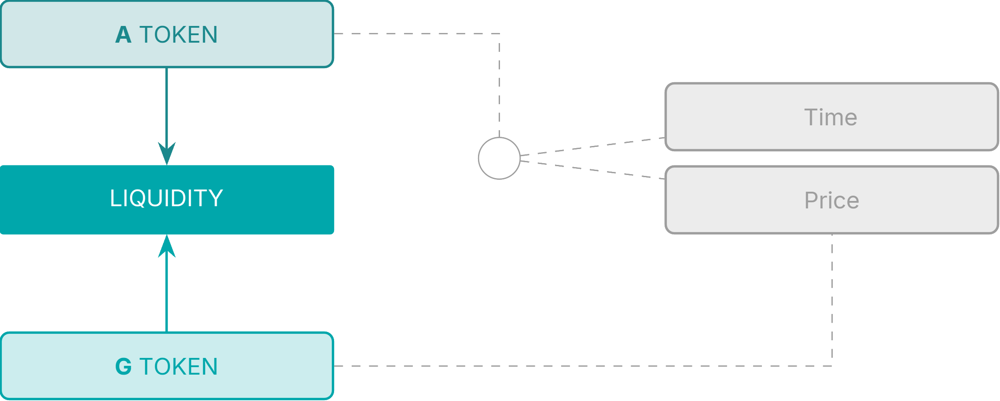

There are two core liquidity pools:

1. An AAM 50:50 pairing of **A** and **G**&nbsp;tokens;
pool&nbsp;<span class="u-overline">**AG**</span>.

2. A hard currency USDC denoted as&nbsp;**Q** paired with&nbsp;**A**;
pool&nbsp;<span class="u-overline">**AQ**</span>.

### 7.1 Liquidity Fees

The <span class="u-overline">**AQ**</span>&nbsp;pool will have its own set of
fees in the normal way.[^1]

The <span class="u-overline">**AG**</span>&nbsp;pool has different economics as
the assets are highly correlated since they represent the same economy. For this
reason, the fees are extremely low.

By locking liquidity&nbsp;(LP&nbsp;tokens) to the **standard maturities**, both
pools may receive a distribution of&nbsp;**A** tokens determined from the Risky
Yield calculation below. This is an <span class="u-underline">additional</span>
primary issuance to the Bond yields already discussed.

[^1]: Note the development of LP&nbsp;pricing functionality may be applicable

## 8 Risky Yield

### 8.1 Beta Determination

We can consider the Bond market yield as the system _risk-free_ rate. In
addition to this mechanism, a _risky_ spread is determined that is ultimately
paid to the liquidity providers of the **A** and **G**&nbsp;tokens as
compensation for the risk levels assumed.

As we have seen, the **G**&nbsp;token has an impact on risk-pricing
of&nbsp;**A**. As **G**&nbsp;staking increases, the relationship between the
Carbon class selected under&nbsp;${tex`G_i`} and the portfolio token&nbsp;**A**
strengthens. We can consider&nbsp;${tex`G_i`} staking as an estimate of residual
or idiosyncratic risk in the carbon-class and this allows us to calculate a
portfolio beta&nbsp;${tex`\beta`} from the implied betas of each carbon
class&nbsp;${tex`i`}.

```js
html`<span id="equation-26">${tex.block`\beta =
  \sqrt{\sum_{i=1}^n A_i - A_i \, (1 - G_i)^2} \tag{26}`}</span>`
```

```js
function computeBeta(vecAi, vecGi) {
  const beta2 = vecAi.reduce(
    (acc, Ai, i) => acc + Ai - Ai * (1 - vecGi[i])**2,
    0,
  );
  return Math.sqrt(beta2);
}
```

```js
function computeBetai(Ai, Gi) {
  return Math.sqrt(Ai - Ai * (1 - Gi)**2);
}
```

The portfolio ${tex`\beta`} determines a yield factor for the liquidity pools of
**A** to compensate for the implied risk levels.

For intuition, the map in [Figure&nbsp;15](#figure-15) shows the various outputs
of the function per Class.

<p id="figure-15" class="u-center">Figure&nbsp;15: Range of&nbsp;${tex`\beta_i`}

```js
const betaData = [];
for (let paramGi = 0; paramGi < 1.01; paramGi += 0.1) {
  betaData.push({
    key: "βᵢ",
    ai: 0,
    gi: paramGi,
    value: NaN,
  });
  for (let paramAi = 0.1; paramAi < 1.01; paramAi += 0.1) {
    betaData.push({
      key: "βᵢ",
      ai: paramAi,
      gi: paramGi,
      value: computeBetai(paramAi, paramGi),
    });
  }
}
```

```js
Plot.plot({
  caption: html`Heatmap of ${tex`\beta_i`}`,
  color: {
    legend: true,
    scheme: "Spectral",
    type: "sequential",
    label: "βᵢ",
  },
  x: { ticks: d3.range(0, 1.01, 0.1), label: "Aᵢ" },
  y: { ticks: d3.range(0, 1.01, 0.1), domain: [1.05, -0.05], label: "Gᵢ" },
  marks: [
    Plot.frame(),
    Plot.rect(betaData, {
      x1: d => d.ai - 0.05,
      x2: d => d.ai + 0.05,
      y1: d => d.gi - 0.05,
      y2: d => d.gi + 0.05,
      fill: "value",
    }),
    Plot.text(betaData, {
      x: "ai",
      y: "gi",
      text: d => Number.isNaN(d.value) ? "" : d.value.toLocaleString(
        "en-GB",
        { minimumFractionDigits: 2, maximumFractionDigits: 2 },
      ),
      fill: d => contrastingTextColor(d3.interpolateSpectral(d.value)),
    }),
  ],
})
```

The table and figure below shows an example of the effects on&nbsp;${tex`\beta`}
on allocating large **G**&nbsp;values to small **A**&nbsp;values where the shift
in **G**&nbsp;results in a lower&nbsp;${tex`\beta`}&nbsp;(0.27 from 0.55) with
no change to total **G** and **A**&nbsp;staking.

<p id="table-2" class="u-center">Table&nbsp;2: Effect on&nbsp;${tex`\beta`} from
  outsized <strong>G</strong>&nbsp;Staking

| Class                     | 1                                | 2                                | 3                                | 4                                | ${tex`\beta`}                      |
|:------------------------- |:--------------------------------:|:--------------------------------:|:--------------------------------:|:--------------------------------:|:----------------------------------:|
| ${tex`A_i`}               | 0.50                             | 0.20                             | 0.10                             | 0.05                             |                                    |
| Initial ${tex`G_i`}       | <span class="u-blue">0.30</span> | <span class="u-blue">0.10</span> | <span class="u-blue">0.05</span> | <span class="u-blue">0.01</span> |                                    |
| Initial ${tex`\beta_i^2`} | 0.2550                           | 0.0380                           | 0.0098                           | 0.0010                           | <span class="u-blue">0.5511</span> |
| New ${tex`G_i`}           | <span class="u-red">0.01</span>  | <span class="u-red">0.05</span>  | <span class="u-red">0.10</span>  | <span class="u-red">0.30</span>  |                                    |
| New ${tex`\beta_i^2`}     | 0.0100                           | 0.0195                           | 0.0190                           | 0.0255                           | <span class="u-red">0.2719</span>  |
| ${tex`\Delta G_i`}        | (0.29)                           | (0.05)                           | 0.05                             | 0.29                             |                                    |
| ${tex`\Delta \beta_i^2`}  | (0.2451)                         | (0.0185)                         | 0.0092                           | 0.0245                           |                                    |

<p id="figure-16" class="u-center">Figure&nbsp;16: Example of
  <strong>G</strong>&nbsp;Stake on&nbsp;${tex`\beta`}

```js
const arrayAi = [0.5, 0.2, 0.1, 0.05];
const arrayInitialGi = [0.3, 0.1, 0.05, 0.01];
const arrayNewGi = arrayInitialGi.toReversed();
const betaContribData = [];
for (let i = 0; i < arrayAi.length; i++) {
  const Ai = arrayAi[i];
  const initialGi = arrayInitialGi[i];
  const initialBeta2 = computeBetai(Ai, initialGi)**2;
  const newGi = arrayNewGi[i];
  const newBeta2 = computeBetai(Ai, newGi)**2;
  betaContribData.push({ key: "Initial Gᵢ", class: i, value: initialGi });
  betaContribData.push({ key: "Initial βᵢ²", class: i, value: initialBeta2 });
  betaContribData.push({ key: "New Gᵢ", class: i, value: newGi });
  betaContribData.push({ key: "New βᵢ²", class: i, value: newBeta2 });
}
const getInitialG = d => d.key === "Initial Gᵢ" ? d.value : NaN;
const getInitialBeta2 = d => d.key === "Initial βᵢ²" ? d.value : NaN;
const getNewG = d => d.key === "New Gᵢ" ? d.value : NaN;
const getNewBeta2 = d => d.key === "New βᵢ²" ? d.value : NaN;

const domainG = [0, Math.max(d3.max(arrayInitialGi), d3.max(arrayNewGi))];
const rangeBeta2 = [
  0,
  Math.max(
    d3.max(betaContribData, getInitialBeta2),
    d3.max(betaContribData, getNewBeta2),
  ),
];
const scaleG = d3.scaleLinear(domainG, rangeBeta2);
const mapScaleG = x => x.map(scaleG);

const paramInitialBeta = computeBeta(arrayAi, arrayInitialGi);
const paramNewBeta = computeBeta(arrayAi, arrayNewGi);

const stringInitialBeta = "Initial β = " + paramInitialBeta.toLocaleString(
  "en-GB",
  { minimumFractionDigits: 4, maximumFractionDigits: 4 },
);
const stringNewBeta = "New β = " + paramNewBeta.toLocaleString(
  "en-GB",
  { minimumFractionDigits: 4, maximumFractionDigits: 4 },
);
```

```js
Plot.plot({
  caption: html`${tex`\beta`} Contribution from <strong>G</strong> Staking`,
  color: {
    legend: true,
    range: ["gray", "black", "blue", "red"],
    domain: ["Initial βᵢ²", "New βᵢ²", "Initial Gᵢ", "New Gᵢ"],
  },
  x: {
    ticks: d3.range(4),
    label: "Aᵢ Over 4 Classes",
    tickFormat: d => arrayAi[d],
  },
  y: { domain: rangeBeta2 },
  insetTop: 16,
  insetLeft: 8,
  insetRight: 8,
  marks: [
    Plot.frame(),
    Plot.axisY({ anchor: "left", label: "βᵢ²" }),
    Plot.axisY(scaleG.ticks(), { anchor: "right", label: "Gᵢ", y: scaleG }),
    Plot.rectY(betaContribData, {
      x1: d => d.class - 0.45,
      x2: d => d.class,
      y: getInitialBeta2,
      fill: "key",
    }),
    Plot.rectY(betaContribData, {
      x1: d => d.class,
      x2: d => d.class + 0.45,
      y: getNewBeta2,
      fill: "key",
    }),
    Plot.lineY(betaContribData, Plot.mapY(mapScaleG, {
      x: "class",
      y: getInitialG,
      stroke: "key",
      strokeDasharray: 4,
    })),
    Plot.dotY(betaContribData, Plot.mapY(mapScaleG, {
      x: "class",
      y: getInitialG,
      fill: "key",
    })),
    Plot.lineY(betaContribData, Plot.mapY(mapScaleG, {
      x: "class",
      y: getNewG,
      stroke: "key",
      strokeDasharray: 4,
    })),
    Plot.dotY(betaContribData, Plot.mapY(mapScaleG, {
      x: "class",
      y: getNewG,
      fill: "key",
    })),
    Plot.text([stringInitialBeta], { x: 0.5, y: 0.23, fill: d => "blue" }),
    Plot.text([stringNewBeta], { x: 2.5, y: 0.23, fill: d => "red" }),
  ],
})
```

[Figure&nbsp;16](#figure-16) shows the&nbsp;${tex`\beta`} sensitivity to
**G**&nbsp;staking as a function of **A**&nbsp;stake; that is to say that a
large **G**&nbsp;stake on a small **A**&nbsp;stake has limited
effects&nbsp;(notwithstanding other consequential factors).

### 8.2 Allocation of Risk Premium

The full issuance of **A**&nbsp;tokens is depicted below including now the risky
premium for the liquidity pools accordingly.

<p id="figure-17" class="u-center">Figure&nbsp;17: <strong>A</strong>&nbsp;Token
  Flow Structure

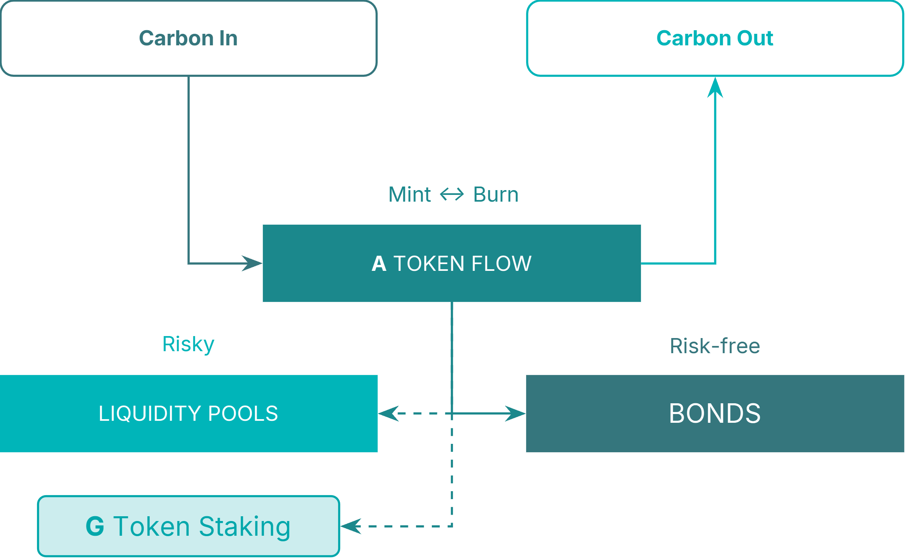

### 8.3 Share of Risky Premium

The risky premium allocation is shared between **G**&nbsp;staking,
<span class="u-overline">**AG**</span> and
<span class="u-overline">**AQ**</span>&nbsp;pools with
shares&nbsp;${tex`\lambda_{GG}`}, ${tex`\lambda_G`} and&nbsp;${tex`\lambda_Q`}
respectively.

Defining:

- ${tex`G_G`}: Total **G**&nbsp;tokens in the
<span class="u-overline">**AG**</span>&nbsp;pool, expressed as a proportion of
outstanding supply of&nbsp;**G**.

- ${tex`A_G`}: Total **A**&nbsp;tokens in the
<span class="u-overline">**AG**</span>&nbsp;pool, expressed as a proportion of
outstanding supply of&nbsp;**A**.

- ${tex`A_Q`}: Total **A**&nbsp;tokens in the
<span class="u-overline">**AQ**</span>&nbsp;pool, expressed as a proportion of
outstanding supply of&nbsp;**A**.

The allocation to **G**&nbsp;token staking, ${tex`\lambda_{GG}`}:

```js
html`<span id="equation-27">${tex.block`\lambda_{GG} = \frac{1 - A_Q}
  {1 + \left( \frac{G_i}{G_G} \right)^2} \tag{27}`}</span>`
```

```js
function computeLambdaGG(AQ, Gi, GG) {
  return (1 - AQ) / (1 + (Gi / GG)**2);
}
```

<p id="figure-18" class="u-center">Figure&nbsp;18: <strong>G</strong>&nbsp;Stake
  Allocation&nbsp;(assuming&nbsp;${tex`G_G = 1 − G_i`})

```js
const lambdaGGData = [];
for (let paramGi = 0; paramGi < 1.01; paramGi += 0.1) {
  for (let paramAQ = 0; paramAQ < 1.01; paramAQ += 0.1) {
    lambdaGGData.push({
      key: "λ",
      aq: paramAQ,
      gi: paramGi,
      value: computeLambdaGG(paramAQ, paramGi, 1 - paramGi),
    });
  }
}
```

```js
const plotLambdaGG = Plot.plot({
  caption: html`Heatmap of ${tex`\lambda_{GG}`} with ${tex`G_G = 1 - G_i`}`,
  color: {
    legend: true,
    scheme: "Spectral",
    domain: [0, 1],
    type: "sequential",
    label: "λ",
  },
  x: { ticks: d3.range(0, 1.01, 0.1), label: "A  " },
  y: { ticks: d3.range(0, 1.01, 0.1), domain: [1.05, -0.05], label: "Gᵢ" },
  marks: [
    Plot.frame(),
    Plot.rect(lambdaGGData, {
      x1: d => d.aq - 0.05,
      x2: d => d.aq + 0.05,
      y1: d => d.gi - 0.05,
      y2: d => d.gi + 0.05,
      fill: "value",
    }),
    Plot.text(lambdaGGData, {
      x: "aq",
      y: "gi",
      text: d => Number.isNaN(d.value) ? "" : d.value.toLocaleString(
        "en-GB",
        { minimumFractionDigits: 2, maximumFractionDigits: 2 },
      ),
      fill: d => contrastingTextColor(
        d3.scaleSequential([0, 1], d3.interpolateSpectral)(d.value),
      ),
    }),
  ],
});

function changeTranslation(dx, dy) {
  return function () {
    const svgTransformList = this.transform.baseVal;
    if (svgTransformList.length > 1) {
      throw new Error("SVGTransformList must only contain one translation");
    }
    const {e, f} = svgTransformList.consolidate().matrix;
    return `translate(${e + dx},${f + dy})`;
  }
}

d3.select(plotLambdaGG)
  .select("g[aria-label='x-axis label']")
  .select("text")
    .clone(false)
    .attr("transform", changeTranslation(-12, 1.5))
    .attr("font-size", "0.6em")
    .attr("font-weight", "600")
    .text("Q");

display(plotLambdaGG);
```

Noting the relationship between&nbsp;${tex`G`} and&nbsp;${tex`\beta`}, and
particularly if&nbsp;${tex`G = 0`}, ${tex`\beta = 0`}.

The residual share, ${tex`1 − λ_{GG}`}, is split between the liquidity pools:

```js
html`<span id="equation-28">${tex.block`\lambda_G =
  \frac{2 \, A_G}{2 \, A_G + A_Q \, \sqrt 2} \tag{28}`}</span>`
```

```js
function computeLambdaG(AQ, AG) {
  return 2 * AG / (2 * AG + AQ * Math.sqrt(2));
}
```

For completeness:

```js
html`<span id="equation-29">${tex.block`\lambda_Q = 1 - \lambda_G
  \tag{29}`}</span>`
```

```js
function computeLambdaQ(AQ, AG) {
  return 1 - computeLambdaG(AQ, AG);
}
```

<p id="figure-19" class="u-center">Figure&nbsp;19: Liquidity Pool
  Split&nbsp;${tex`\lambda_G, \lambda_Q`}

```js
const lambdaGQData = [];
for (let paramAG = 0; paramAG < 1.01; paramAG += 0.1) {
  for (let paramAQ = 0; paramAQ < 1.01; paramAQ += 0.1) {
    if (paramAG + paramAQ < 1.01) {
      lambdaGQData.push({
        key: "𝗔𝗚 Liquidity Pool Share",
        aq: paramAQ,
        ag: paramAG,
        value: computeLambdaG(paramAQ, paramAG),
      });
      lambdaGQData.push({
        key: "𝗔𝗤 Liquidity Pool Share",
        aq: paramAQ,
        ag: paramAG,
        value: computeLambdaQ(paramAQ, paramAG),
      });
    }
  }
}
```

```js
const plotLambdaGQ = Plot.plot({
  caption: html`<span class="u-overline"><strong>AG</strong></span>
    and <span class="u-overline"><strong>AQ</strong></span>&nbsp;Liquidity Pools
    Shares&nbsp;${tex`\lambda_G`} and&nbsp;${tex`\lambda_G`}`,
  aspectRatio: 1,
  color: {
    legend: true,
    scheme: "Spectral",
    domain: [0, 1],
    type: "sequential",
    label: "λ",
  },
  x: { ticks: d3.range(0, 1.01, 0.1), label: "A  " },
  y: {
    ticks: d3.range(0, 1.01, 0.1),
    domain: [1.05, -0.05],
    label: "A",
  },
  fx: { label: null },
  className: "LambdaGQ",
  marks: [
    Plot.frame(),
    Plot.rect(lambdaGQData, {
      x1: d => d.aq - 0.05,
      x2: d => d.aq + 0.05,
      y1: d => d.ag - 0.05,
      y2: d => d.ag + 0.05,
      fx: "key",
      fill: "value",
    }),
    Plot.text(lambdaGQData, {
      x: "aq",
      y: "ag",
      fx: "key",
      text: d => Number.isNaN(d.value) ? "" : d.value.toLocaleString(
        "en-GB",
        { minimumFractionDigits: 2, maximumFractionDigits: 2 },
      ),
      fill: d => contrastingTextColor(
        d3.scaleSequential([0, 1], d3.interpolateSpectral)(d.value),
      ),
    }),
  ],
});

d3.select(plotLambdaGQ)
  .select("g[aria-label='x-axis label']")
  .select("text")
  .clone(false)
    .attr("transform", changeTranslation(-12, 1.5))
    .attr("font-size", "0.6em")
    .attr("font-weight", "600")
    .text("Q");

d3.select(plotLambdaGQ)
  .select("g[aria-label='y-axis label']")
  .select("text")
    .attr("transform", changeTranslation(0, 10))
  .clone(false)
    .attr("transform", changeTranslation(14, 4.1))
    .attr("font-size", "0.6em")
    .attr("font-weight", "600")
    .text("G");

display(plotLambdaGQ);
```

### 8.4 Risky Premium Distribution

For&nbsp;${tex`\lambda_{GG}`}, ${tex`\lambda_G`}, ${tex`\lambda_Q`} we
apply&nbsp;${tex`\beta`}:

```js
html`<span id="equation-30">${tex.block`\Lambda_X = \lambda_X \, \beta, \quad
  \text{for } X \in \{GG, G, Q\} \tag{30}`}</span>`
```

Taking&nbsp;${tex`b`} as a discount parameter:

```js
html`<span id="equation-31">${tex.block`b =
  \frac{\sum_1^{40} Z_t \, S_t \, B_t}{\sum_1^{40} Z_t \, S_t }
  \tag{31}`}</span>`
```

The total Risky Yield tokens&nbsp;${tex`R_\lambda`}:

```js
html`<span id="equation-32">${tex.block`R_\lambda = b \, R \,
  (\Lambda_3 + \Lambda_4 + \Lambda_5) \tag{32}`}</span>`
```

The allocations of&nbsp;${tex`R_\lambda`} are pro-rata
to&nbsp;${tex`\Lambda_3`}, ${tex`\Lambda_4`}, ${tex`\Lambda_5`} and thereafter:

1. Locked **G**: ${tex`\Lambda_3`} in proportion to **G**.

2. Locked <span class="u-overline">**AG**</span>, <span class="u-overline">**AQ**</span> tokens are allocated a
weighting&nbsp;${tex`G_t`}, ${tex`Q_t`} depending on their time
bucket&nbsp;${tex`t`}:

    ```js
    html`<span id="equation-33">${tex.block`G_t =
      \frac{Z_t \, L_{Gt} \, B_t}{\sum Z_t \, L_{Gt} \, B_t} \tag{33}`}</span>`
    ```

    ```js
    html`<span id="equation-34">${tex.block`Q_t =
      \frac{Z_t \, L_{Qt} \, B_t}{\sum Z_t \, L_{Qt} \, B_t} \tag{34}`}</span>`
    ```

    Where&nbsp;${tex`L_{Gt}`}, ${tex`L_{Qt}`} are the proportion of all
    liquidity locked in each time bucket
    for&nbsp;<span class="u-overline">**AG**</span>
    and&nbsp;<span class="u-overline">**AQ**</span> respectively.

Thereafter each time bucket allocation is proportionate to LP&nbsp;holdings.

## 9 Distribution

### 9.1 Planned Allocations

<p id="table-3" class="u-center">Table&nbsp;3: KLIMA Token

| Cohort         | Proportion | Quantity&nbsp;(m) |
|:-------------- |:----------:|:-----------------:|
| Klima Holders  | 87.5%      | 17.5              |
| DAO / Treasury | 10%        | 2.0               |
| 01X            | 2.5%       | 0.5               |
| Total          |            | 20                |

<p id="table-4" class="u-center">Table&nbsp;4: KlimaX Token

<table>
  <thead>
    <tr>
      <th>Cohort
      <th class="u-center">Proportion
      <th class="u-center">Quantity&nbsp;(m)
      <th>Liquidity
  </thead>
  <tbody>
    <tr>
      <td>Klima Holders
      <td class="u-center">40%
      <td class="u-center">40
      <td>Logistic Vesting 48&nbsp;months
    <tr>
      <td>Ecosystem Grant
      <td class="u-center">5%
      <td class="u-center">5
      <td>Logistic Vesting 48&nbsp;months
    <tr class="u-gray">
      <td>Programmatic Incentives
      <td class="u-center">40%
      <td class="u-center">40
      <td>Incentive Curve
    <tr>
      <td>pKlima Holders
      <td class="u-center">3.0%
      <td class="u-center">3
      <td>Logistic Vesting 48&nbsp;months
    <tr>
      <td>DAO / Treasury
      <td class="u-center">4.5%
      <td class="u-center">4.5
      <td>24&nbsp;month locked&nbsp;LP
        of&nbsp;<span class="u-overline"><strong>AG</strong></span>
    <tr>
      <td>01X
      <td class="u-center">2.5%
      <td class="u-center">2.5
      <td>24&nbsp;month locked&nbsp;LP
        of&nbsp;<span class="u-overline"><strong>AG</strong></span>
    <tr>
      <td>Product design and development
      <td class="u-center">5%
      <td class="u-center">5
      <td>Logistic Vesting 48&nbsp;months
    <tr>
      <td>Total
      <td>
      <td class="u-center">100
      <td>
  </tbody>
</table>

<p id="figure-20" class="u-center">Figure&nbsp;20: Allocations: KlimaX Token

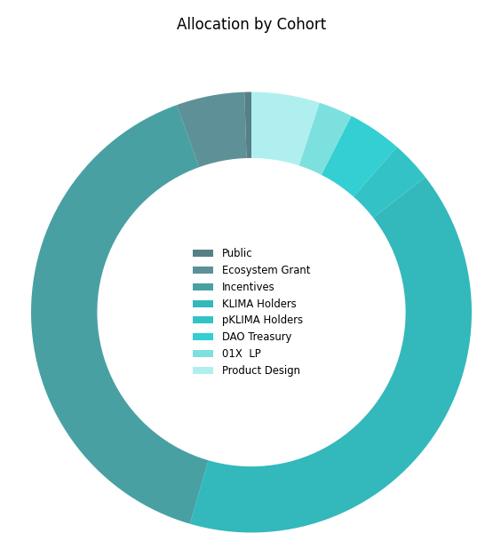

### 9.2 Programmatic Incentive Curve

The incentive issuance is built on a logistic function, ${tex`P`}, to generate
total proportion of supply in issue. It is calibrated from the initial issuance
at&nbsp;TGE&nbsp;${tex`P_0`} and the inflection point time&nbsp;${tex`T`}
where&nbsp;50% of **G**&nbsp;token incentives have been released.

Setting&nbsp;${tex`x_0`} from the initial supply parameter:

```js
html`<span id="equation-35">${tex.block`x_0 =
  \ln\left( \frac{P_0}{1 - P_0} \right) \tag{35}`}</span>`
```

With ${tex`x_t`} at time point&nbsp;${tex`t \in (0, \infty)`}:

```js
html`<span id="equation-36">${tex.block`x_t = x_0 \,
  \left( 1 - \frac t T \right) \tag{36}`}</span>`
```

Giving supply function ${tex`P_t`} as:

```js
html`<span id="equation-37">${tex.block`P_t = \frac{\exp(x_t)}{\exp(x_t) + 1}
  \tag{37}`}</span>`
```

${tex`P_0`} set at&nbsp;7.0% and&nbsp;${tex`T`} at 24&nbsp;months:

<p id="figure-21" class="u-center">Figure&nbsp;21: Incentive Issuance

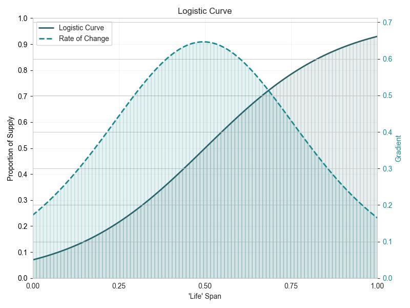

<p id="figure-22" class="u-center">Figure&nbsp;22: KlimaX Token Supply Over Time

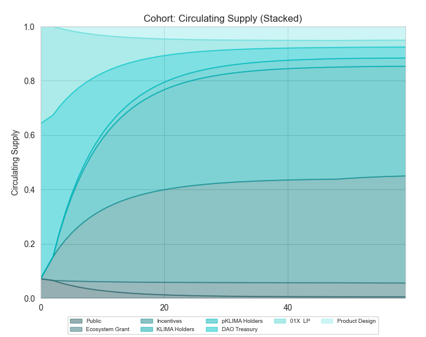


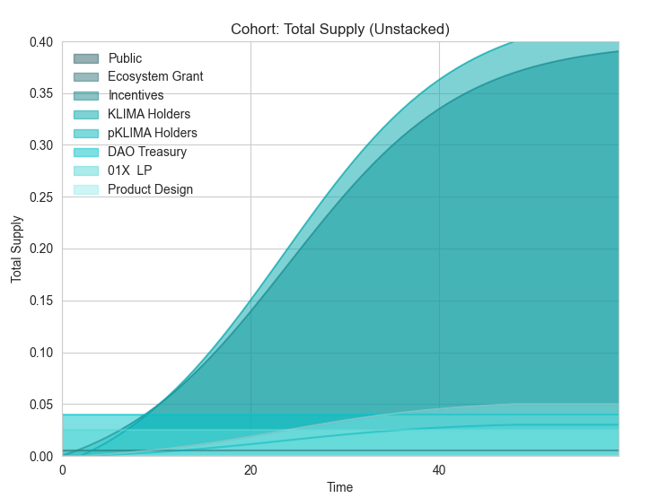

<p id="figure-23" class="u-center">Figure&nbsp;23: KlimaX Token Supply Risk
  Metrics

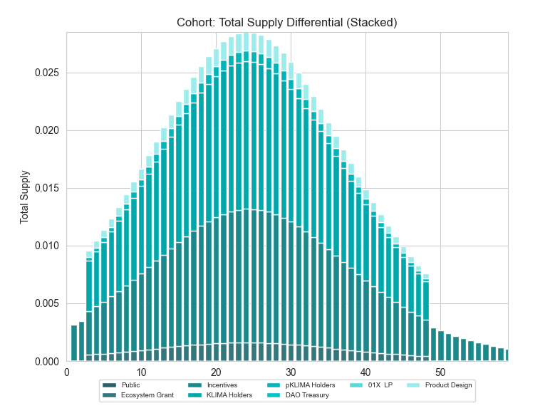

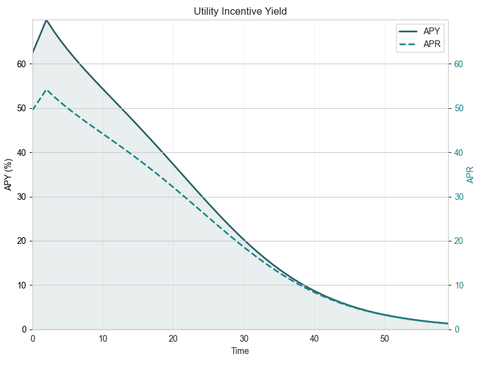

### 9.3 Incentive Allocations

<p id="figure-24" class="u-center">Figure&nbsp;24:
  <strong>G</strong>&nbsp;Token Incentive Distribution Structure

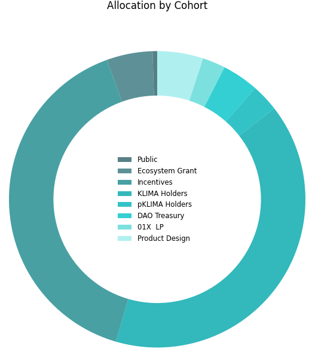

The **relative utilisation** measurement factor&nbsp;${tex`\upsilon`} is
calculated as follows.

Defining initially:

- ${tex`G`}: Total **G** tokens staked expressed as a proportion of
circulating supply, ${tex`G \in [0, 1]`}.

- ${tex`L`}: Total **G** tokens held in the <span class="u-overline">**AG**</span> pool
expressed as a proportion of circulating supply, ${tex`L \in (0, 1]`}.

Where ${tex`\upsilon = 0`} if ${tex`G + L = 0`}, otherwise:

```js
html`<span id="equation-38">${tex.block`\upsilon =
  \left( \frac{2 G L}{G^2 + L^2} \right)^2 \tag{38}`}</span>`
```

```js
function computeUpsilon(G, L) {
  if (G === 0 && L === 0) {
    return 0;
  } else {
    return (2 * G * L / (G**2 + L**2))**2;
  }
}
```

<p id="figure-25" class="u-center">Figure&nbsp;25:
  Upsilon&nbsp;${tex`\upsilon`} range of value

```js
const upsilonData = [];
for (let paramG = 0; paramG < 1.01; paramG += 0.05) {
  for (let paramL = 0; paramL < 1.01; paramL += 0.05) {
    if (paramG + paramL < 1.01) {
      upsilonData.push({
        key: "υ",
        l: paramL,
        g: paramG,
        value: computeUpsilon(paramG, paramL),
      });
    }
  }
}
```

```js
Plot.plot({
  caption: html`Range of ${tex`\upsilon`}`,
  aspectRatio: 1,
  color: {
    legend: true,
    scheme: "Spectral",
    domain: [0, 1],
    type: "sequential",
    label: "Relative Utilisation υ",
  },
  x: { ticks: d3.range(0, 1.01, 0.1), label: "Liquidity L" },
  y: {
    ticks: d3.range(0, 1.01, 0.1),
    domain: [1.025, -0.025],
    label: "Stake G",
  },
  marks: [
    Plot.frame(),
    Plot.rect(upsilonData, {
      x1: d => d.l - 0.025,
      x2: d => d.l + 0.025,
      y1: d => d.g - 0.025,
      y2: d => d.g + 0.025,
      fill: "value",
    }),
    Plot.text(upsilonData, {
      x: "l",
      y: "g",
      text: d => Number.isNaN(d.value) ? "" : d.value.toLocaleString(
        "en-GB",
        { minimumFractionDigits: 2, maximumFractionDigits: 2 },
      ),
      fill: d => contrastingTextColor(
        d3.scaleSequential([0, 1], d3.interpolateSpectral)(d.value),
      ),
    }),
  ],
})
```

The **absolute utilisation** parameter&nbsp;${tex`\eta`} is defined
as&nbsp;${tex`\eta = 0`} if ${tex`G + L = 0`}, otherwise:

```js
html`<span id="equation-39">${tex.block`\eta = \frac{1}{1 - \log(G + L)}
  \tag{39}`}</span>`
```

```js
function computeEta(G, L) {
  if (G === 0 && L === 0) {
    return 0;
  } else {
    return 1 / (1 - Math.log(G + L));
  }
}
```

```js
const etaData = [];
for (let paramG = 0; paramG < 1.01; paramG += 0.05) {
  for (let paramL = 0; paramL < 1.01; paramL += 0.05) {
    if (paramG + paramL < 1.01) {
      etaData.push({
        key: "η",
        l: paramL,
        g: paramG,
        value: computeEta(paramG, paramL),
      });
    }
  }
}
```

```js
Plot.plot({
  caption: html`Range of ${tex`\eta`}`,
  aspectRatio: 1,
  color: {
    legend: true,
    scheme: "Spectral",
    domain: [0, 1],
    type: "sequential",
    label: "Absolute Utilisation η",
  },
  x: { ticks: d3.range(0, 1.01, 0.1), label: "Liquidity L" },
  y: {
    ticks: d3.range(0, 1.01, 0.1),
    domain: [1.025, -0.025],
    label: "Stake G",
  },
  marks: [
    Plot.frame(),
    Plot.rect(etaData, {
      x1: d => d.l - 0.025,
      x2: d => d.l + 0.025,
      y1: d => d.g - 0.025,
      y2: d => d.g + 0.025,
      fill: "value",
    }),
    Plot.text(etaData, {
      x: "l",
      y: "g",
      text: d => Number.isNaN(d.value) ? "" : d.value.toLocaleString(
        "en-GB",
        { minimumFractionDigits: 2, maximumFractionDigits: 2 },
      ),
      fill: d => contrastingTextColor(
        d3.scaleSequential([0, 1], d3.interpolateSpectral)(d.value),
      ),
    }),
  ],
})
```

Incentives&nbsp;${tex`I`} are allocated as follows.

<p id="9-3-1-treasury" tabindex="-1">
  <a class="observablehq-header-anchor" href="#9-3-1-treasury">
    <strong>Treasury</strong>
  </a>

The allocation to the Treasury&nbsp;${tex`I_T`} is the imbalance generated
from&nbsp;${tex`\upsilon`}:

```js
html`<span id="equation-40">${tex.block`I_T = 1 - \upsilon \, \eta
  \tag{40}`}</span>`
```

```js
function computeTreasury(G, L) {
  return Math.max(0, 1 - computeUpsilon(G, L) * computeEta(G, L));
}
```

<p id="9-3-2-post-treasury" tabindex="-1">
  <a class="observablehq-header-anchor" href="#9-3-2-post-treasury">
    <strong>Post Treasury</strong>
  </a>

The residual post Treasury allocation is shared four ways within 2&nbsp;buckets:

1. <p id="9-3-2-1-a-bonds-and-g-staking" tabindex="-1">
    <a class="observablehq-header-anchor" href="#9-3-2-1-a-bonds-and-g-staking">
      <strong>A Bonds & G Staking</strong>
    </a>

    Where&nbsp;${tex`S`} is the proportion of **A**&nbsp;tokens that are staked
    for Bonds&nbsp;(as defined previously in [Section&nbsp;4](#4-bond-market)):

    1. **A**&nbsp;Bonds, ${tex`I_S`}:

        ```js
        html`<span id="equation-41">${tex.block`I_S = S \, \frac{L^2}{G^2 + L^2}
          \tag{41}`}</span>`
        ```

    2. **G**&nbsp;Staking, ${tex`I_G`}:

        ```js
        html`<span id="equation-42">${tex.block`I_G = (1 − S) \,
          \frac{L^2}{G^2 + L^2} \tag{42}`}</span>`
        ```

```js
function computeIBonds(G, L, S) {
  if (G === 0 && L === 0) {
    return 0;
  } else {
    return S * L**2 / (G**2 + L**2);
  }
}

function computeIStaking(G, L, S) {
  if (G === 0 && L === 0) {
    return 0;
  } else {
    return (1 - S) * L**2 / (G**2 + L**2);
  }
}
```

2. <p id="9-3-2-2-liquidity" tabindex="-1">
    <a class="observablehq-header-anchor" href="#9-3-2-2-liquidity">
      <strong>Liquidity</strong>
    </a>

    With&nbsp;${tex`\lambda_G`}, ${tex`\lambda_Q`}, ${tex`\lambda_{GG}`} as
    defined in [Section&nbsp;8.3](#8-3-share-of-risky-premium):

    3. <span class="u-overline">**AG**</span> Pool&nbsp;${tex`I_{AG}`}:

        ```js
        html`<span id="equation-43">${tex.block`I_{AG} =
          \frac{\lambda_G}{1 - \lambda_{GG}} \, \frac{G^2}{G^2 + L^2}
          \tag{43}`}</span>`
        ```

    4. <span class="u-overline">**AQ**</span> Pool&nbsp;${tex`I_{AQ}`}:

        ```js
        html`<span id="equation-44">${tex.block`I_{AQ} =
          \frac{\lambda_Q}{1 - \lambda_{GG}} \, \frac{G^2}{G^2 + L^2}
          \tag{44}`}</span>`
        ```

```js
function computeIPool(G, L, weight) {
  if (G === 0 && L === 0) {
    return 0;
  } else {
    return weight * G**2 / (G**2 + L**2);
  }
}
```

<p id="figure-26" class="u-center">Figure&nbsp;26: Share of Non-Treasury
  Incentives&nbsp;${tex`I_S`}, ${tex`I_G`}, ${tex`I_{AG}`}
  and&nbsp;${tex`I_{AQ}`}

```js
const allocationSQData = [];
for (let paramG = 0; paramG < 1.01; paramG += 0.1) {
  for (let paramL = 0; paramL < 1.01; paramL += 0.1) {
    if (paramG + paramL < 1.01) {
      allocationSQData.push({
        key: "𝗔 Bonds Allocation",
        l: paramL,
        g: paramG,
        value: computeIBonds(paramG, paramL, inputS__),
      });
      allocationSQData.push({
        key: "𝗚 Staking Allocation",
        l: paramL,
        g: paramG,
        value: computeIStaking(paramG, paramL, inputS__),
      });
    }
  }
}
```

```js
const plotAllocationSQ = Plot.plot({
  caption: html`1. <strong>A</strong>&nbsp;Bonds and
    <strong>G</strong>&nbsp;Staking Allocations&nbsp;${tex`I_S`}
    and&nbsp;${tex`I_G`}`,
  aspectRatio: 1,
  color: {
    legend: true,
    scheme: "Spectral",
    domain: [0, 1],
    type: "sequential",
    label: "Allocation I",
  },
  x: { ticks: d3.range(0, 1.01, 0.1), label: "Liquidity L" },
  y: {
    ticks: d3.range(0, 1.01, 0.1),
    domain: [1.05, -0.05],
    label: "Stake G",
  },
  fx: { label: null },
  marks: [
    Plot.frame(),
    Plot.rect(allocationSQData, {
      x1: d => d.l - 0.05,
      x2: d => d.l + 0.05,
      y1: d => d.g - 0.05,
      y2: d => d.g + 0.05,
      fx: "key",
      fill: "value",
    }),
    Plot.text(allocationSQData, {
      x: "l",
      y: "g",
      fx: "key",
      text: d => Number.isNaN(d.value) ? "" : d.value.toLocaleString(
        "en-GB",
        { minimumFractionDigits: 2, maximumFractionDigits: 2 },
      ),
      fill: d => contrastingTextColor(
        d3.scaleSequential([0, 1], d3.interpolateSpectral)(d.value),
      ),
    }),
  ],
});

d3.select(plotAllocationSQ)
  .select("g[aria-label='y-axis label']")
  .select("text")
    .attr("transform", changeTranslation(0, 10));

display(plotAllocationSQ);
```

```js
const inputS__ = view(Inputs.range([1, 0], {
  label: tex`S \text{ (share of } A \text{ tokens staked for bonds)}`,
  step: 0.01,
  value: 0.5,
}));
```

```js
const allocationPoolData = [];
for (let paramG = 0; paramG < 1.01; paramG += 0.1) {
  for (let paramL = 0; paramL < 1.01; paramL += 0.1) {
    if (paramG + paramL < 1.01) {
      allocationPoolData.push({
        key: "𝗔𝗚 Pool Allocation",
        l: paramL,
        g: paramG,
        value: computeIPool(paramG, paramL, inputWeightAG),
      });
      allocationPoolData.push({
        key: "𝗔𝗤 Pool Allocation",
        l: paramL,
        g: paramG,
        value: computeIPool(paramG, paramL, paramWeightAQ),
      });
    }
  }
}
```

```js
const plotAllocationPool = Plot.plot({
  caption: html`2. <span class="u-overline"><strong>AG</strong></span>
    and&nbsp;<span class="u-overline"><strong>AQ</strong></span>&nbsp;Liquidity
    Pools Allocations&nbsp;${tex`I_{AG}`} and&nbsp;${tex`I_{AQ}`}`,
  aspectRatio: 1,
  color: {
    legend: true,
    scheme: "Spectral",
    domain: [0, 1],
    type: "sequential",
    label: "Allocation I",
  },
  x: { ticks: d3.range(0, 1.01, 0.1), label: "Liquidity L" },
  y: {
    ticks: d3.range(0, 1.01, 0.1),
    domain: [1.05, -0.05],
    label: "Stake G",
  },
  fx: { label: null },
  marks: [
    Plot.frame(),
    Plot.rect(allocationPoolData, {
      x1: d => d.l - 0.05,
      x2: d => d.l + 0.05,
      y1: d => d.g - 0.05,
      y2: d => d.g + 0.05,
      fx: "key",
      fill: "value",
    }),
    Plot.text(allocationPoolData, {
      x: "l",
      y: "g",
      fx: "key",
      text: d => Number.isNaN(d.value) ? "" : d.value.toLocaleString(
        "en-GB",
        { minimumFractionDigits: 2, maximumFractionDigits: 2 },
      ),
      fill: d => contrastingTextColor(
        d3.scaleSequential([0, 1], d3.interpolateSpectral)(d.value),
      ),
    }),
  ],
});

d3.select(plotAllocationPool)
  .select("g[aria-label='y-axis label']")
  .select("text")
    .attr("transform", changeTranslation(0, 10));

display(plotAllocationPool);
```

```js
const inputWeightAG = view(Inputs.range([1, 0], {
  label: tex`\text{Relative share of \textbf{A}~tokens held in }
    \overline{\textbf{AG}}~\text{pool}`,
  step: 0.01,
  value: 0.5,
}));
```

```js
const paramWeightAQ = 1 - inputWeightAG
```

<p id="figure-27" class="u-center">Figure&nbsp;27: Treasury
  Incentives&nbsp;${tex`I_T`}

```js
const treasuryData = [];
for (let paramG = 0; paramG < 1.01; paramG += 0.05) {
  for (let paramL = 0; paramL < 1.01; paramL += 0.05) {
    if (paramG + paramL < 1.01) {
      treasuryData.push({
        key: "I_T",
        l: paramL,
        g: paramG,
        value: computeTreasury(paramG, paramL),
      });
    }
  }
}
```

```js
Plot.plot({
  caption: html`Treasury Allocation ${tex`I_T`}`,
  aspectRatio: 1,
  color: {
    legend: true,
    scheme: "Spectral",
    domain: [0, 1],
    type: "sequential",
    label: "Allocation I",
  },
  x: { ticks: d3.range(0, 1.01, 0.1), label: "Liquidity L" },
  y: {
    ticks: d3.range(0, 1.01, 0.1),
    domain: [1.025, -0.025],
    label: "Stake G",
  },
  marks: [
    Plot.frame(),
    Plot.rect(treasuryData, {
      x1: d => d.l - 0.025,
      x2: d => d.l + 0.025,
      y1: d => d.g - 0.025,
      y2: d => d.g + 0.025,
      fill: "value",
    }),
    Plot.text(treasuryData, {
      x: "l",
      y: "g",
      text: d => Number.isNaN(d.value) ? "" : d.value.toLocaleString(
        "en-GB",
        { minimumFractionDigits: 2, maximumFractionDigits: 2 },
      ),
      fill: d => contrastingTextColor(
        d3.scaleSequential([0, 1], d3.interpolateSpectral)(d.value),
      ),
    }),
  ],
})
```
